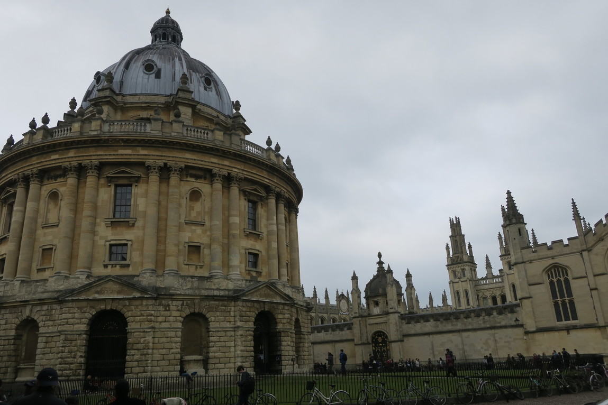
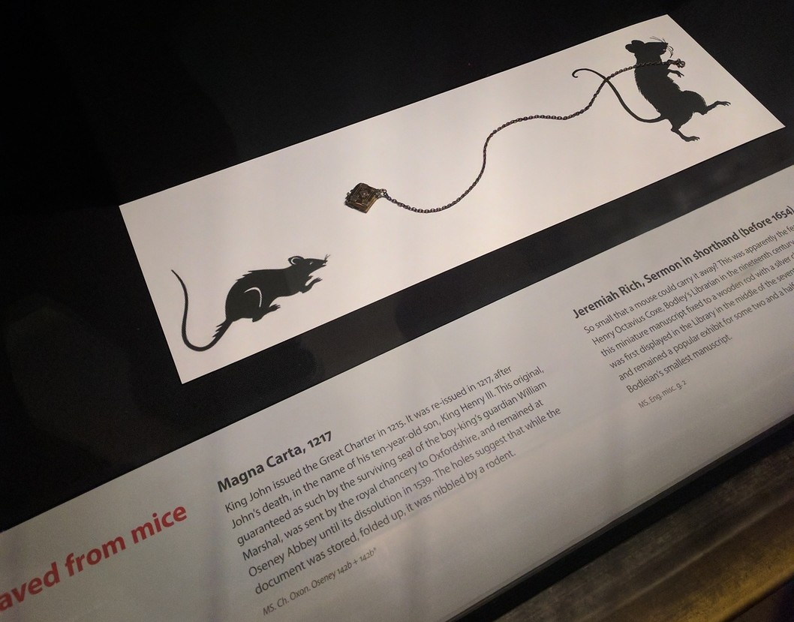
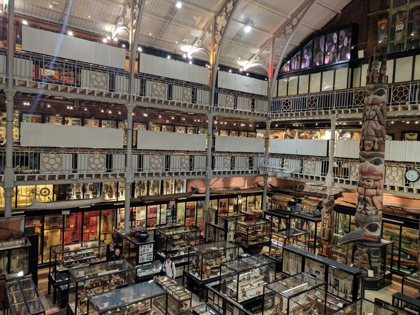
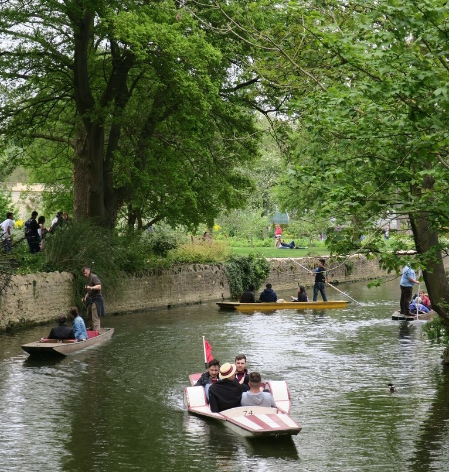

---
categories:
- Travel
date: '2017-05-07'
featured_image: posts/2017/oxford/museum.jpg
slug: oxford
tags:
- Europe
- UK
- England
- Oxford
title: Oxford
---

On way to Oxford we stopped at Stratford-upon-Avon and saw the church with Shakespeare's grave while we stopped for lunch.
There was a nice canal but that's about it.

We were staying on the outskirts of Oxford so it would be easier to drive in and out, but the area wasn't all that nice and there weren't many places to eat.

The next day we got the bus into the center, and went to Blackwell's Bookshop while we waited for a tour.
It was really cool and had heaps of books. Upstairs was fiction, but they had heaps of non-fiction books downstairs in the [Norrington Room](https://en.wikipedia.org/wiki/Blackwell_UK#/media/File:Norrington_room.jpg) that looked interesting.

Our tour guide was an ex-student and reminded us of Jack Whitehall. There was a graduation on with them all in their gowns, which they also have to wear to exams. We learnt how the colleges were established to separate the students from the townsfolk, as they didn't get along well and had a habit of [stabbing each other](https://en.wikipedia.org/wiki/St_Scholastica_Day_riot)

We really wanted to go in the [Bodleian Library](https://en.wikipedia.org/wiki/Bodleian_Library) but it is closed on graduation days. There is a section filmed for the restricted section in harry potter, that is actually restricted as it has lots of old books. It's also a legal deposit library so they get a copy of every book published in the UK and have over 12 million books. It's actually so big it's 5 different buildings, with tunnels and conveyer belts underneath where they can send books between them.

Near the Radcliffe Camera our guide pointed out some things that potentially inspired Tolkien and C. S. Lewis who lived there, like this door that has a lion engraving that allegedly inspired the door for the Chronicles of Narnia.

We saw a pub [full of cut off neck ties](https://en.wikipedia.org/wiki/Bear_Inn,_Oxford#Tie_collection), and had a pub pointed out where Bob Hawke broke the world record for sculling beer.

We saw [Einstein's Blackboard](https://en.wikipedia.org/wiki/Einstein's_Blackboard) in the science museum.

We got some Burritos for lunch around the corner from [Gropecunt Lane](https://en.wikipedia.org/wiki/Gropecunt_Lane).

We couldn't get into the main library, but there was a small section in the Weston Library we went to which had original [Tolkien Christmas letter](https://en.wikipedia.org/wiki/The_Father_Christmas_Letters) which was cool to see something actually written by Tolkein but also funny because I'd never head of them before and they reminded me of the notes mum used to write for Sarah as Santa. They had some other rare books on display, like this tiny one.

We also went to the Pitt Rivers Museum, and saw some shrunken human heads as well as a really long skull.

We were going to go to the botanical gardens but they cost money, so instead we just walked along the river and saw all the rowing teams. There was also people on boats they pushed against the ground with poles.

