---
categories:
- Travel
type: post
date: '2017-04-20'
featured_image: posts/2017/paris/melting_house.jpg
slug: paris
tags:
- Europe
- France
- Paris
title: Paris and Versailles
---

After very little sleep on the bus, and leaving over an hour late, it meant we arrived late in Paris and so hit peak hour traffic, making us later still and stuck in traffic at a crawl. The bus actually went near our hostel and then we spent probably an hour in traffic after that getting to the bus stop on the other side of the city.

The bus depot itself was pretty terrible, essentially a giant car park near a metro station. Luckily we finished there and didn't wait there as there was no toilets, no cover and no food. We got a train to the hostel to find out they actually charge by the hour for luggage storage. So we had planned to go into the city but instead paid for a couple of hours and went to get food until we could check-in.

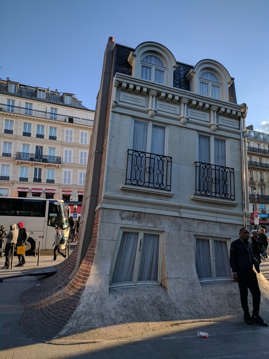

The Hostel had a booking desk, and the lady told us we could buy skip the line tickets from her for much cheaper due to a special deal and it also included audio-guides. It seemed to be good to be true but she was adamant. Turns out she was full of shit though, as we got there and they said no we had to line up (which took 2 hours) and then it didn't even include an audioguide.

It was the same hostel we stayed at [last time](/posts/2010/euro-trip-paris) and we thought was great, except this time I have to give the opposite review. So at this point neither of us was in a particularly good mood, and Rachael was starting to get sick so was at a point where she just wanted to cancel the holiday and go home.

Eventually we made it to the front of the line though, and the catacombs themselves were incredible and worth the wait. The first part was just miners tunnels which were pretty cool, but not what we waited 2 hours to see. And then you get to the bones, of which there was a mind-blowing amount and the tunnels just kept on going. It was hard to fathom that they were all people once and the sheer number of bodies dumped down there.

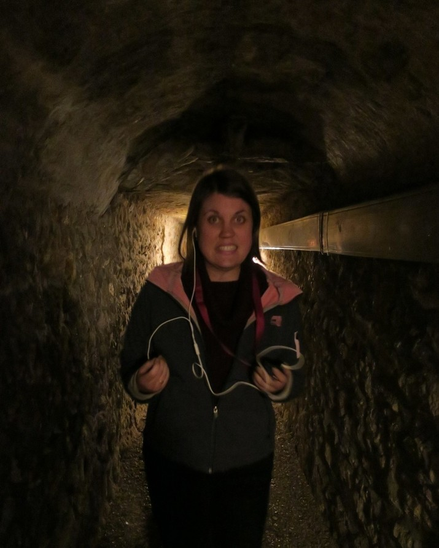

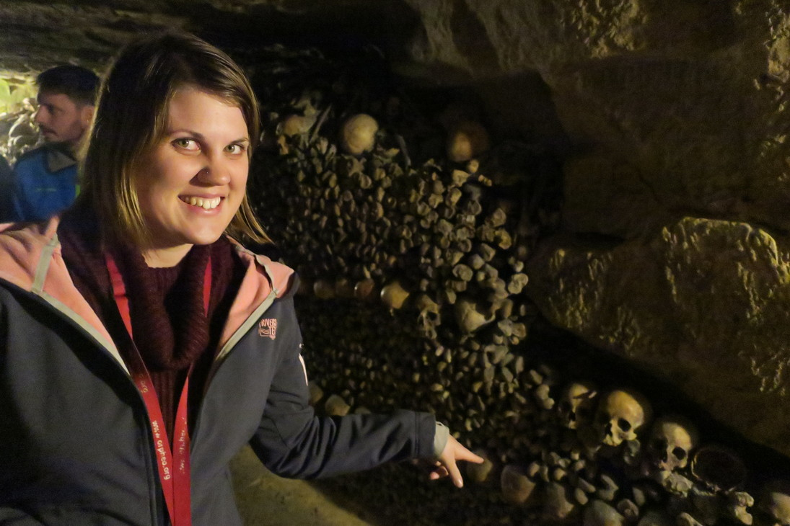

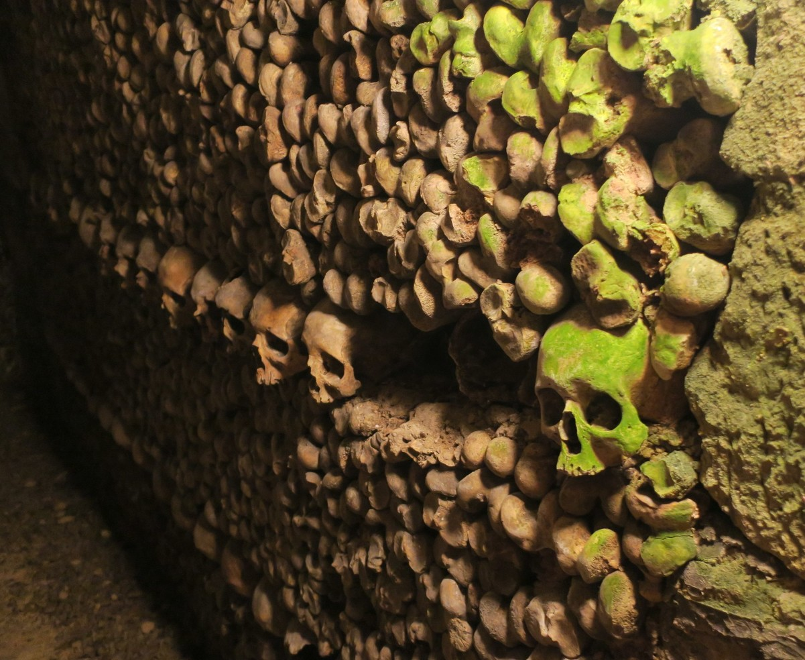

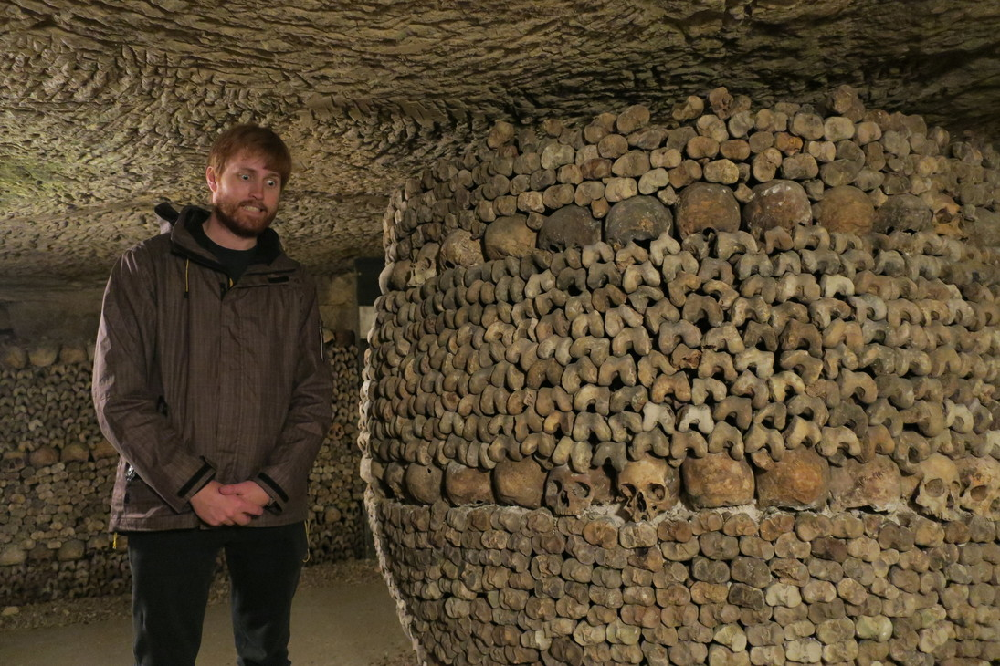

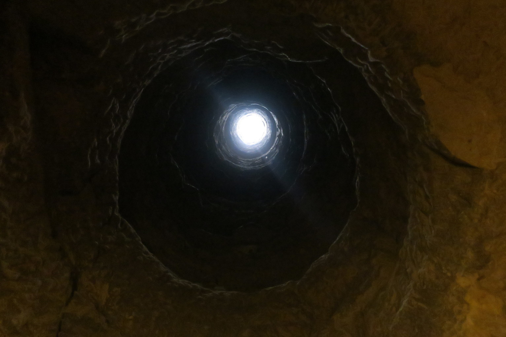

We were in a much better mood when we came out, and then went to visit the Luxembourg Gardens.

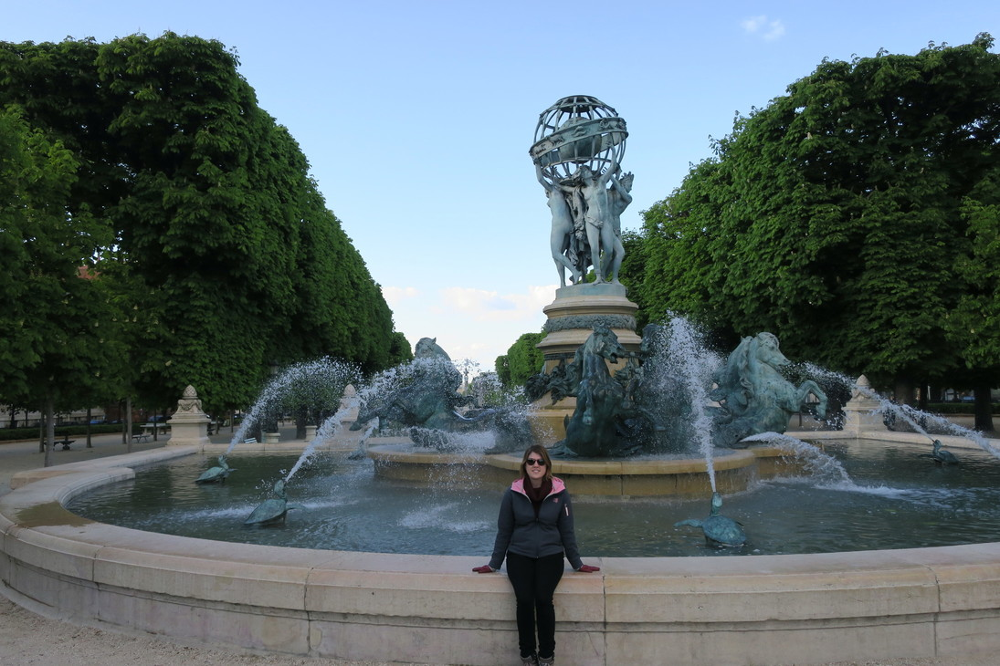

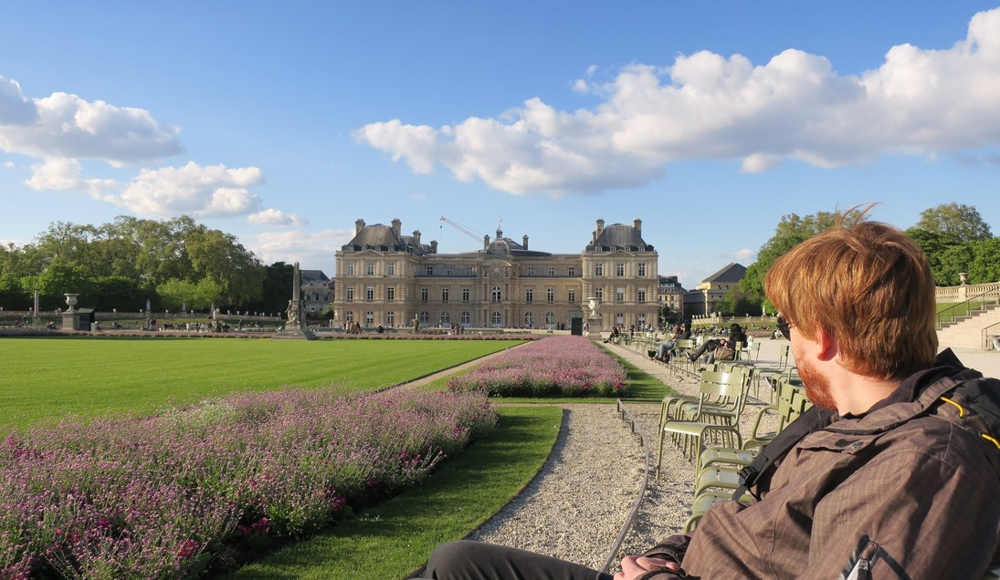

The next morning we went to the Château de Versailles. Which we got there early but was still packed with tourists, which despite this was also incredible. It was like the Vatican with the amazing paintings on every surface except even grander. Unfortunately lots of the palace was closed for renovations which was annoying because it didn't say this anywhere when we booked the tickets or even the tourist information they gave out once you got in. The audio guide would say to go one way and then someone would say sorry you can't go down there it's closed.

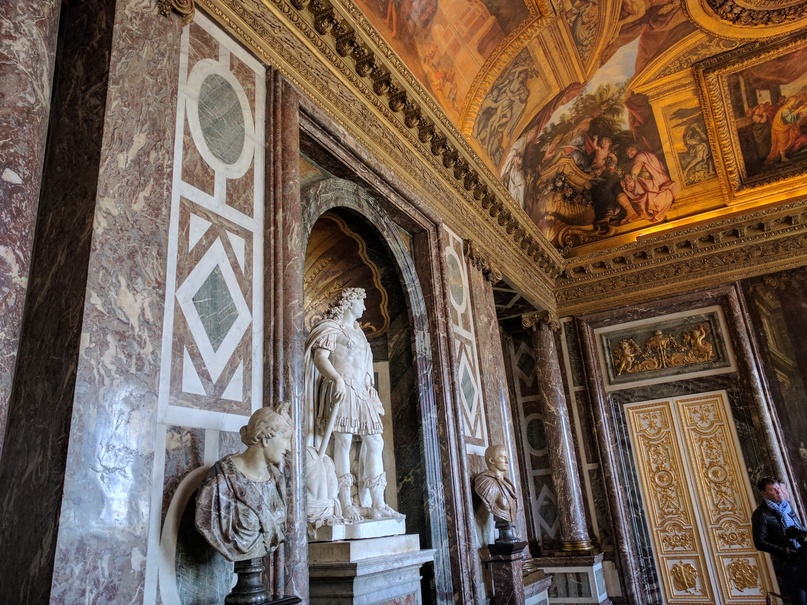

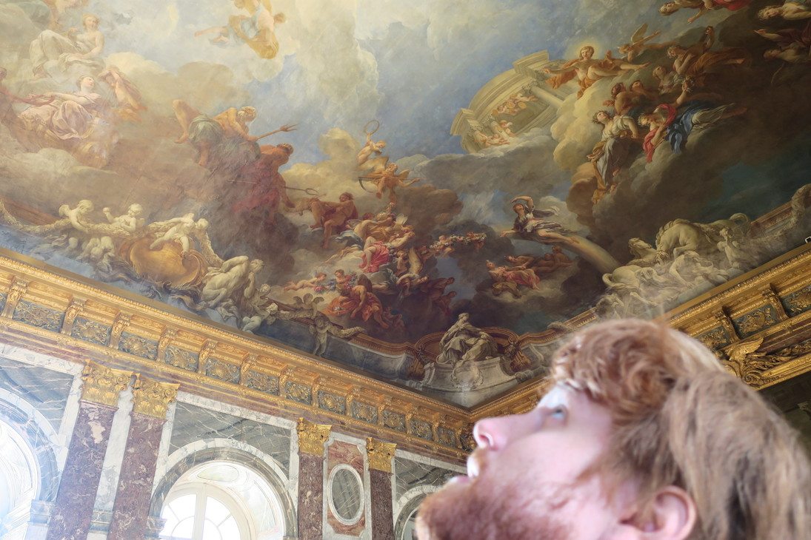

It was also interesting to see what was considered valuable then, as the grandest part was the [Hall of Mirrors](https://en.wikipedia.org/wiki/Hall_of_Mirrors) which at the time showed incredible wealth as most people could not afford a mirror, let alone an entire hallway of them.

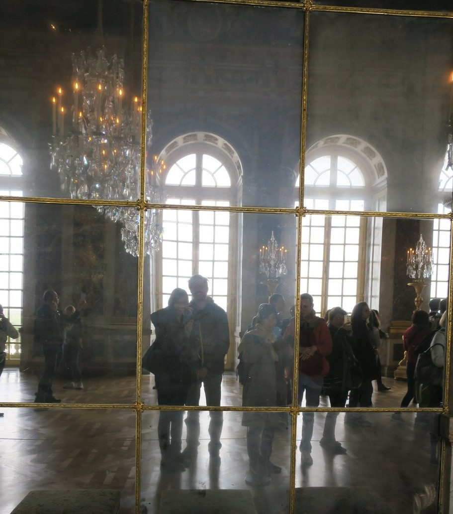

Once you get out of the palace itself, it was time to visit the gardens. They are also incredible in their scale, better then any other gardens we have been to and the fountains were all turned off that day, so I imagine it's even better when they are on.

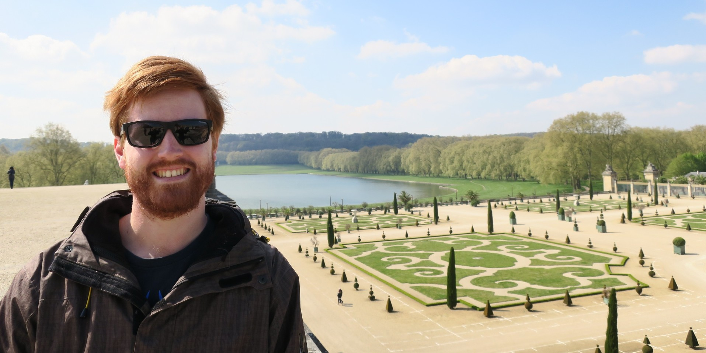

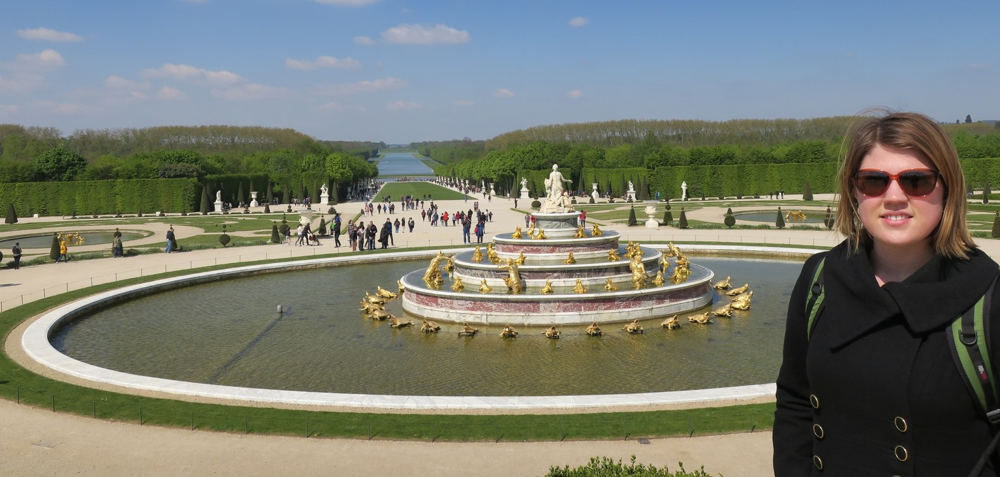

There was another whole grounds in the [Marie Antoinette garden](https://en.wikipedia.org/wiki/Hameau_de_la_Reine), which was probably the highlight as there were heaps of [different paths and styles](https://www.google.com.au/maps/@48.8145288,2.109453,285a,35y,355.57h,39.38t/data=!3m1!1e3) and we probably didn't even see a quarter of the grounds.

And finally we headed back into the city, and had some delicious Sri Lankan for dinner.

The next morning Rachael was sick, so I went out myself to the see La Basilique du Sacré Cœur de Montmartre which has a great view of the city. I got there pretty early and there wasn't many people around, just scam artists and some guy that wanted to sell me weed. It had a nice view but couldn't really see any landmarks, and could only just see Eiffel Tower if you looked at the right angle. The church itself was pretty impressive.

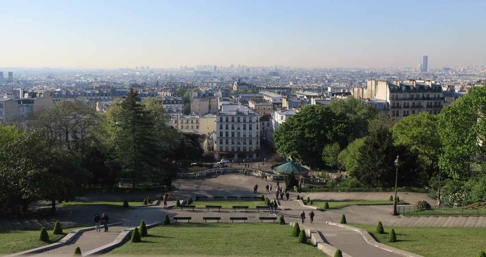

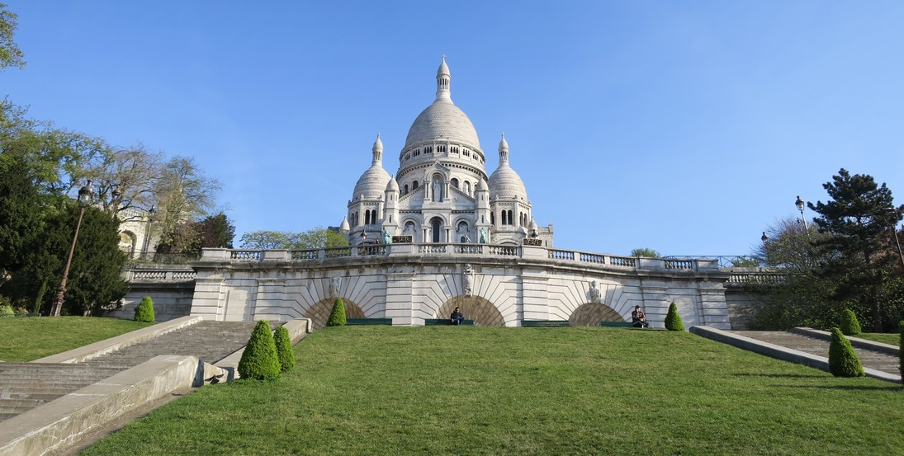

Last time we stayed in Paris we thought it was great and wanted to stay longer, but this time we were mostly glad to leave. We were glad we came back for a second visit though, as the Catacombs and Versailles where well worth it.

The airport seemed to have changed a lot since last time we were there, and was a much better experience then last time. It was a nice quick flight and crazy how small the English channel is from the air. Was cool seeing Dover after being there could just make out the white cliffs and the harbour and ships.
Paris seemed dirtier and not as nice as last time.

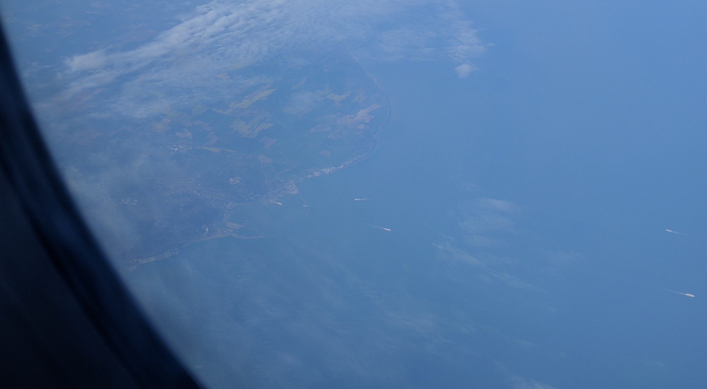
