---
categories:
- Travel
date: '2017-05-05'
featured_image: posts/2017/snowdonia/walk7.jpg
slug: snowdonia
tags:
- Europe
- UK
- Wales
- Snowdonia
title: Snowdonia
---

We booked a farmhouse on AirBnB which was really hard to find and Rachael was a bit freaked out when we got there because it was in the middle of nowhere and there wasn't anybody home. But the owners showed up a bit later and were really nice, and put on an amazing breakfast.

The next morning we went for a hike. To hike Mt Snowden you need to get there extremely early to get a car park, so we did the less popular [Crimpiau](http://www.eryri-npa.gov.uk/visiting/walking/mountain-walks/crimpiau-capel-curig) one instead. There was a free car park at the start next to a waterfall.

It's through farm land so there were heaps of sheep and lamb at the start. Also lots of stiles and ladders to cross fences.

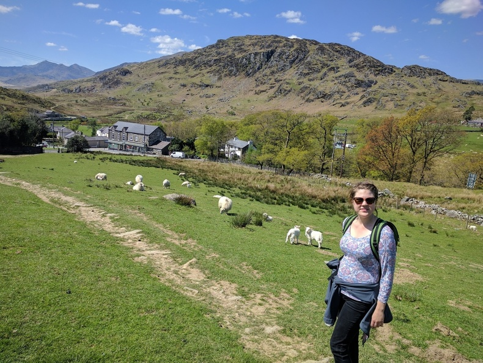

The start was a nice woodland area, and then it got more open.

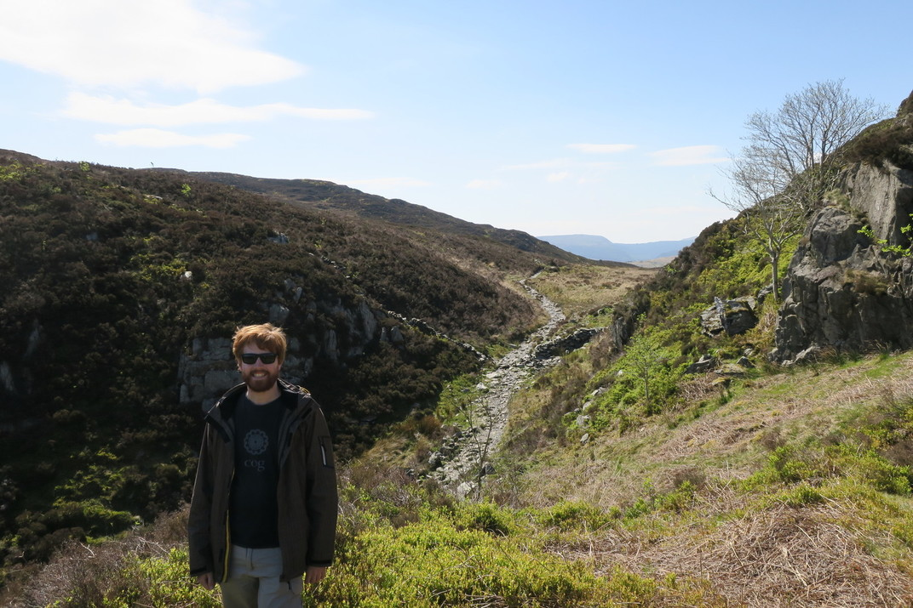

About half way up there was a really nice view of a lake on the other side.

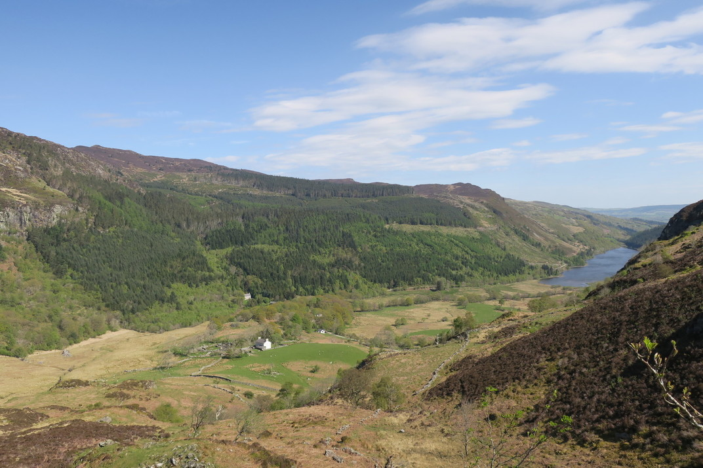

Was super windy at the top, but not as bad as Scotland. We could hear jets flying over which echoed across the whole valley, although we couldn't see them.

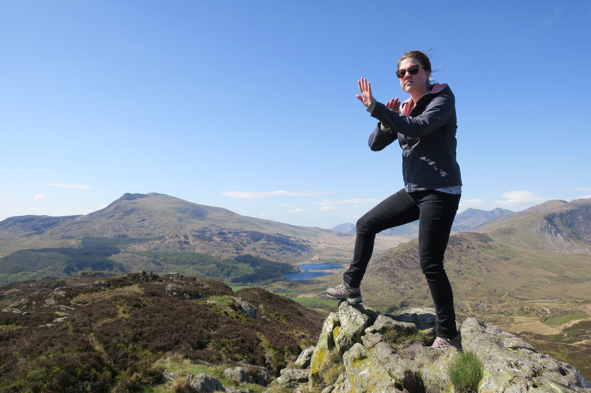

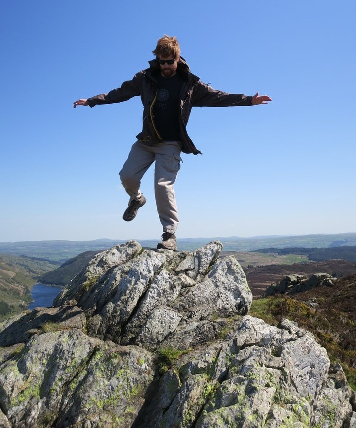

Rachael was saying how great it was to be able to go on a hike without worrying about snakes and spiders, and about 5 minutes later she freaked out when I nearly stood on a small bright orange snake. I didn't see it until it was slithering away, but it was really pretty.

The path then went through a bog. I never really knew what a bog was and thought it was like a wetland.
The ground looked like solid dry grass, but when you step on it you sink slightly and your shoe fills with water. Not very pleasant but was a bit trippy at first so cool in that sense.

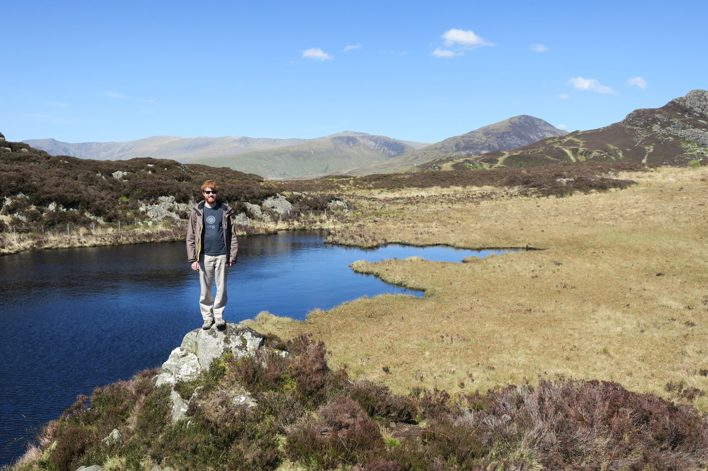

After out hike, we drove past the base of the Snowden walk, and even the drive up was crazy high. Rachael didn't like driving near a shear drop, and it was a bit like driving to the ski fields in New Zealand. The car park was packed so we are glad we did the other hike. There was a cool quarry at the bottom on the other side as well.

Since the distances are so small, we drove a bit further to the beach and actually found a proper fish and chips shop this time.
It was actually a nice little beach besides the rocks.

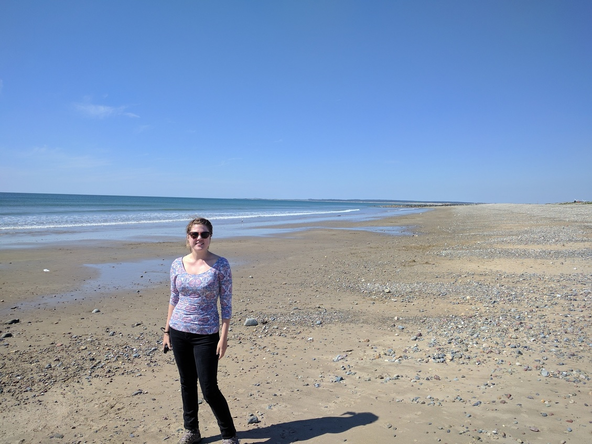
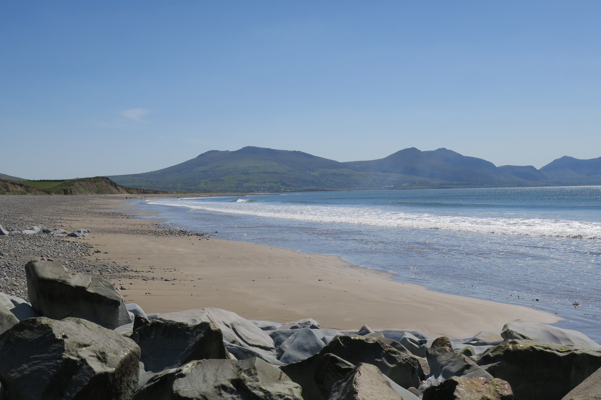

There was also a [hillfort](https://en.wikipedia.org/wiki/Dinas_Dinlle) which had a nice view.

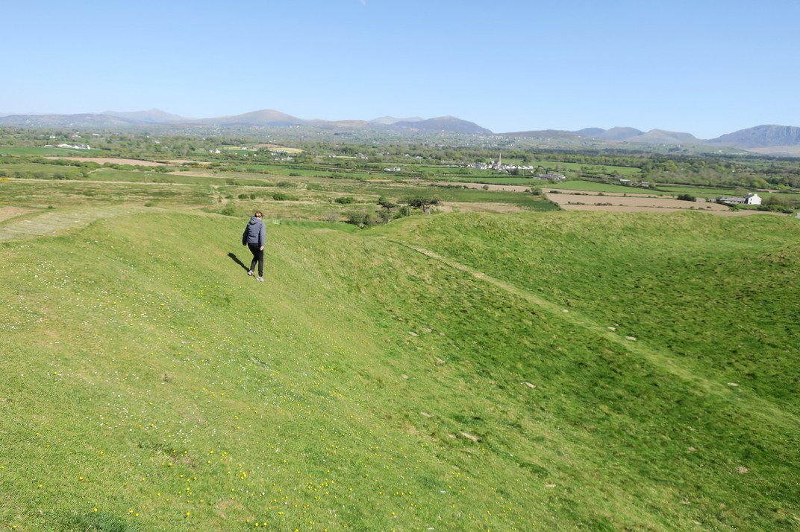

We drove bank to Bala lake as we didn't get a chance to see it the day before.

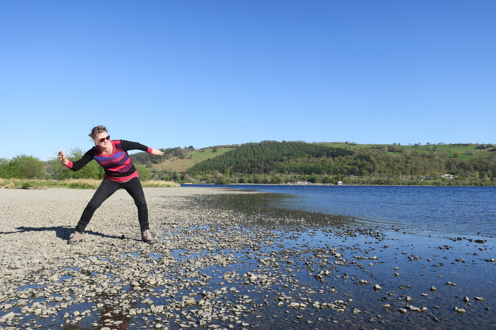

On our last night, the pig at the farm gave birth to piglets. And Rachael couldn't leave without patting their lamb.

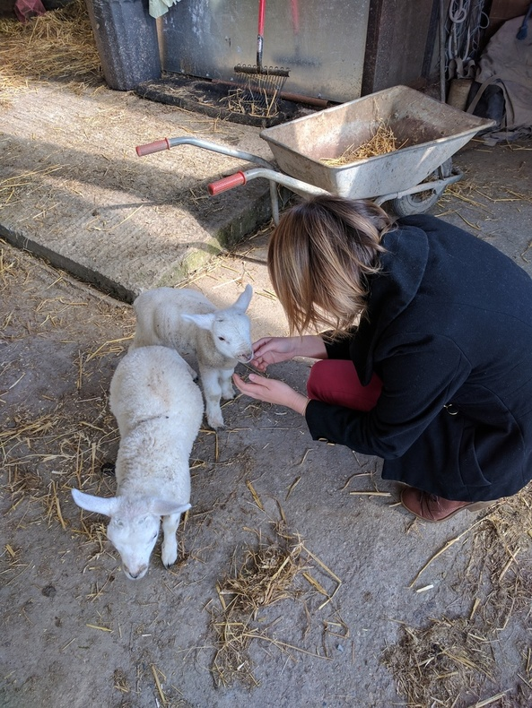