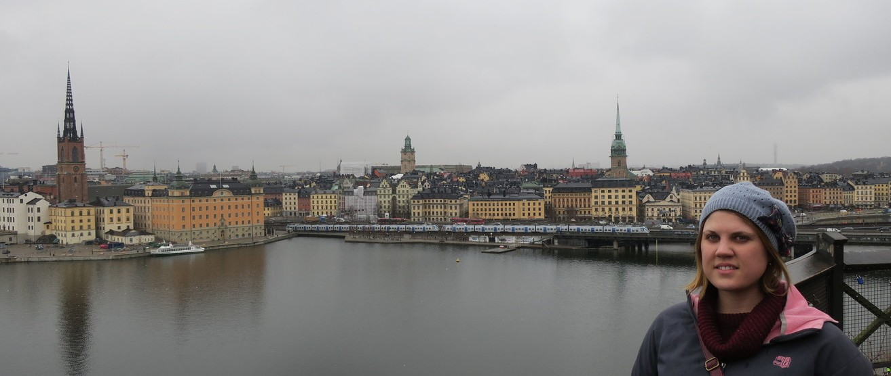
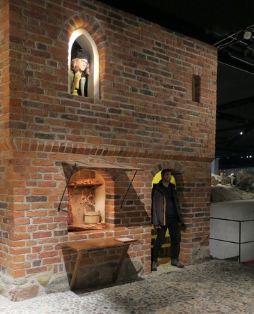
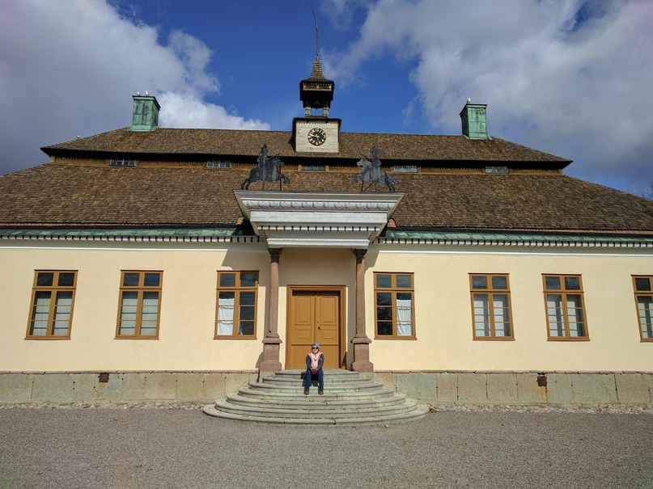
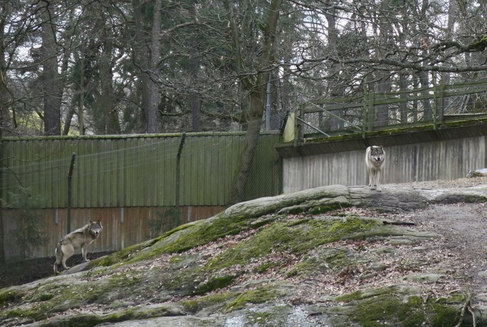
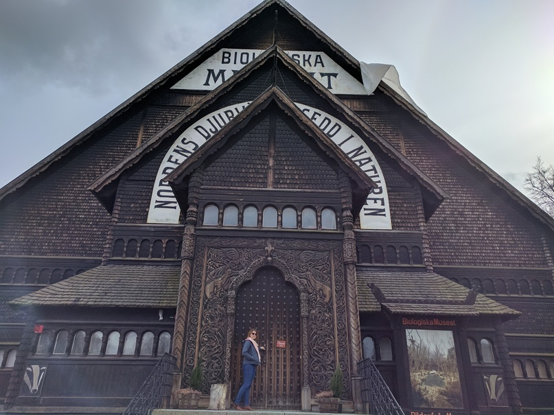
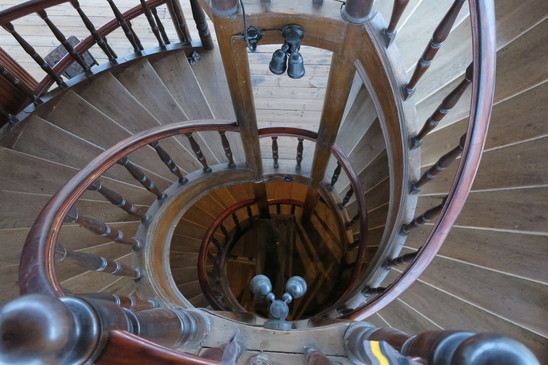
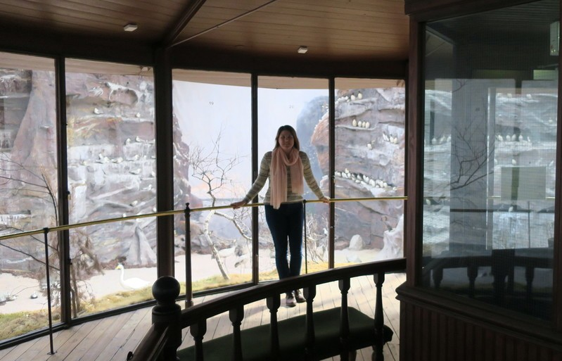
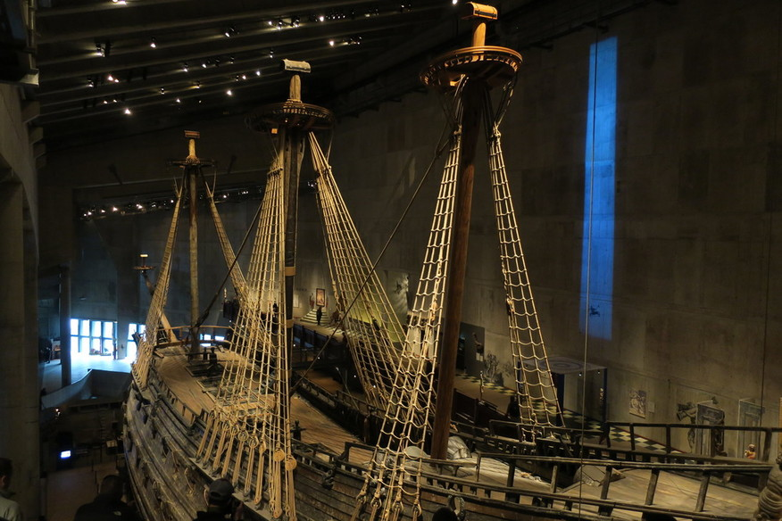
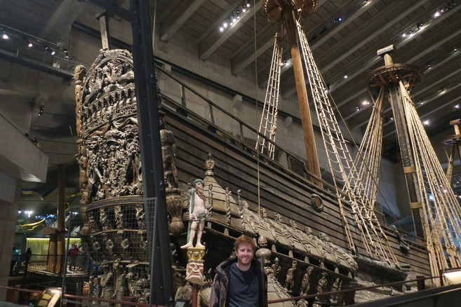

+++
categories = ['Travel']
date = '2017-03-31'
thumbnail = 'posts/2017/stockholm/stockholm.jpg'
slug = 'stockholm'
tags = ['Europe', 'Sweden']
title = 'Stockholm'
type = 'post'

+++

We flew into Stockholm and it was snowing outside when we arrived, not something we were expecting for Spring.

We got a train from the airport into the city and checked into our AirBnB. We then went for a walk around the old town which was full of pretty buildings. We visited
[a free medieval museum](http://medeltidsmuseet.stockholm.se/in-english/) which was on a little island next to the Royal Palace. Was a really cool area and the museum was pretty interesting. The old town itself was nice to just walk around.

We left early the next morning to walk to Skansen, after picking up some awesome pastry for breakfast from Coop.
Skansen is an open air museum and zoo, but since it was still cold most things were closed and the animals were hibernating or not around. We did see some reindeer and wolves, and there was great views from the hill, but overall we weren't super impressed.

Next to Skansen there was a really cool looking biological museum. We thought it was part of the Skansen ticket, but it wasn't and was pretty expensive admission. The guy on the door gave us a discount though, and it had a really cool double helix staircase.  The exhibit was mostly unchanged in 100 years, and while it wasn't that impressive after being to the natural history museum in London, at the time it was built it must have seemed incredible.

Finally we went to the Vasa Museum, which was definitely the highlight of Stockholm for us. The [Vasa](http://www.vasamuseet.se/) was a massive warship that sank on it's maiden voyage. They recently pulled it out of the water and restored it, and built a giant museum around it. The museum has so much more to offer then I was expecting, for example they have a floor where they have the skeletons of the crew that died when it sank, along with their belongings and clothes, which allowed them to learn a huge amount of detail about how people lived during that time period.

After the Vasa Museum, we were starving and walked into the city to get a late lunch. We were going to look around, but it started raining, so we got the train back to the accommodation. Once it started to cool it turned to snow again later in the evening.