+++
categories = ['Misc']
date = '2017-09-24'
thumbnail = 'posts/2017/tcof2017/lb1.jpg'
slug = 'tcof2017'
tags = ['TCOF', 'Toowoomba']
title = 'Toowoomba Carnival of Flowers 2017'
type = 'post'

+++

Laurel Bank Park always has the best flowers, and this year was pretty good also although harder to make out the shapes then previous years (besides the Australia outline).

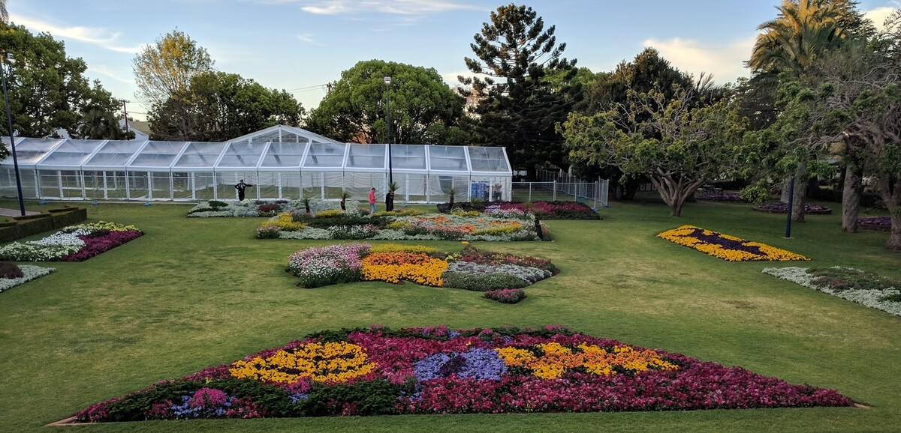

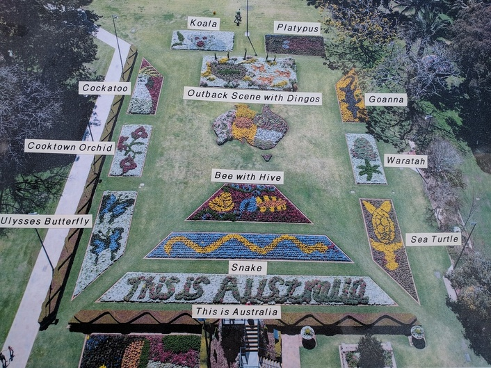

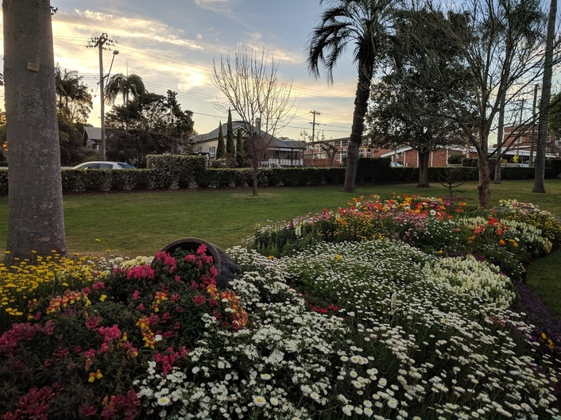

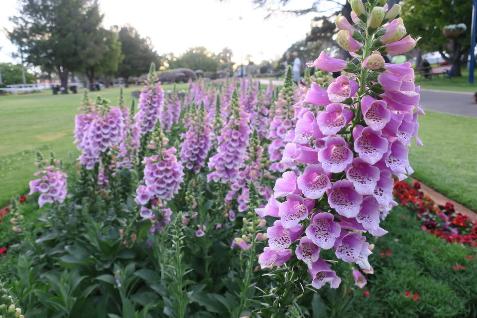

Queen's Park was also as good as always also.

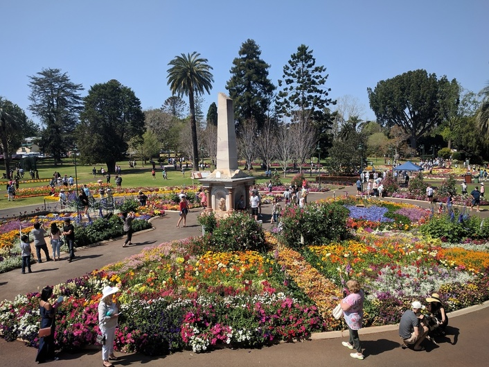

We only went to one day of the food and wine festival this year, and we didn't have anyone staying with us, but it was as fun as always.

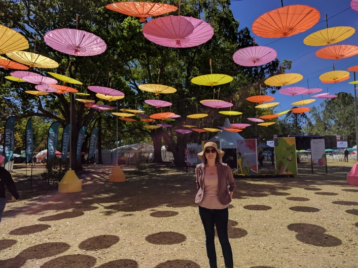

We went at lunch time so Rachael finally got to make her free headband before they ran out of flowers.

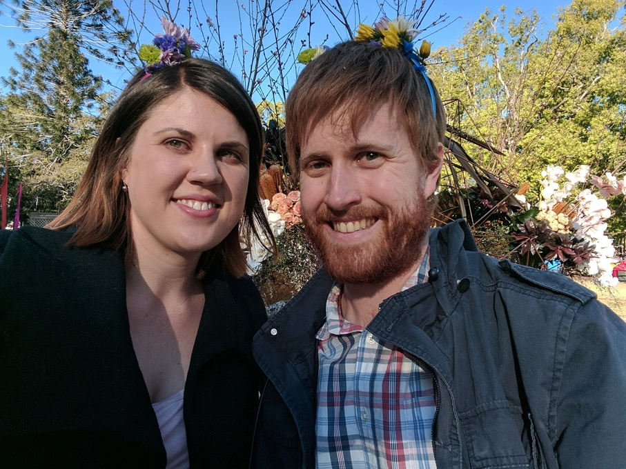

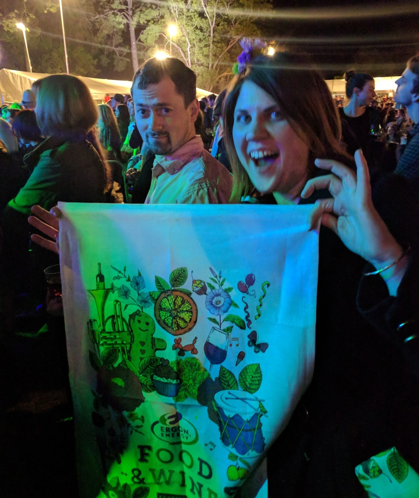

Alex Lahey and Temper Trap were both awesome.

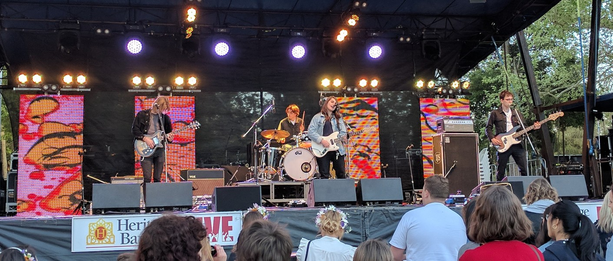

We also went and saw some different prize gardens to previous years. The winning garden was at Highfields and full of native trees and flowers and had bees everywhere. There was another good one in Highfields that was on a big block of land and pretty fancy. We saw two new ones in town as well that were next to each other (with no fence between) and had lots of herbs and vegetables and an elaborate chicken coop.

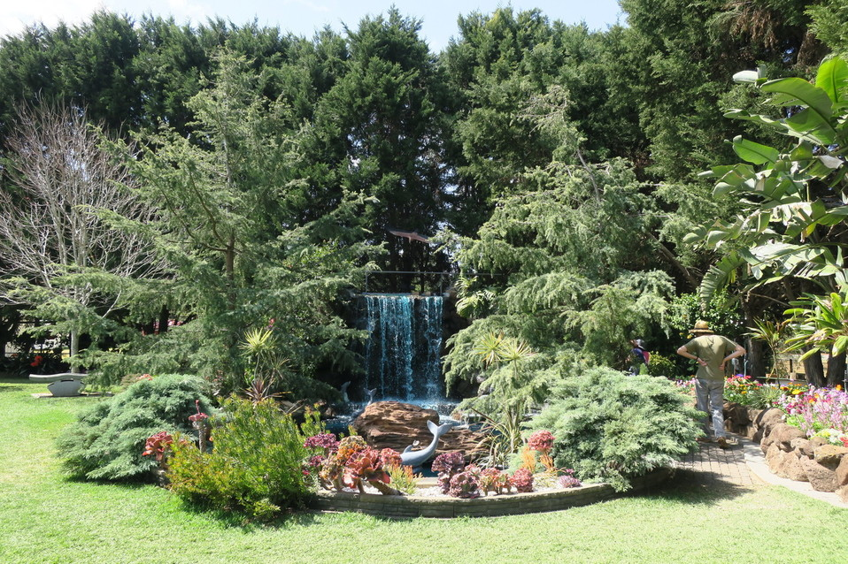

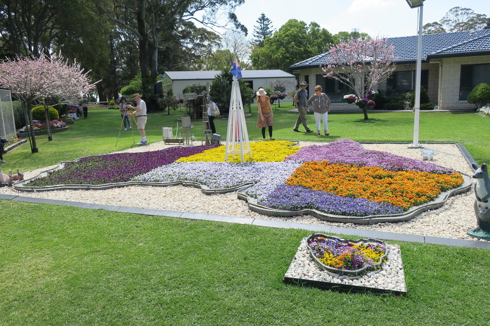

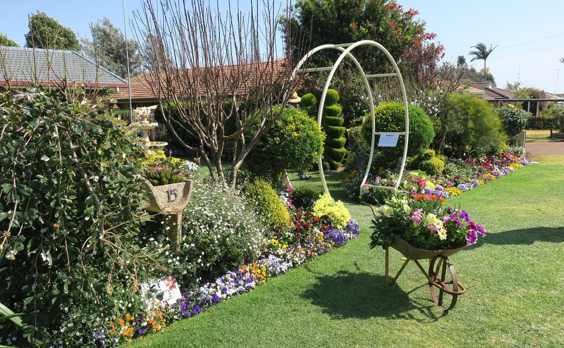

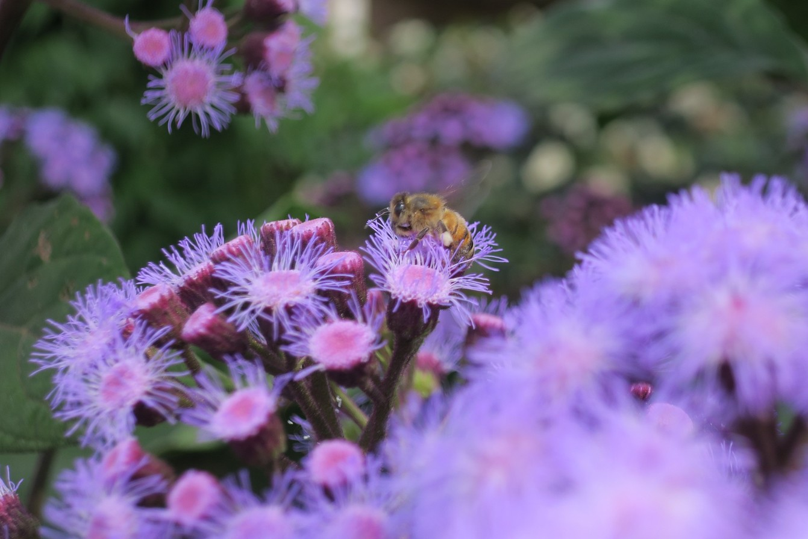