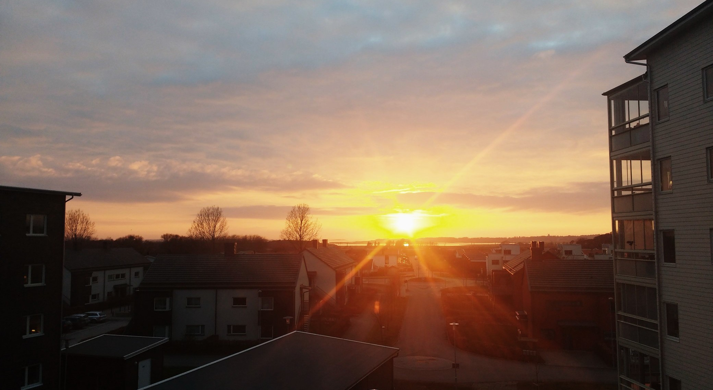
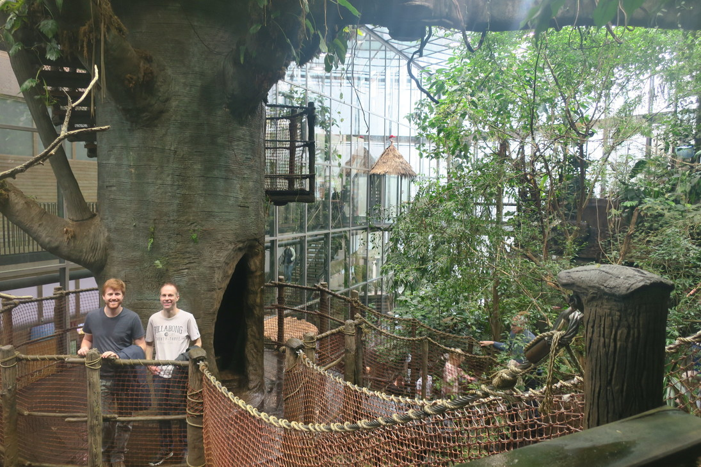
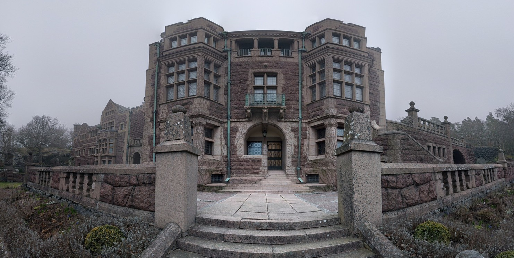
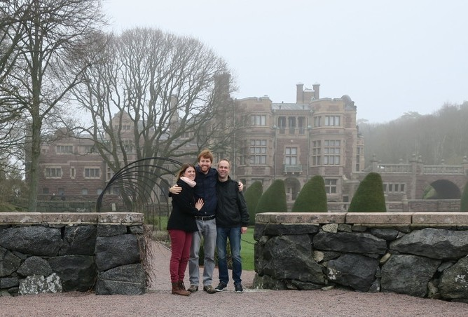
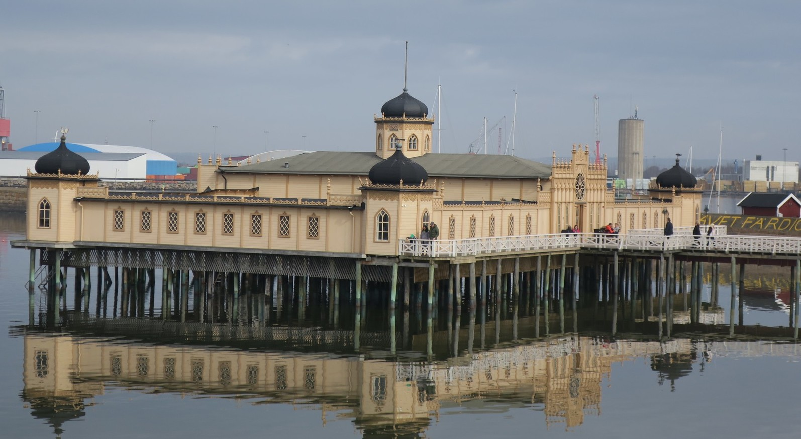
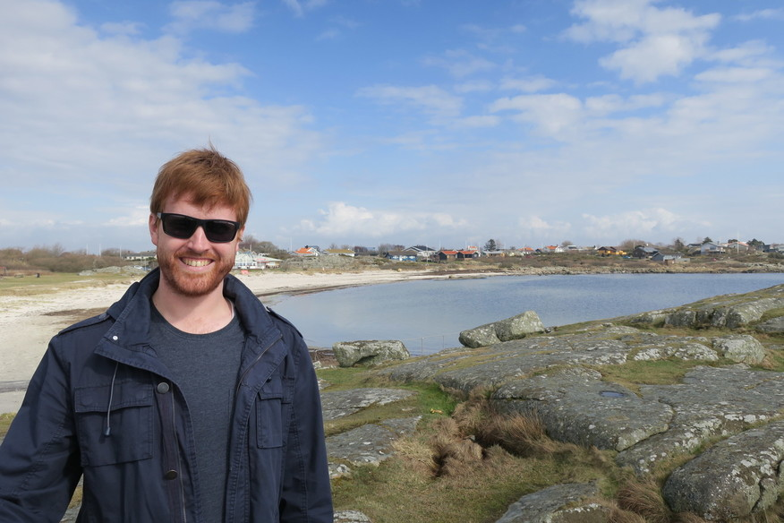
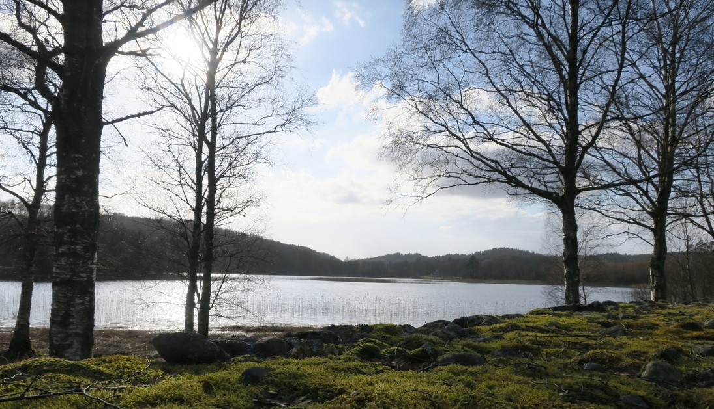

Next up we got a train to Guttenberg to meet my friend Johan. I was surprised by the amount of forest on the train ride, unfortunately our train seat didn't have a window but from what we could see there wasn't many towns on the way. We met Johan at Guttenberg then went to meatball house, and got some Swedish meatballs which were delicious.

From here Johan drove us to his new apartment in Varberg. It was a really nice place, and the area really reminded me of Turgi. We went to the grocery store and bottle-o, interestingly Johan said that alcohol over 3.5% can only be sold at a [government run store](https://en.wikipedia.org/wiki/Systembolaget), where we bought some really nice Swedish wheat beer.
It was Johan's birthday, so went out to a nice Indian place for dinner.  Johan's place even had ocean views.

The next morning was really foggy, so we thought it would be a good time to go back into Guttenberg and visit Universium. It was a science museum but also had a cool rainforest and aquarium. It also had a cool space section where they had scales that had your weight on different planets.

On the way back we stopped at an English-Style castle called Tjolöholms slott.

The next day we went to see the Varberg Fortress, there was also a really interesting looking swimming pool structure at the beach. They had photos of people swimming in the middle of winter when the ocean is frozen, but the water looked nice the day we were there (it was still way too cold though).

We went to meet Johan's parents and had a lovely home cooked meal. They also lived near a really nice beach, I wasn't expecting Sweden to have nice beaches.

Finally, we went for a drive inland and went for a walk along some of the lakes.

Johan was an excellent host, and we had an amazing time in Sweden. It wasn't what I was expecting at all and was also great having a local experience. We learnt lots and found out heaps of interesting things you wouldn't normally, like the fact that Denmark is so close that the TV could pick up both Swedish and Danish channels, and that they have a self serve checkout system over there where you get a handheld scanner to take with you and scan the items as you shop.
