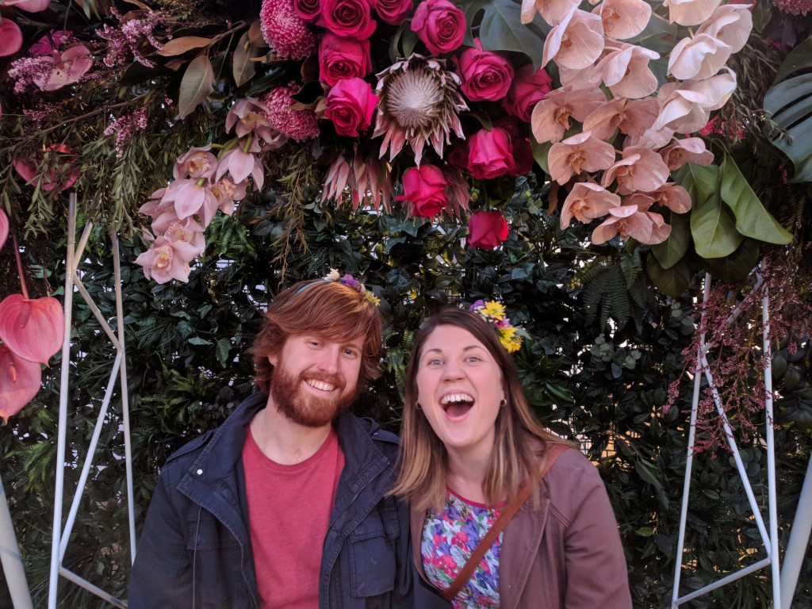
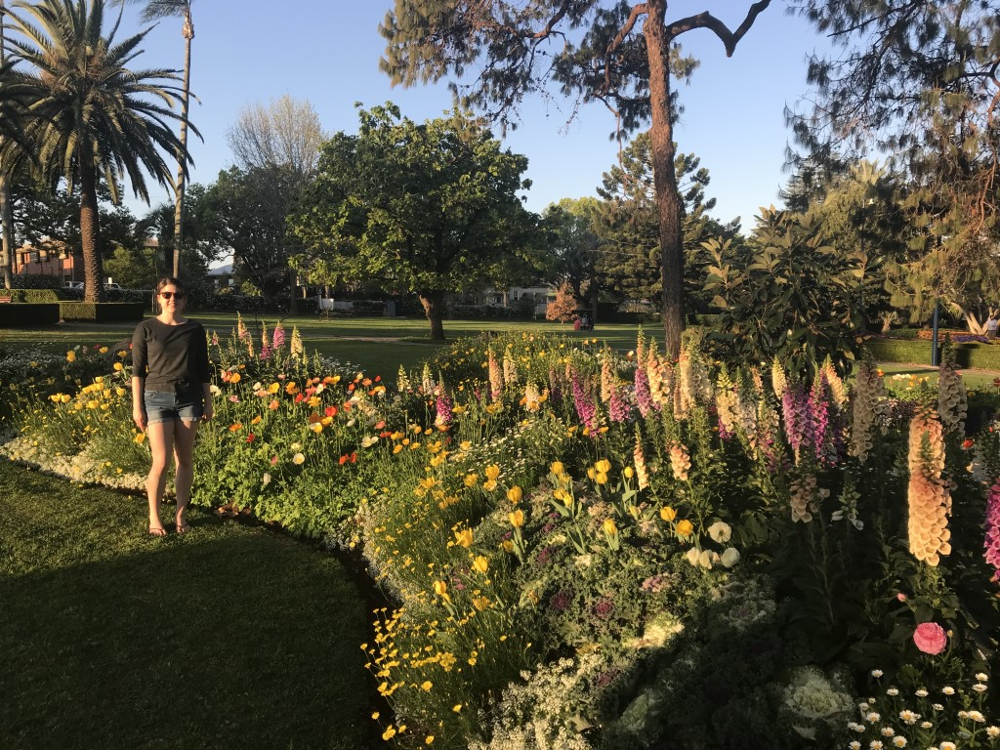

---

date: "2018-09-29"
slug: tcof2018
title: TCOF 2018

categories: ["Misc"]
tags: [TCOF, Flowers, Toowoomba]
---

The Food and Wine Festival was great as always. Katherine was visiting from London, and Geoff & Carla also came up.

I didn't think the theme at Laurel Bank was as good as previous years, but still impressive.

I actually thought Queen's Park had better flowers this year.

There was a new event called the Night Garden, which was okay but probably not worth the admission price (I ended up winning free tickets from work).
The Christmas Lights at the end of the year are better (and entry only gold coin donation).

We went to a couple of prize gardens that were new or we had missed previous years.

The best was the prize garden on Mabel St which had a bed full of water, piano, outdoor chestboard and all kinds of eccentric things.

This year we also went to an art show that is held at Downloads each year during the carnival.
It was mostly local artists, and way better then I was expecting!

And finally, we went for a drive out to Harrow Homestead at Cambooya.
They have just sold to new owners so this was the last year it's open for viewing (and our first visit).
Was a massive grounds and the building itself was also impressive inside, and reminded me of really old rich european buildings.

