+++
title = "Carnarvon Gorge - Lower Gorge"
date = "2018-10-15"
slug = "lower-gorge"
type = "post"

[taxonomies]
categories = [ "Travel",]
tags = [ "Queensland",]
series = [ "Carnarvon",]

[extra]
image = "posts/2018/lower-gorge/creek.jpg"

+++

The actual hikes are all a single path that follows the creek, with a bunch of side paths.
It's recommend to go to the end first but as we were going with Rachael's dad Mark,
we did them in the order we came across them and aimed to do the main 4 in the lower gorge.

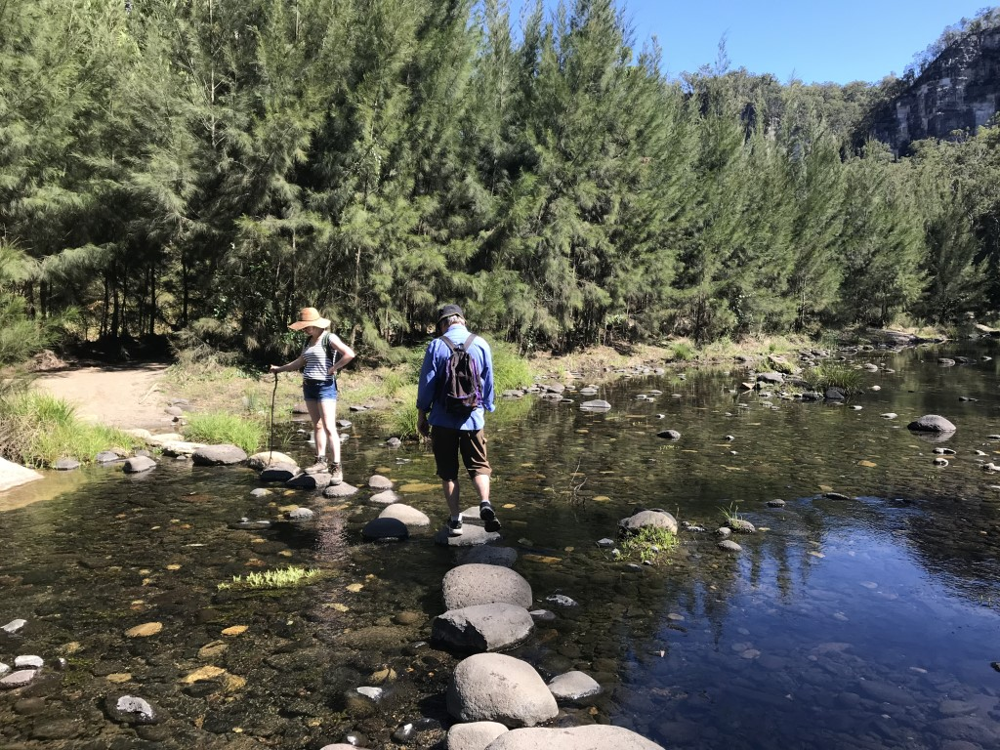

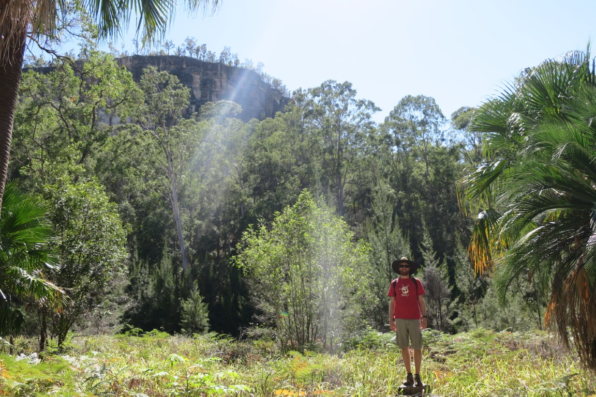

The first side track is for Moss Garden.
The water seeps through the sandstone gorge over thousands of years and then hits the basalt layer where it is forced outwards.
This means that the creek has water year round and there is a bunch of moss on the rocks.

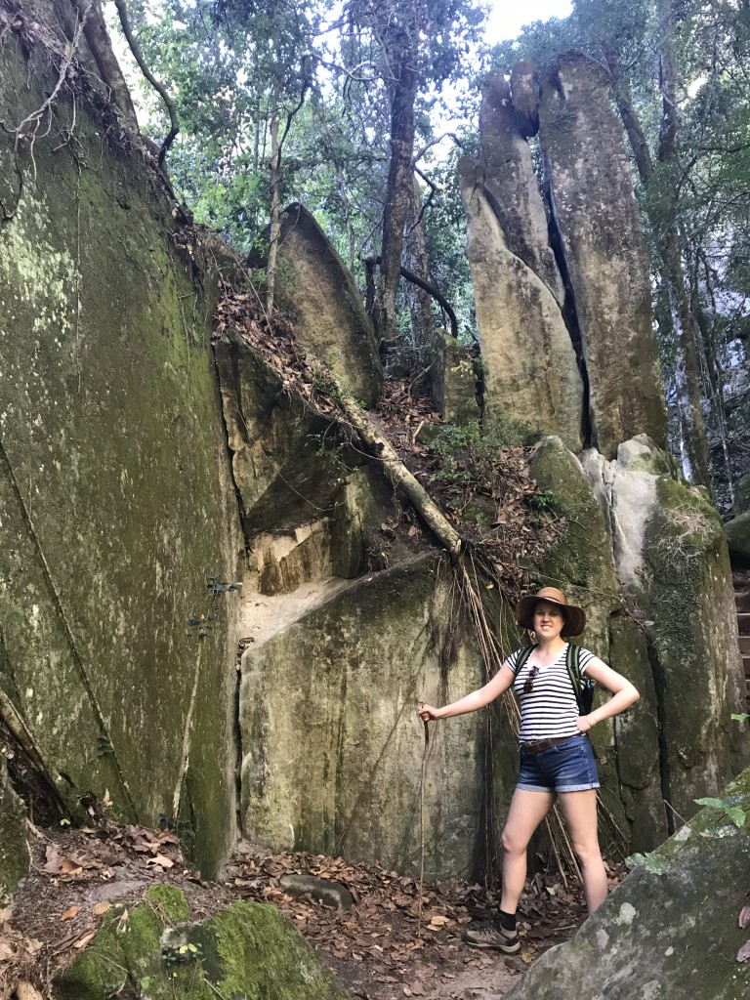
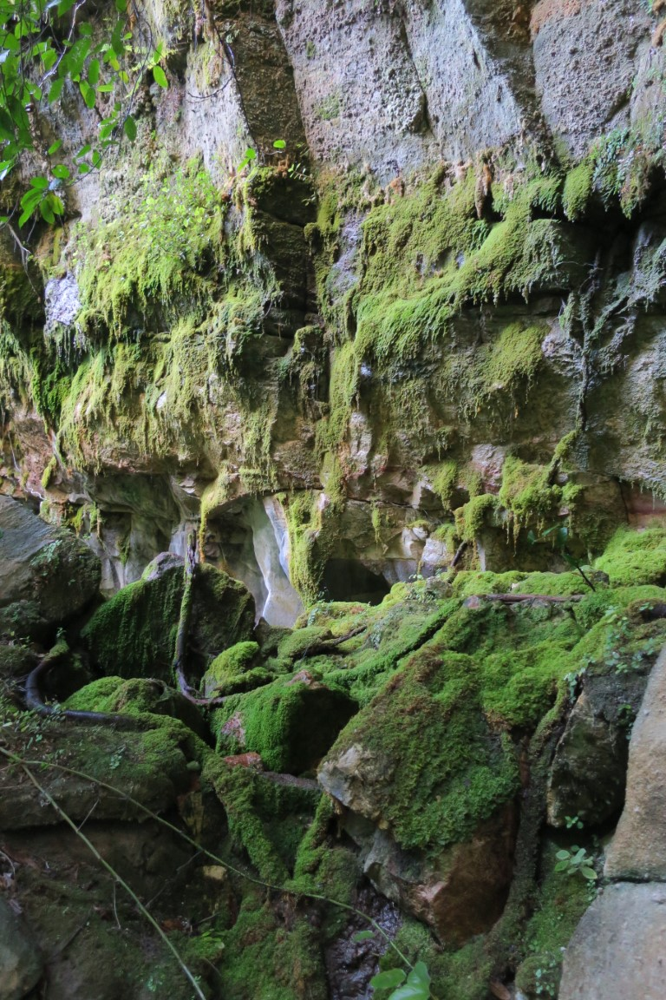

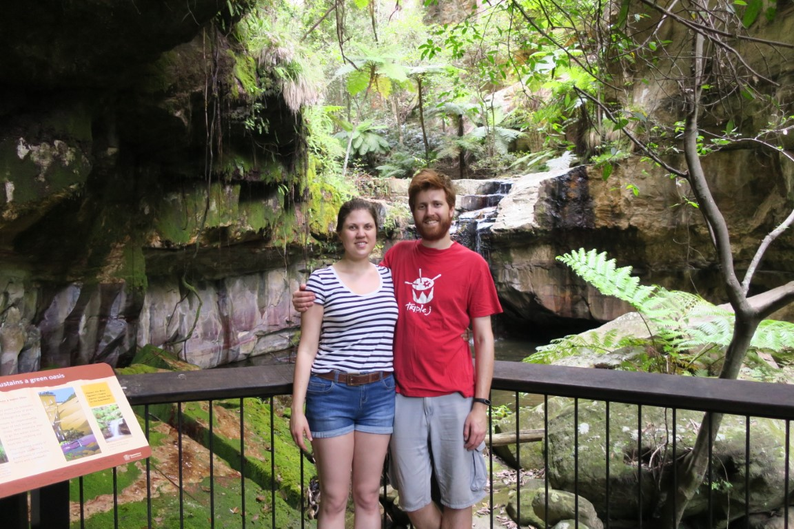

Ampitheatre was probably the best side track. It's a little crack in the gorge that you can climb up (via ladder) and opens into a small opening full of greenery.
It also seemed like it was about 10° cooler in the cave.

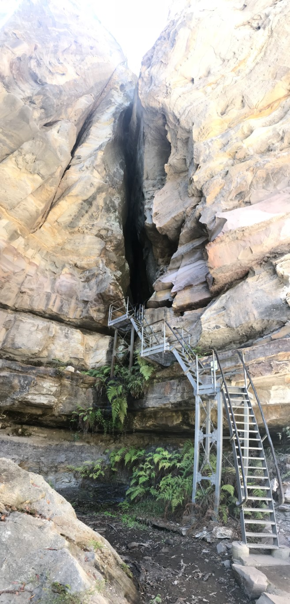

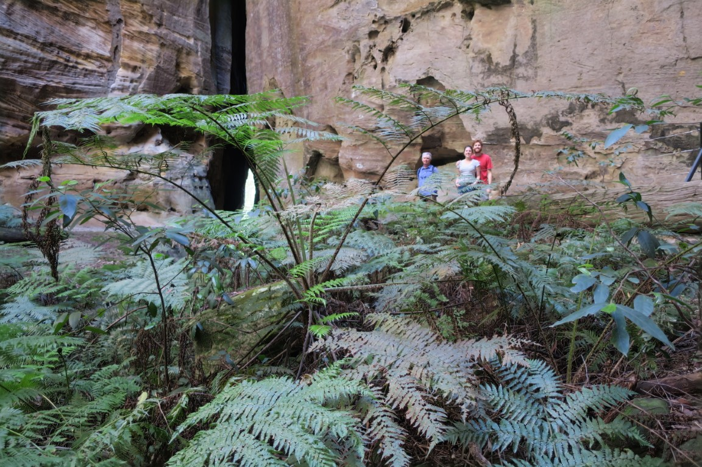

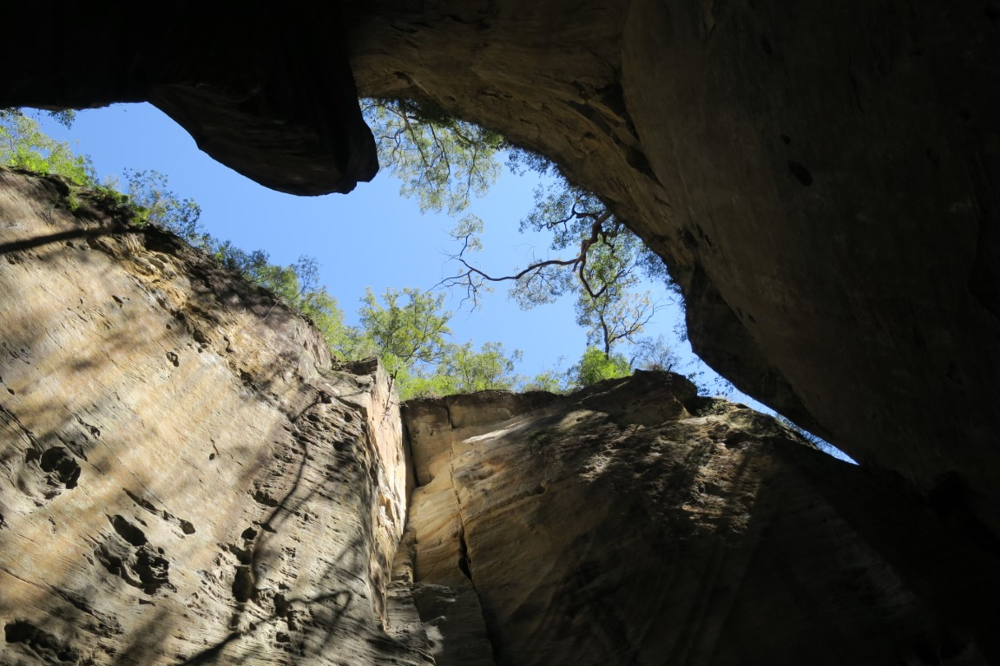

Mark left us there and Rachael and I continued on to Ward's Canyon, which started with a cool little waterfall.

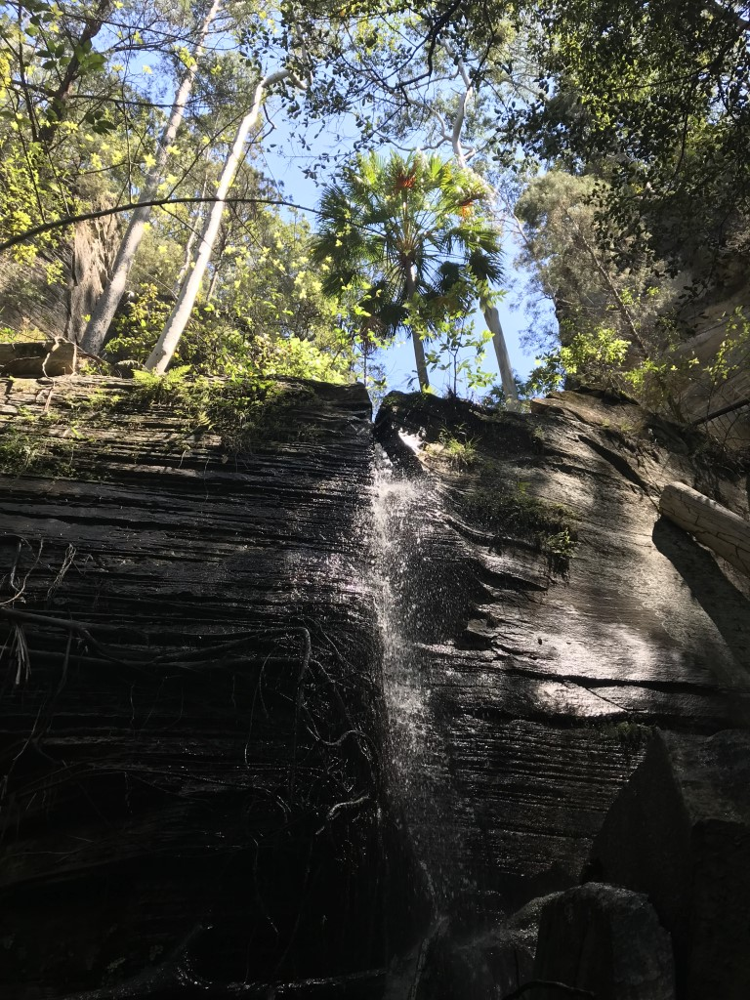

From the waterfall, you climb up above it and into the actual gorge itself.
Again it was super cool in the gorge compared to the main track.
The actual gorge was full of king palms and a small trickle of water.

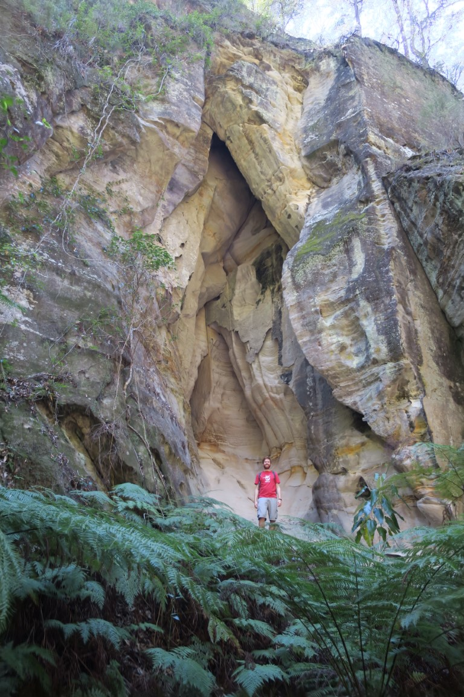

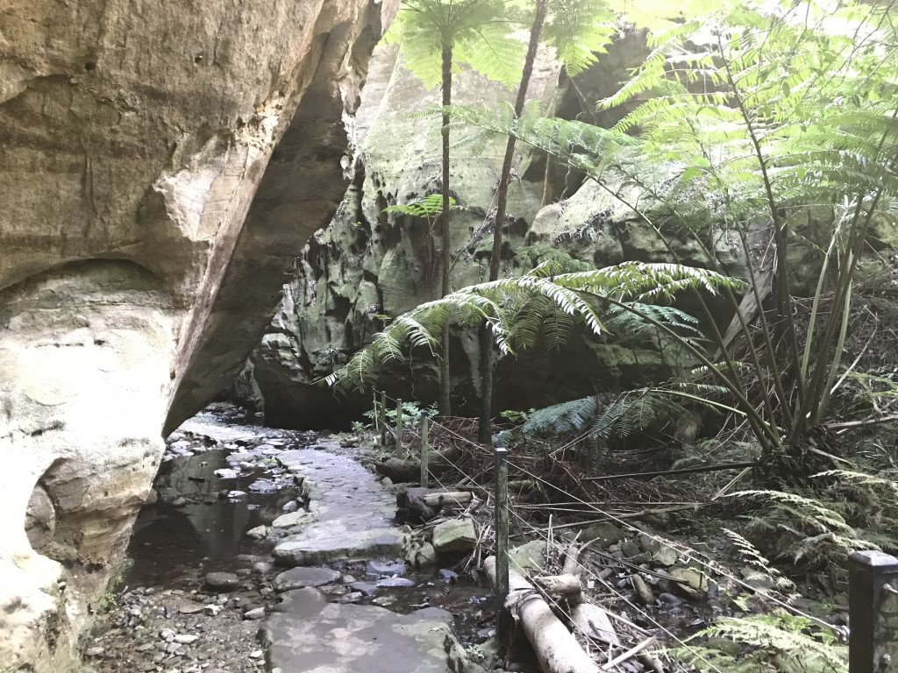

The final stop for us that day was Art Gallery, which was another aboriginal rock art site
(and much more impressive then Baloon cave.)

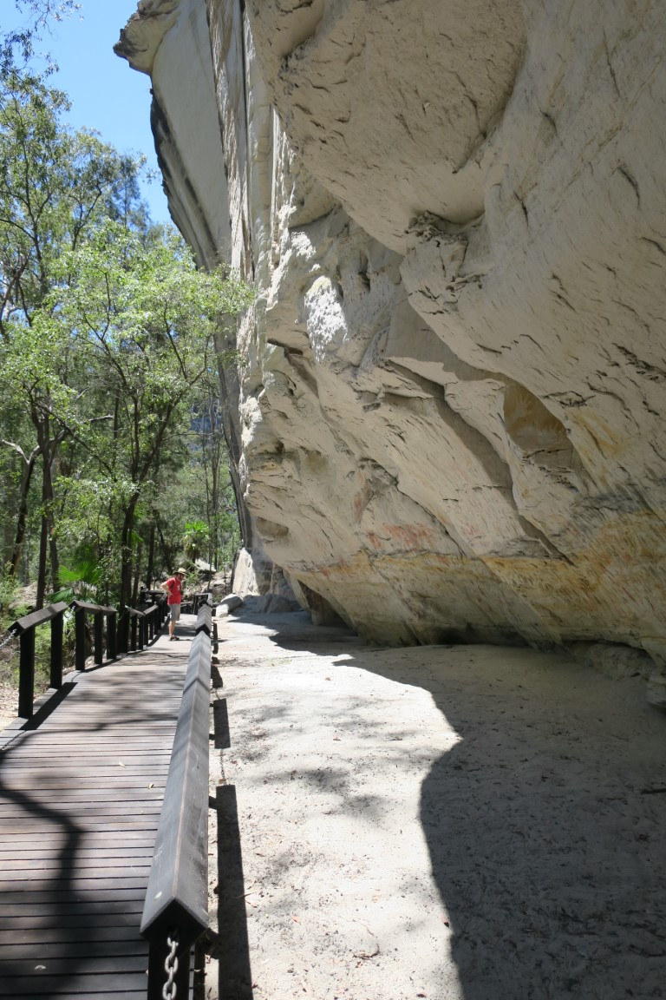

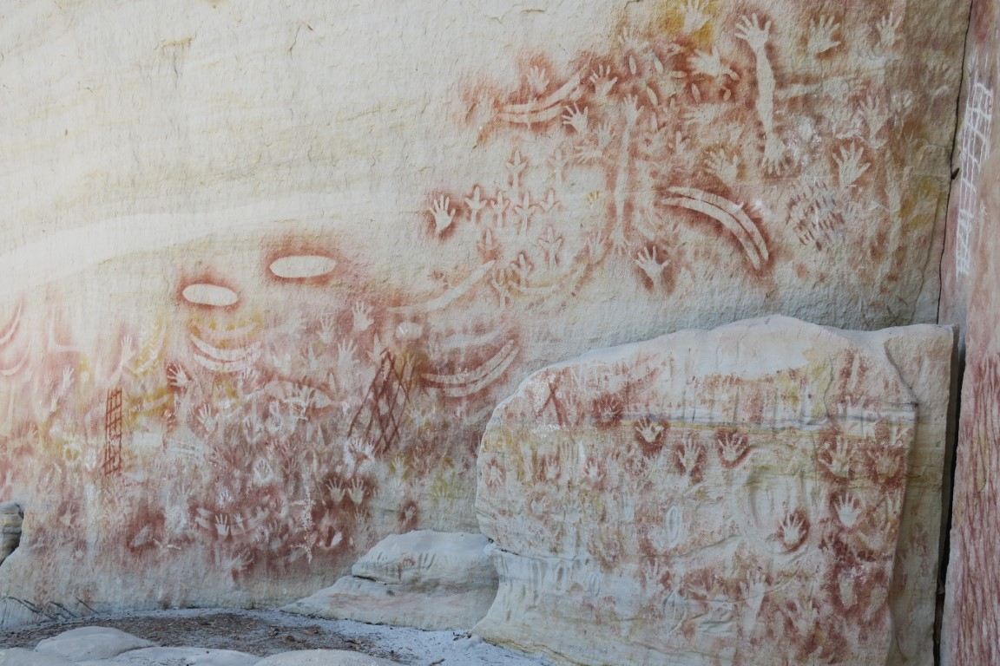

By the time we turned around and walked back to the car we were buggered!