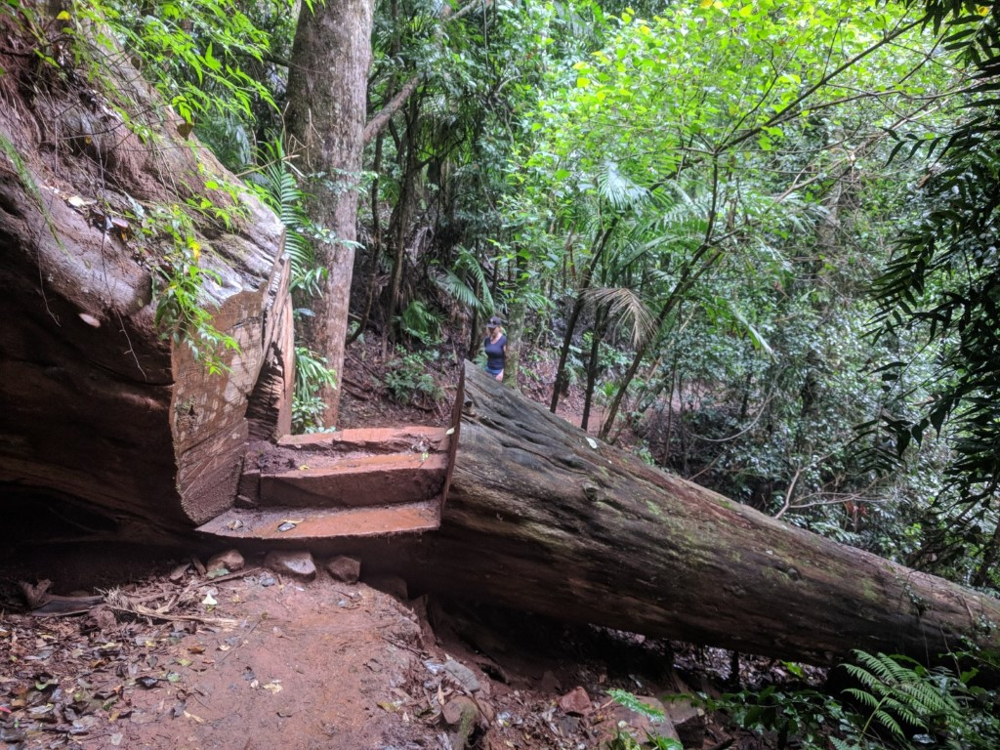
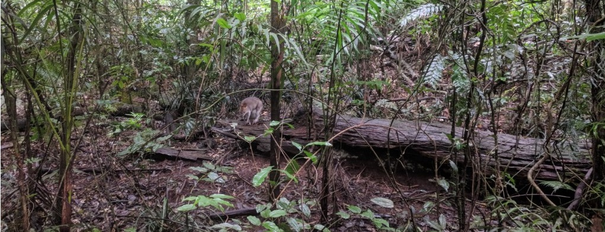
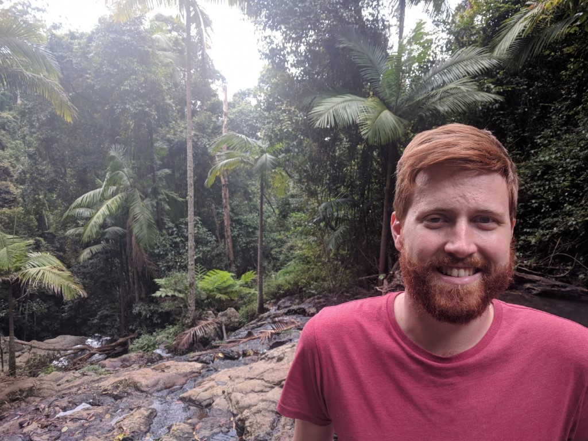
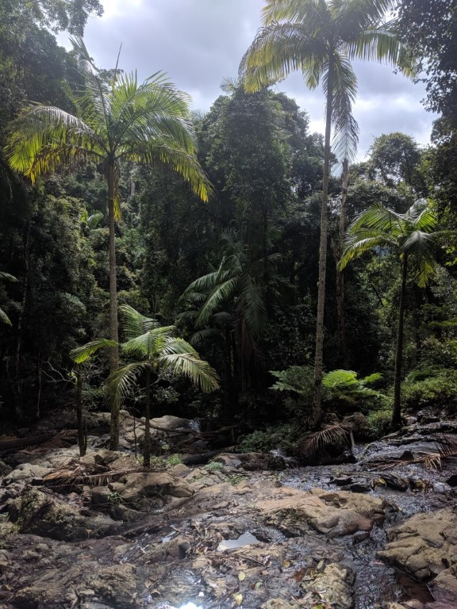
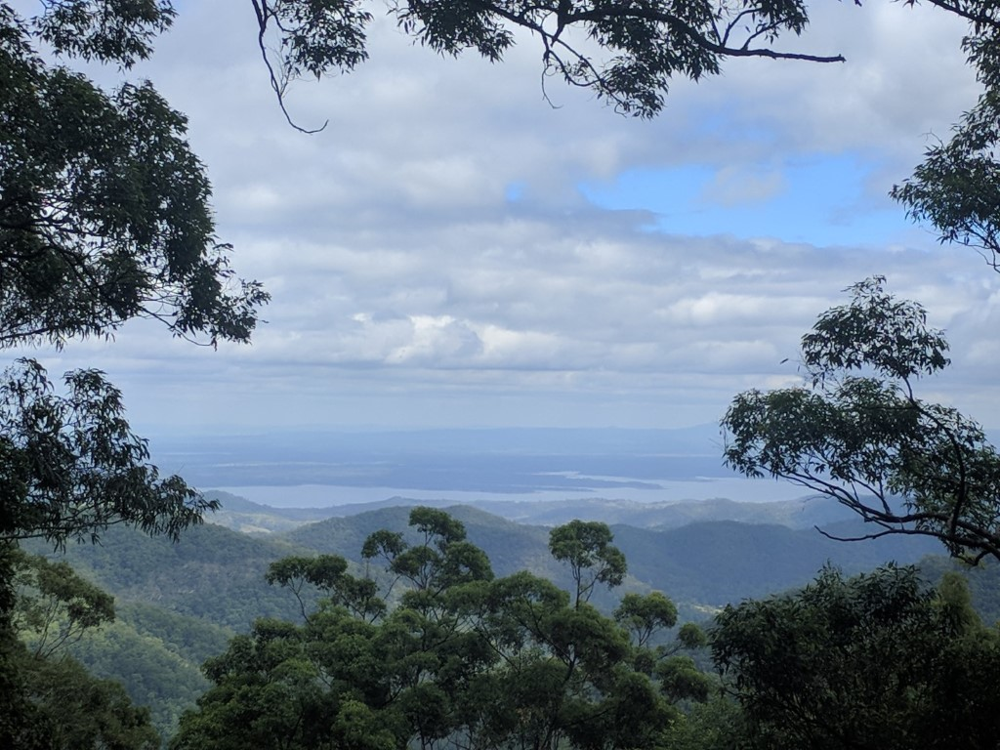
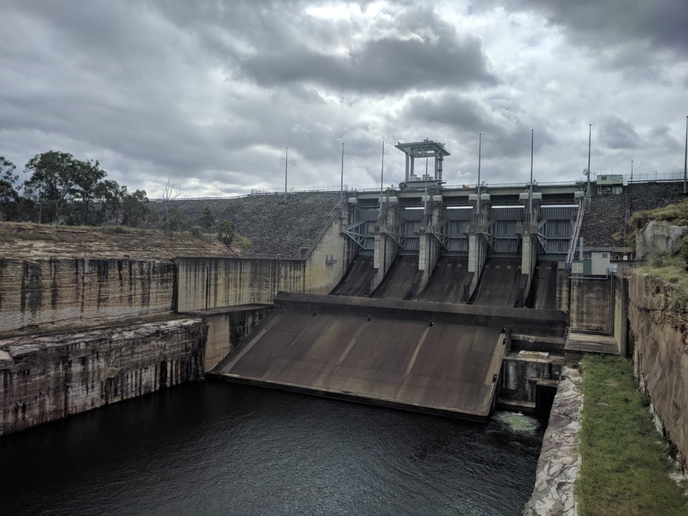
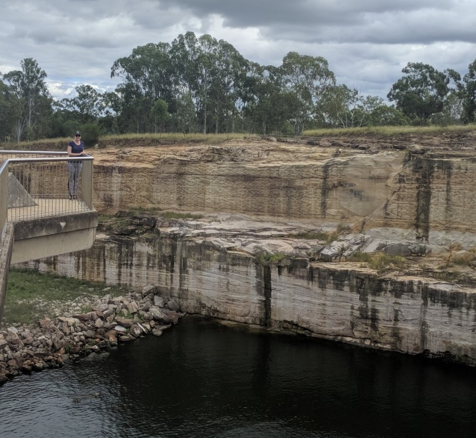
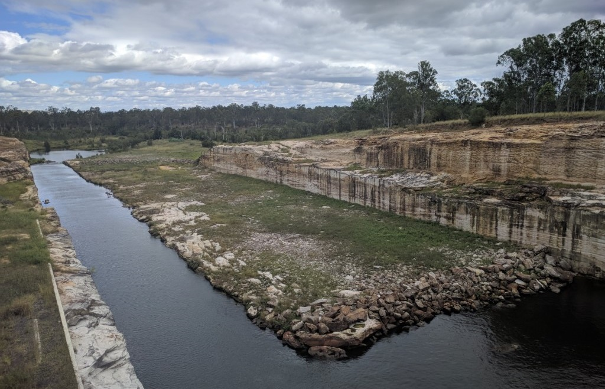

---
categories:
- Travel
type: post
date: '2018-04-22 00:00:00+10:00'
featured_image: posts/2018/mount-glorious/walk1.jpg
slug: mount-glorious
tags:
- Queensland
- Mt Glorious
- Wivenhoe
- Dam
title: Mt Glorious
---

We decided to drive home a different way from Brisbane and come back through Mt Glorious (D'Aguilar National Park).
It was a much more scenic drive then going through the city and not much longer from Joyner.

First we did the Maiala walk to Greene’s Falls.

The track to the waterfall was super muddy, but the last bit had a walkway and we even saw a wallaby.

We then drove a bit further to campsite that had a lookout towards Wivenhoe.

Then we went on to Wivenhoe Dam itself. The view from the lower lookout was pretty
cool, and how they had carved the rock was super impressive.

There wasn't much to see from up the top but it would be a good place to go camping and get a kayak.