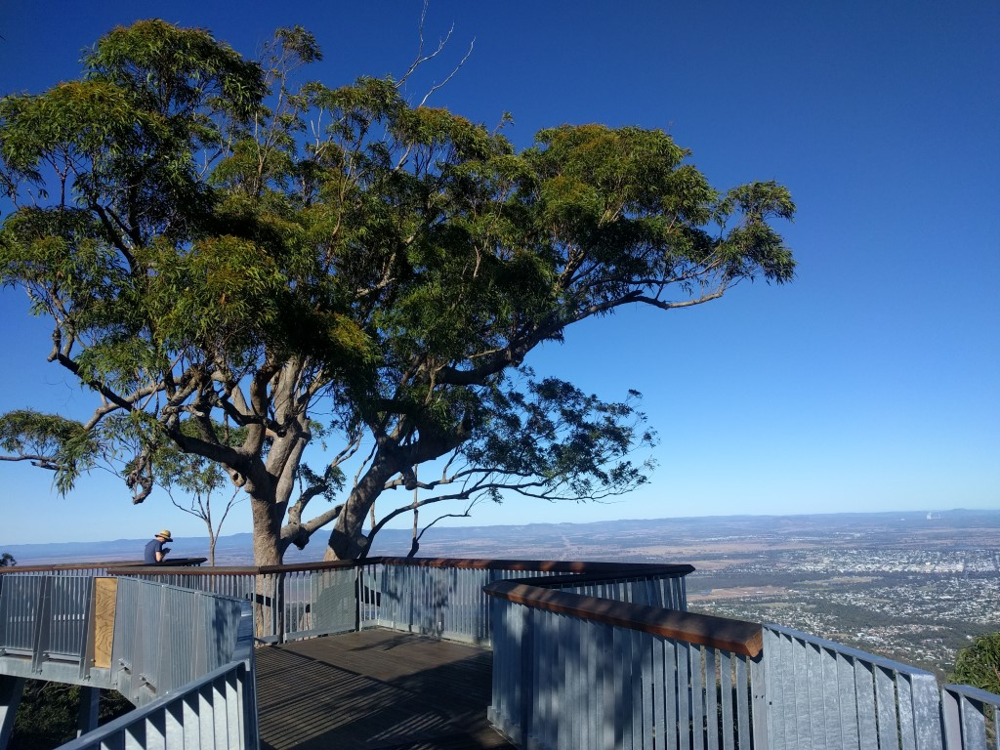
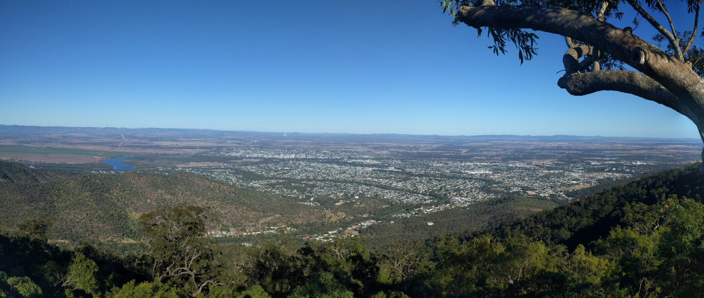
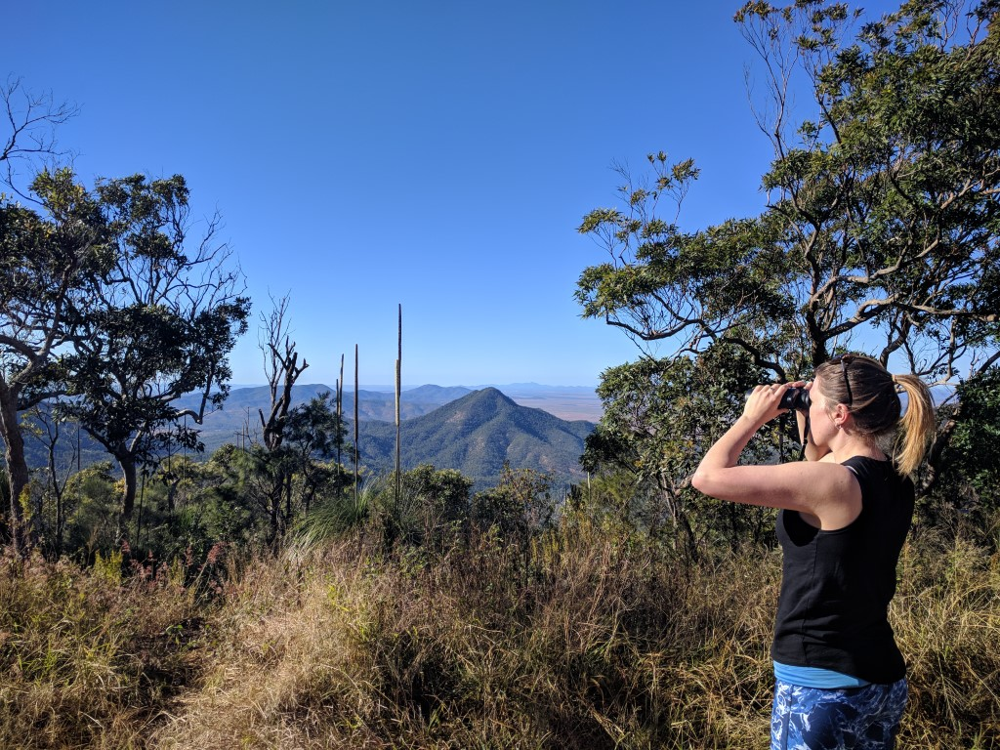
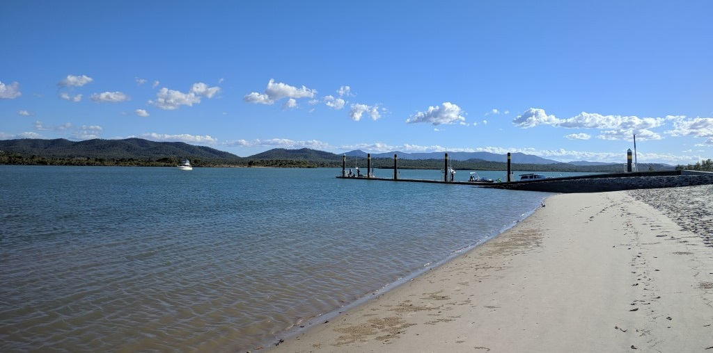
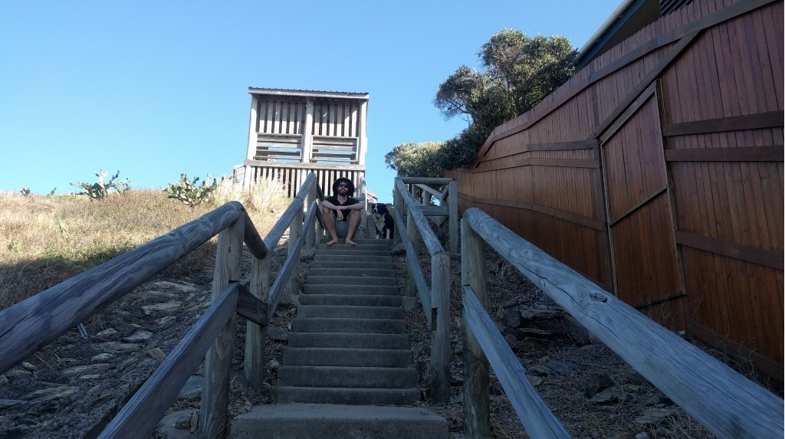
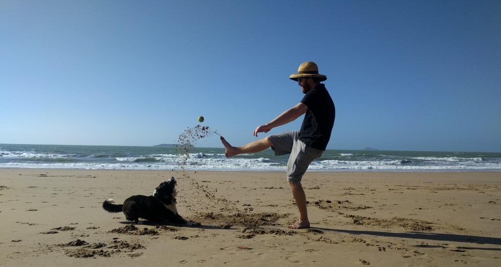
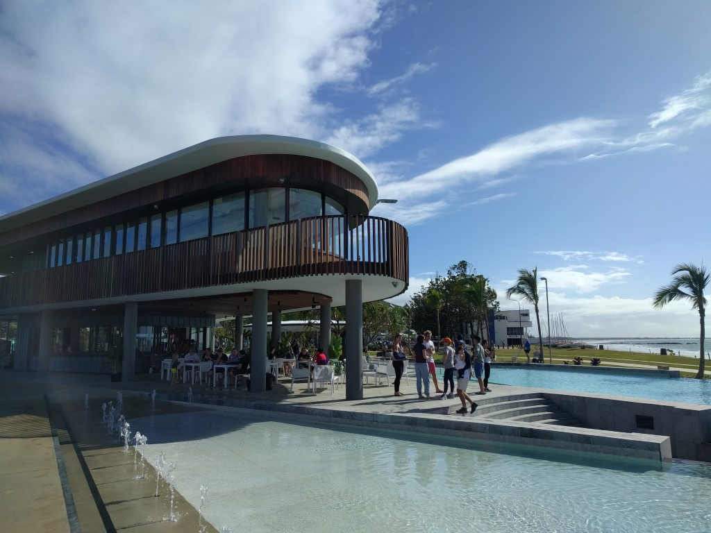
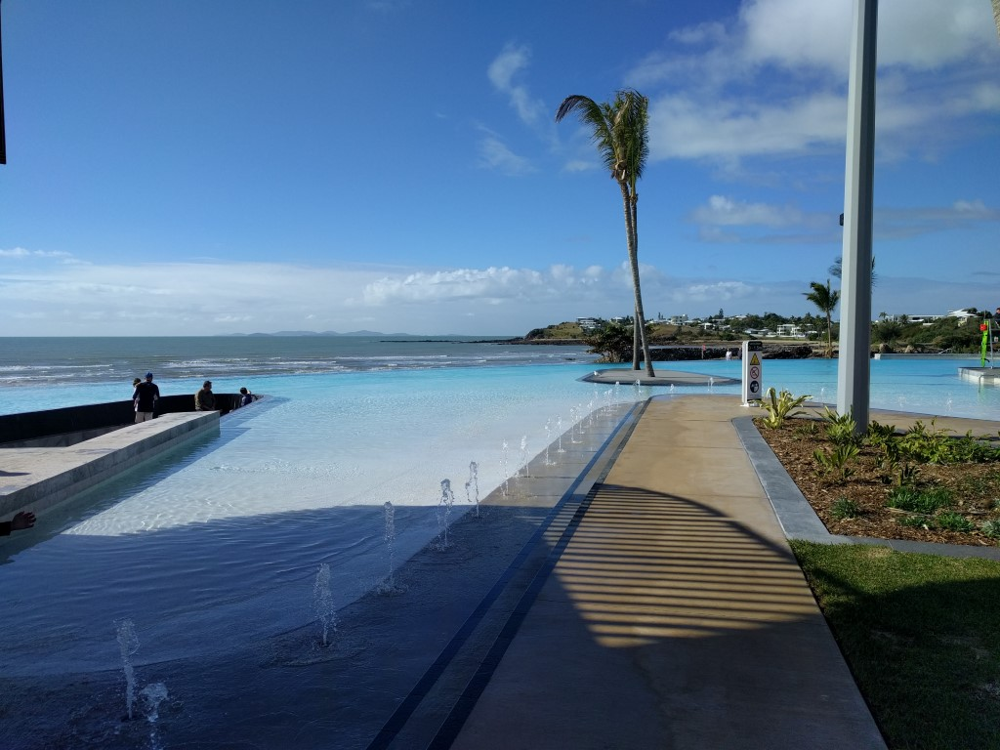

---
categories:
- Travel
date: '2018-06-10'
featured_image: posts/2018/rocky-again/mtarcher1.jpg
slug: rocky-again
tags:
- Queensland
- Rockhampton
- Mt Archer
- Emu Park
- Yeppoon
title: Rocky (again)
---

We were up in Rocky again (for the 4th time this year), this time for my cousin Kate's wedding.
Making the most of our time there, we tried to do more sightseeing.

Firstly, we went and saw the new lookout at Mt Archer.
It had been nice and warm in Rocky compared to Toowoomba, but we went up pretty early in the morning and up the top there was a bitterly cold breeze like we get in Tbah. Rachael was pretty keen to get back to the car and not look for too long.

I remembered the view west of the city, but forgot that you could see the ocean clearly when looking to the east.

Rachael had never been to Coorooman Ck, so we went for a drive there the next day. Although there isn't much to do if you aren't putting in a boat to go fishing.

Since we were staying at the beach, we also wanted to do the Kemp Bluff track. We tried to do it in the afternoon but we forgot that it is National Park and we had Mia, so went to the Causeway instead. There were plenty of other people walking their dogs when we went this next morning - despite all the signs. It was a much busier track then I rememebered, and we saw lots of turtles from the lookout.

We took Mia to a bit of a hidden beach that we always called "the beach with the steps" as kids. I looked it up and it's apparently named [Arthur Pt Beach](https://beachsafe.org.au/beach/qld/rockhampton/emu-park/arthur-point).

The wedding itself was at Rosyln Bay and was great and it was really nice to catch up with all the family. We did the [Yeppoon parkrun](http://www.parkrun.com.au/yeppoon/) the next morning which was a bit rough, but a really nice course (and we knew the organisers).

The Lagoon has opened at Yeppoon now and was pretty awesome.

