---
categories:
- Travel
date: '2018-10-14'
featured_image: posts/2018/takarakka/platapus.jpg
slug: takarakka
tags:
- Queensland
- Carnarvon Gorge
- Takarakka
- Baloon Cave
- Mickey Creek
- Bullimba Bluff
title: Carnarvon Gorge - Takarakka
series:
- Carnarvon
---

I'd always wanted to go to Carnarvon Gorge when I lived in Rocky, but never quite got there because it's a fair way inland.
We worked out though that it's actually not that much further (2.5hrs or so) from Toowoomba.
It really is in the middle of nowhere though, the closest fuel (and shops) are at Injune and Rolleston.

On the drive in you pass through Bandana Station which had a bunch of cattle on the road, but we also saw a few Bustards and Emu's.
I don't think I'd seen a Bustard in the wild before (they are pretty huge) and haven't seen Emu's in the wild since Emu Park still had them when we were kids.

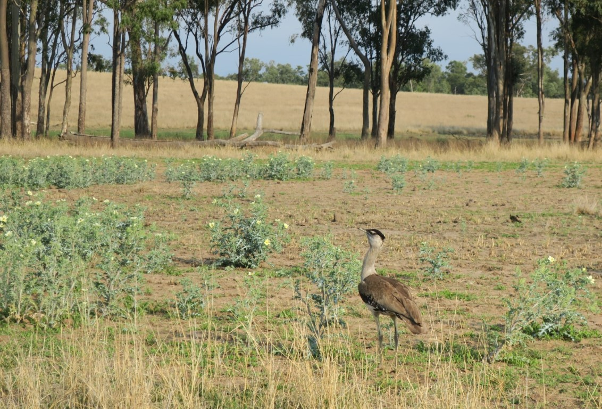

Watching the emus squat under this barbe wire fence to get a way from us was a strange site.

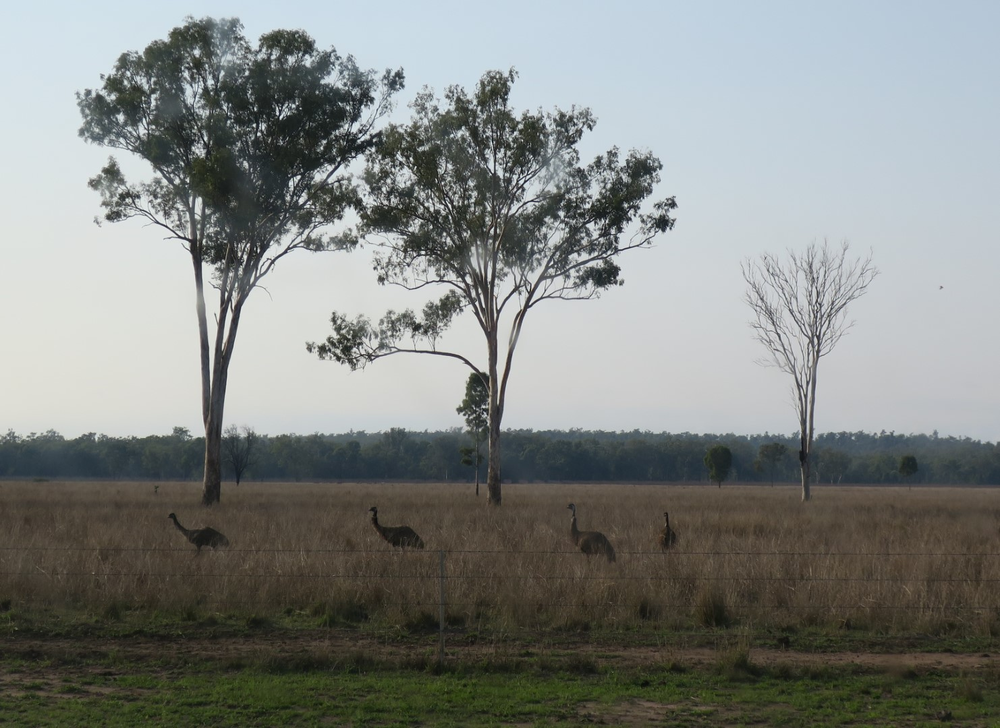

The caravan park was pretty good, can recommend staying at Takarakka.
They had good camp kitchen and facilities, and there was heaps of wildlife.

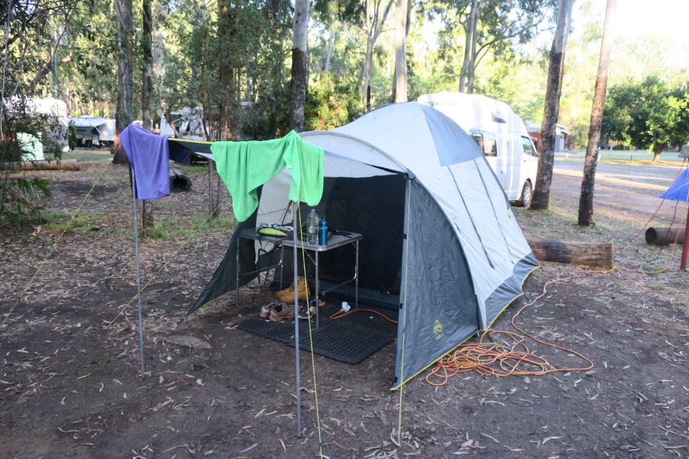

We also did the roast dinner that they put on one night which was pretty good.

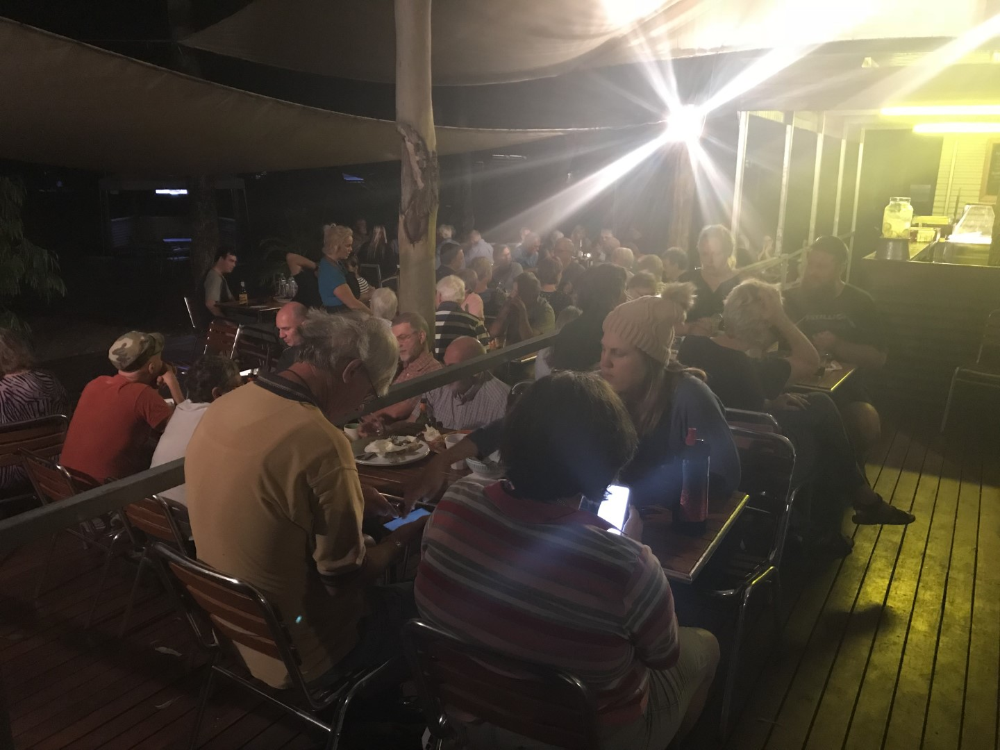

They have 2 resident platapus and we saw a bunch of echidna's and a Bettong (kangaroo-rat).

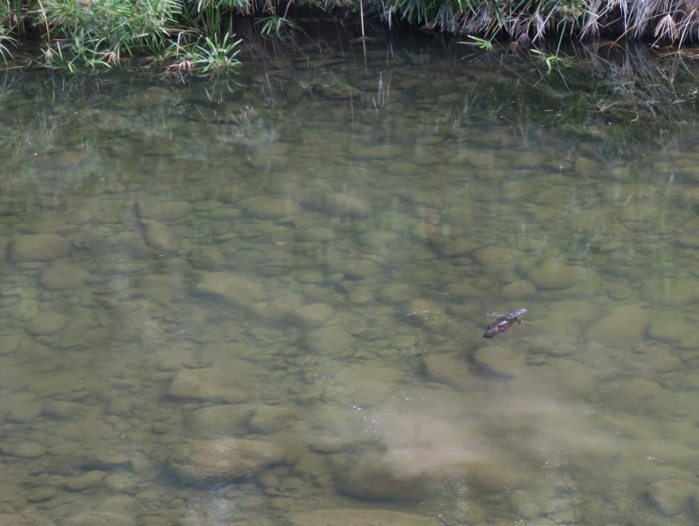

")

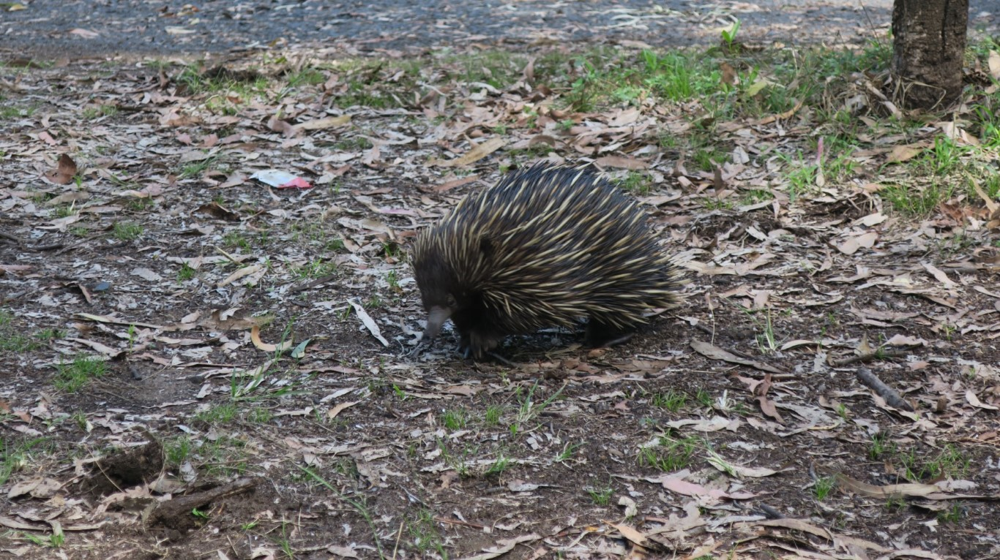

On the first day, we did some of the easier walks.
Baloon cave was a short walk and had some aboriginal rock art (although not really a cave).

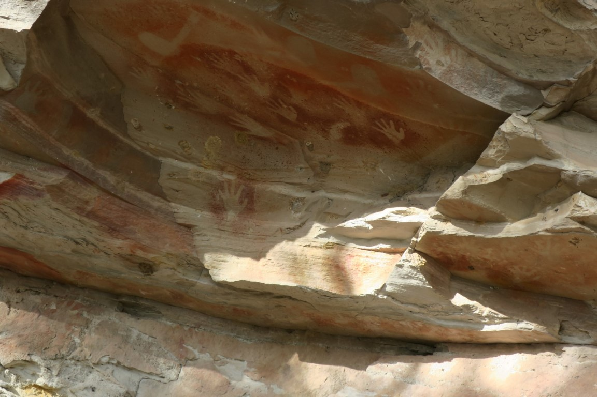

Mickey Creek Gorge was awesome and probably one of the highlights.
The 'formed' path stops well before the gorge itself, but it gets better the further you keep going.

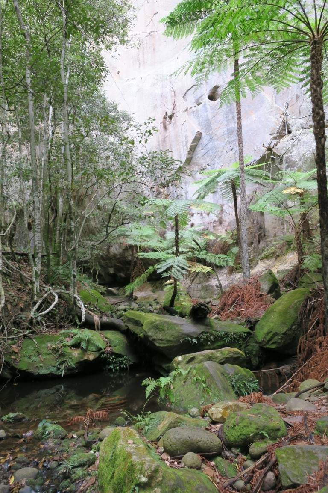

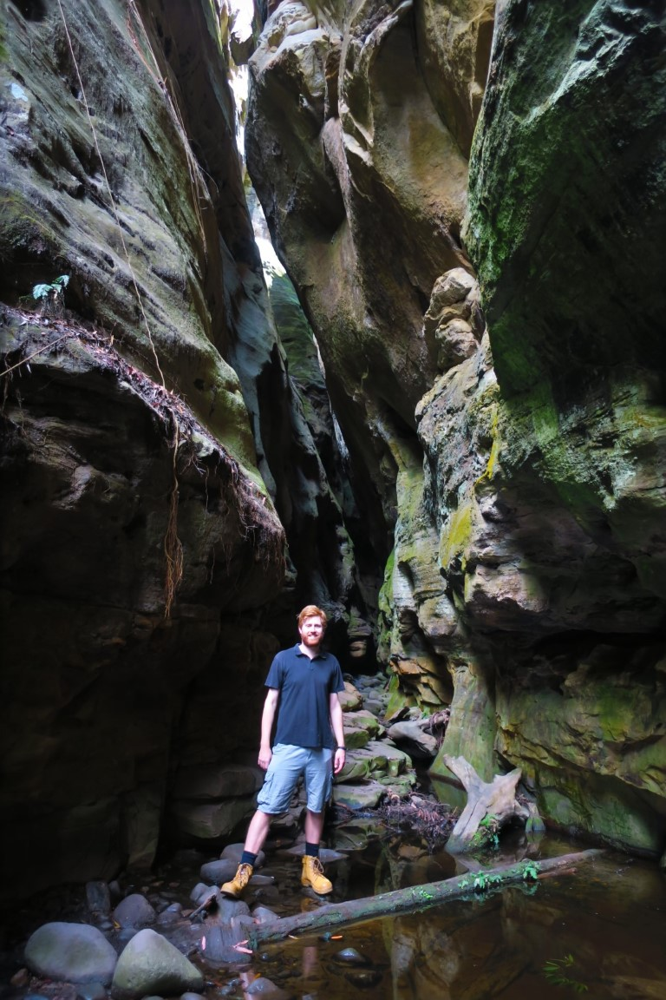

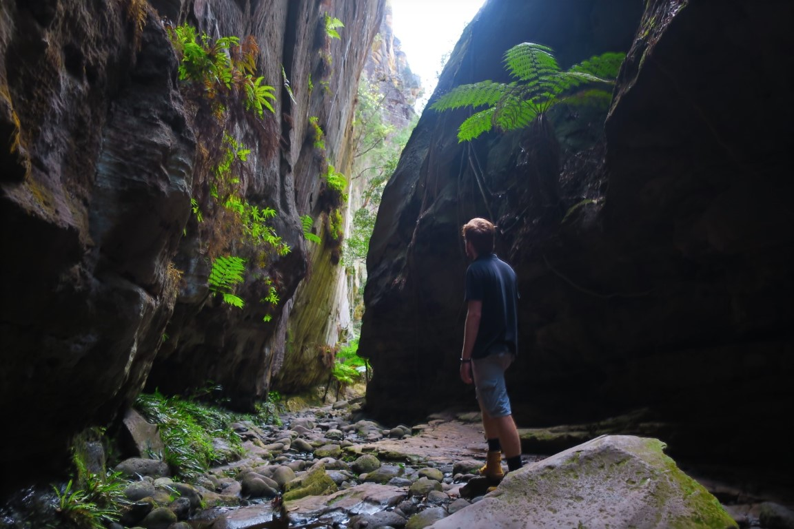

We then went down to the visitor centre where they have a 3D model of the gorge.

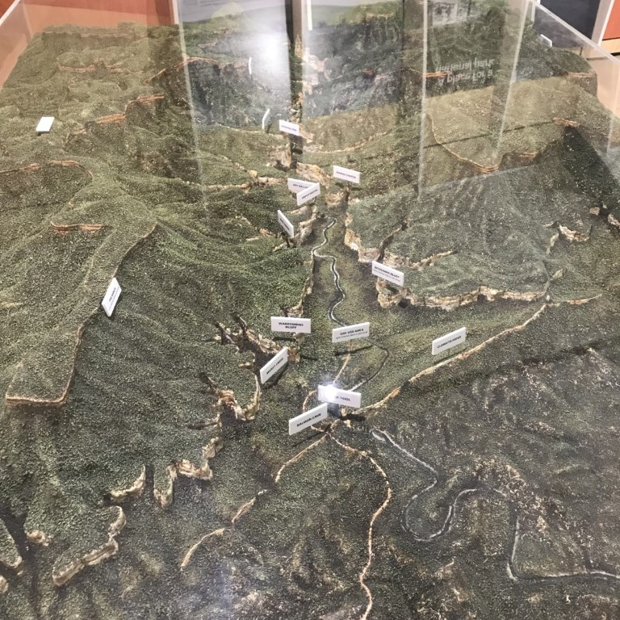

We did the short nature walk which runs along the creek and loops back to the car park.

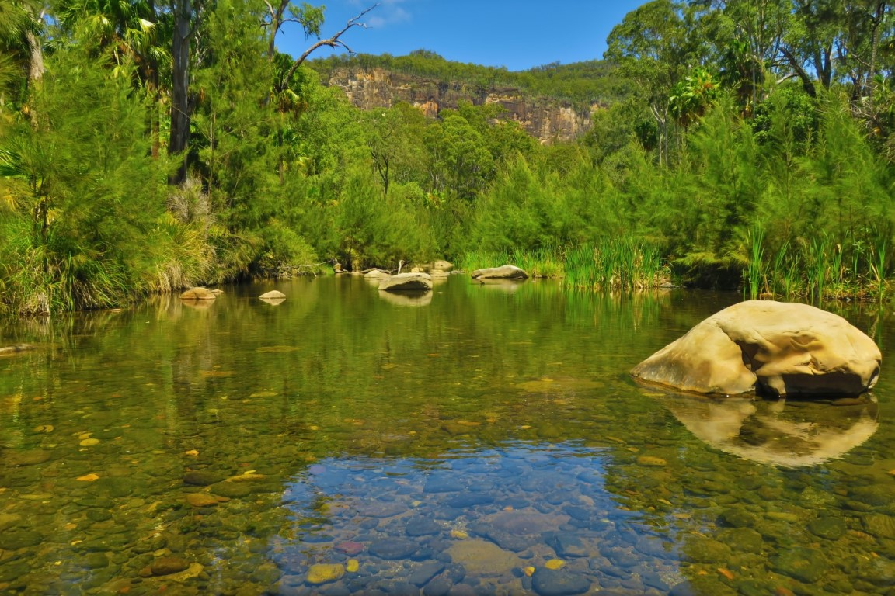

We went to Rock Pool for a dip, but the water was a bit too cold so we didn't stay long and went back to the Caravan Park for lunch.
After lunch, Rachael and I drove back and did the hike up Bullimba Bluff.
There was a bunch of steps and the elevation was pretty intense, but only took a bit over 2 hours or so return and the views from the top were pretty spectacular and well worth the effort.

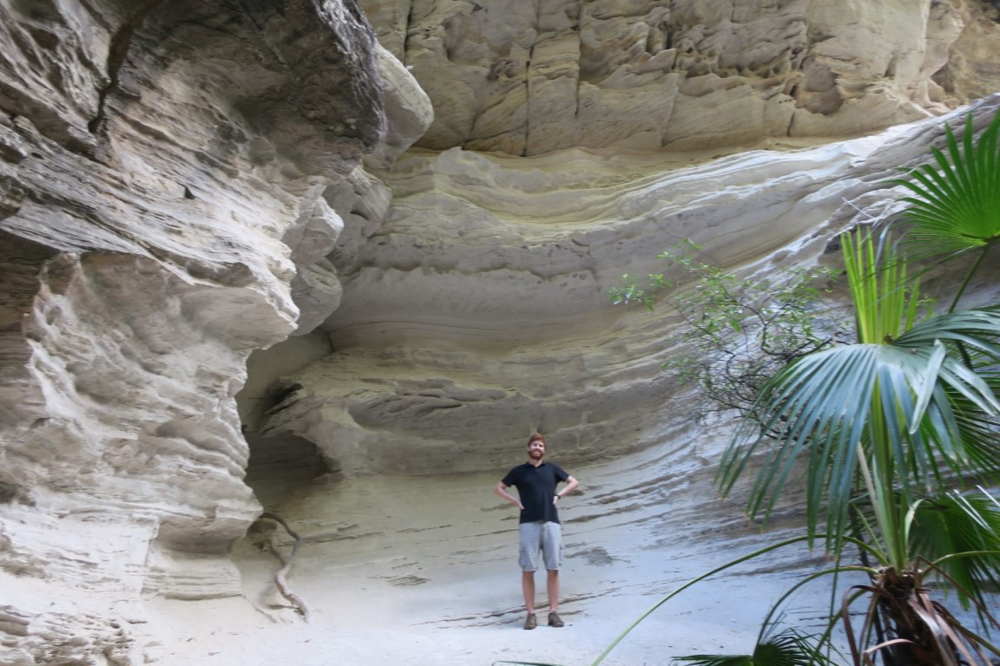

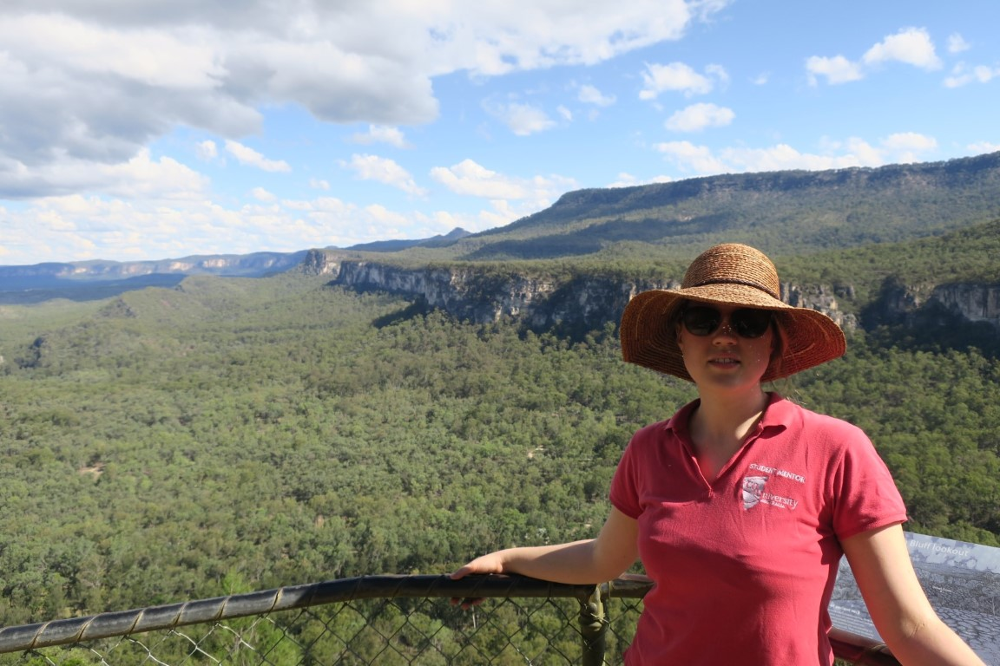

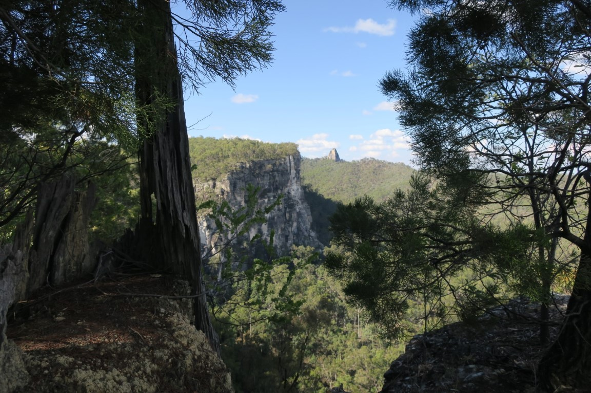