+++
title = "Carnarvon Gorge - Upper Gorge"
date = "2018-10-17"
slug = "upper-gorge"
type = "post"

[taxonomies]
categories = [ "Travel",]
tags = [ "Queensland",]
series = [ "Carnarvon",]

[extra]
image = "posts/2018/upper-gorge/creek1.jpg"

+++

On our last day we set straight out to the end of the walking track to Big Bend.
When you are not doing the side tracks it doesn't actually take that long
[11km and took 2 hours](https://www.strava.com/activities/1907628547)
although is still a massive distance and so we were pretty tired by the time we got to the end for a break.

The actual walk itself was great, with lots of different creek crossings and scenery.

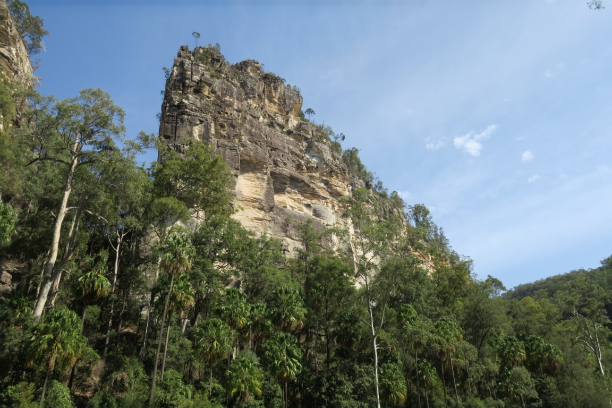

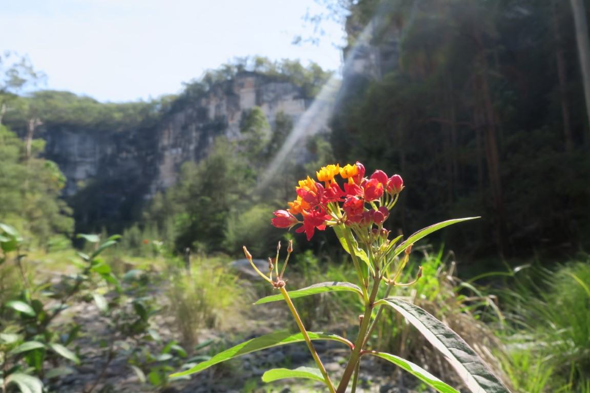

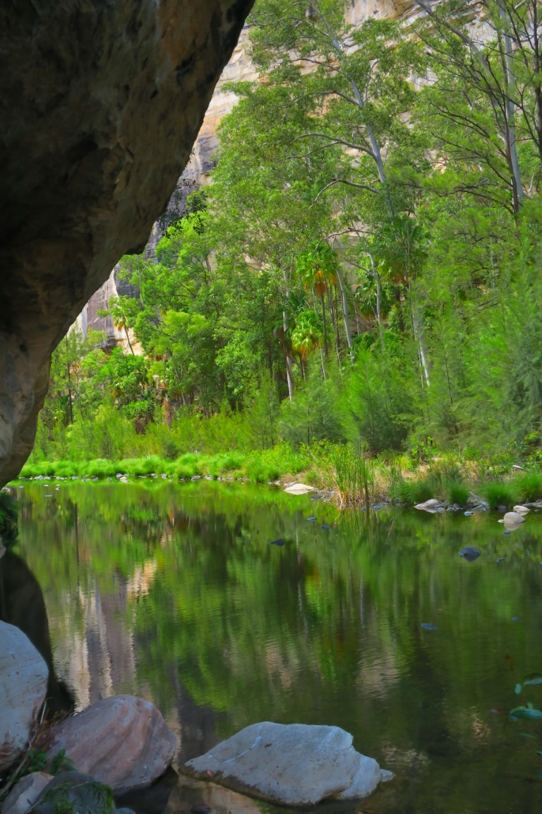

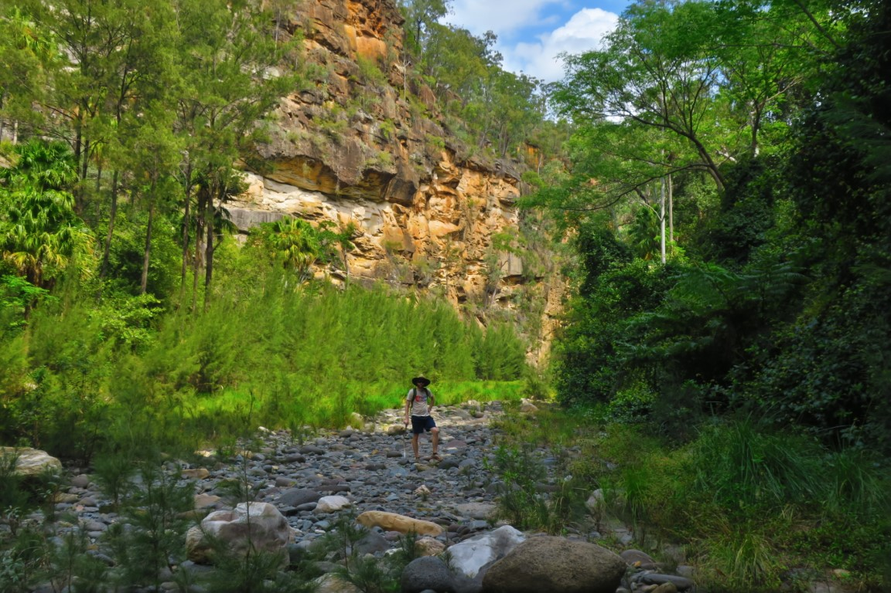

Big Bend is the first overnight stop when you are doing the 5 day hike.
Looking at the map, the creek itself actually keeps going for ages but there is no track past Big Band.

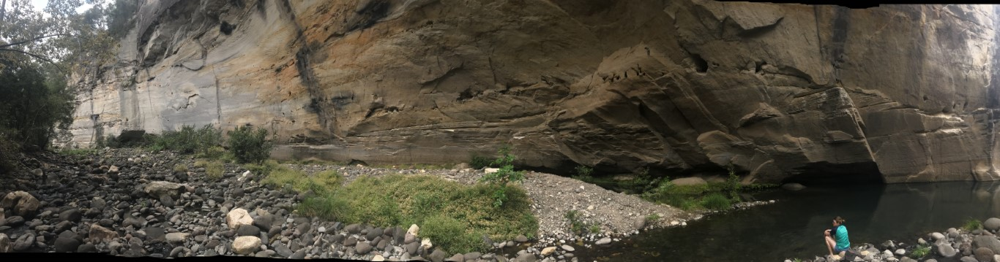

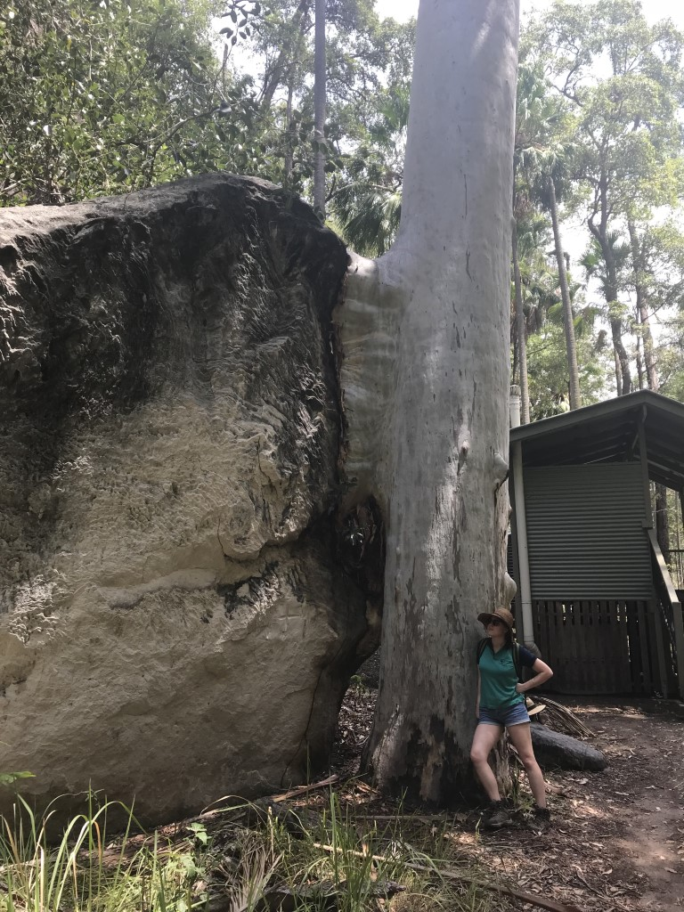

If you are doing the overnight hike, you then go into Boowinda Gorge which takes you all the way up to Battleship Spur.
We went up the gorge for a few hundred meters (which is apparently the best bit anyway).
It was much wider then Mitchell Creek gorge and must just have torrents of water during heavy rain to have calved out like it did.

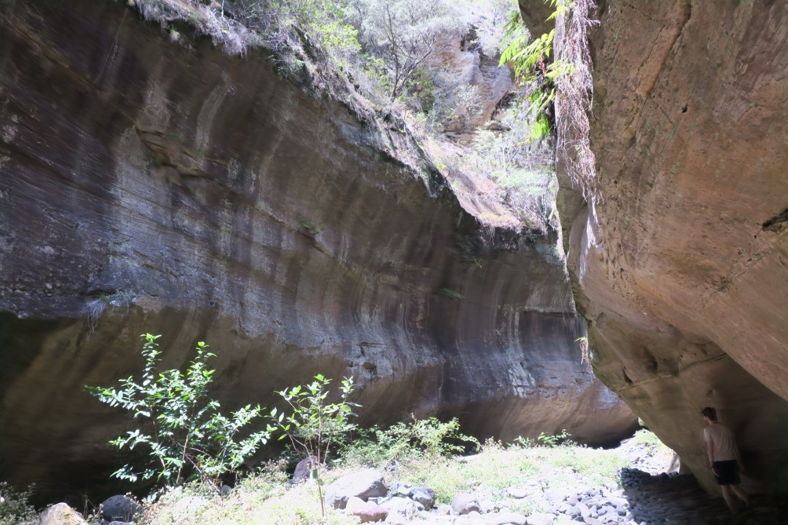

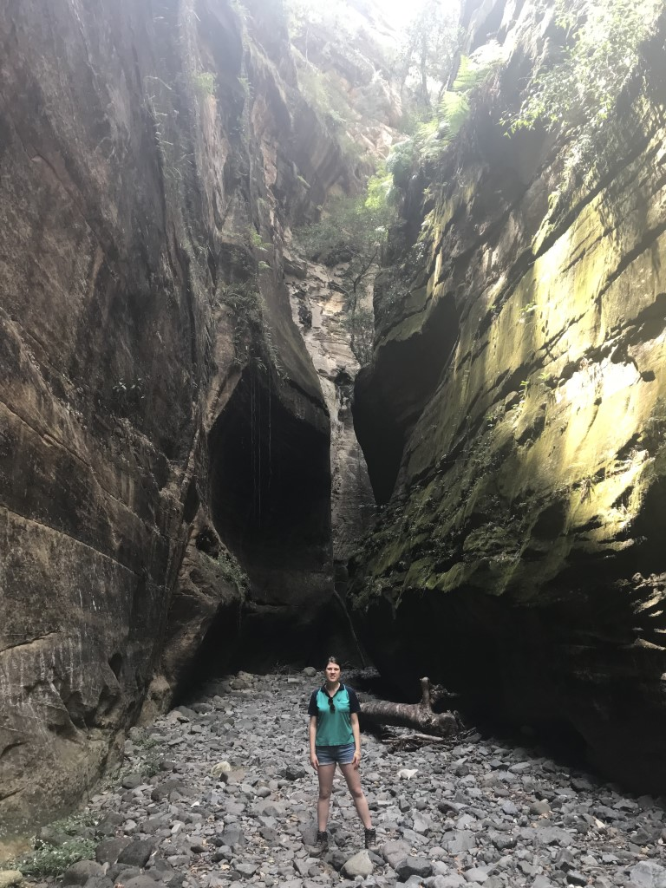

Just off the track towards the end was Cathedral Cave (another aboriginal rock art site).

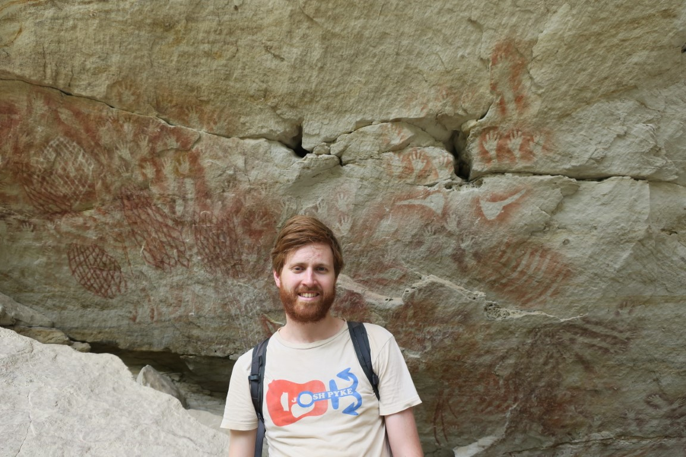

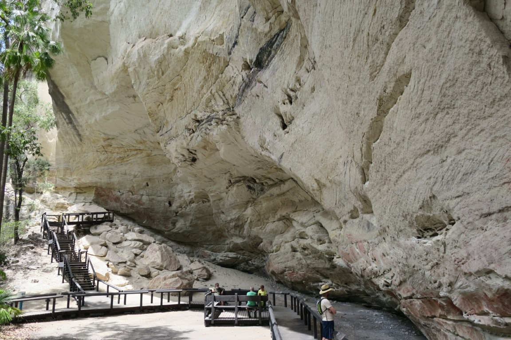

We then had an 11km walk back the other way!
It got pretty hot by lunch time so we popped quickly back into Ampitheatre to cool down on the way back also.

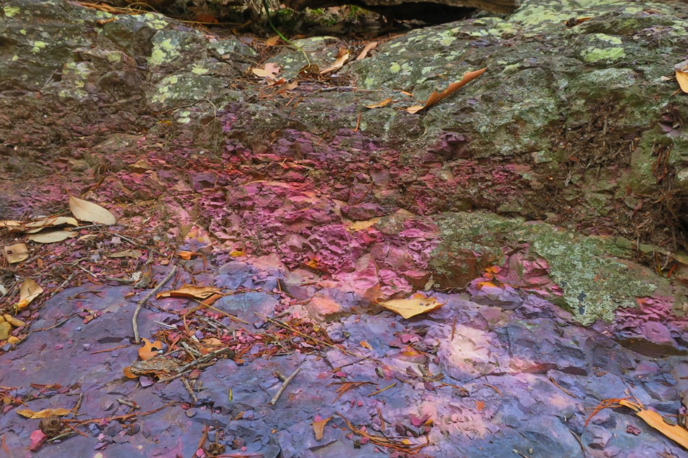

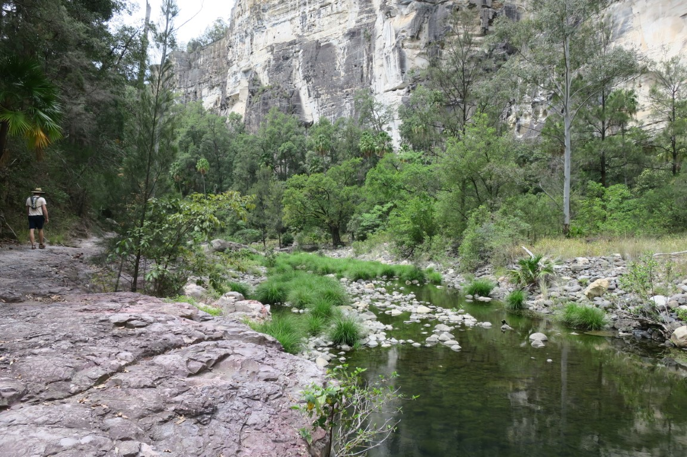

All and all we had great weather and had an awesome time.

On the way home we made a quick detour to Mitchell to use the [Great Artesian Spa](https://www.greatartesianspa.com/).
It was no Blue Lagoon, but much cheaper and well worth the detour to split up the drive.