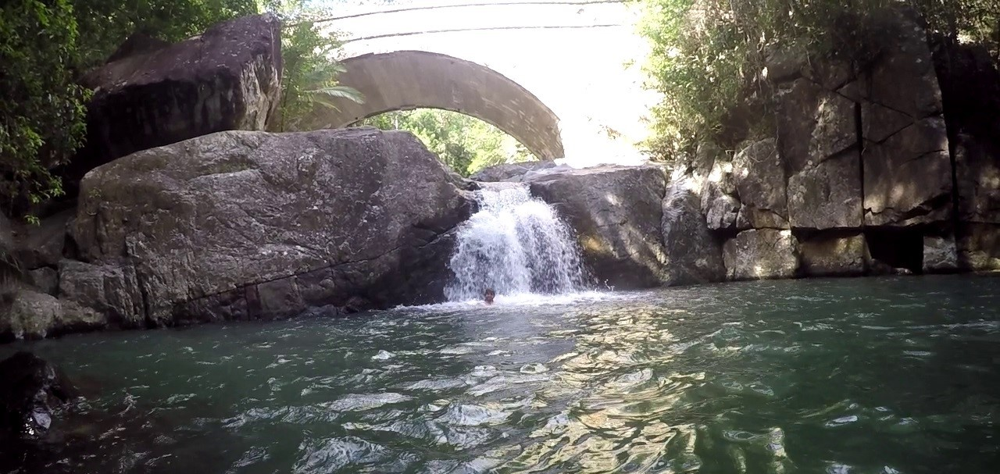
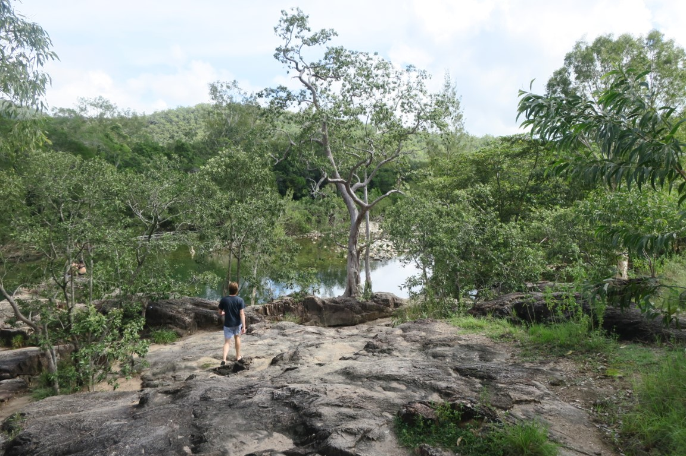
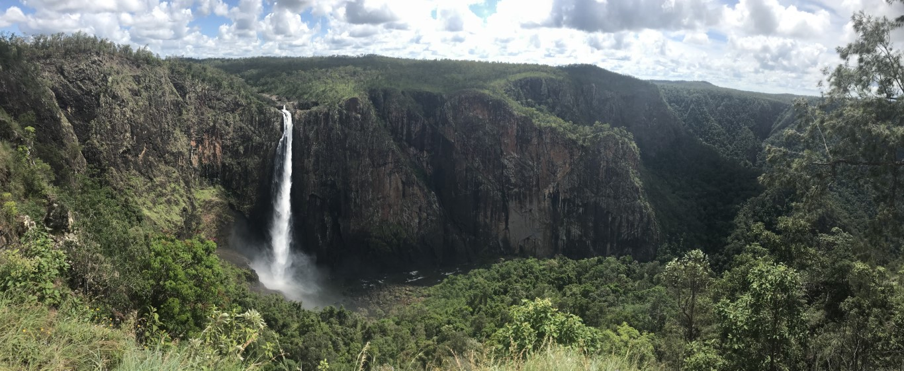
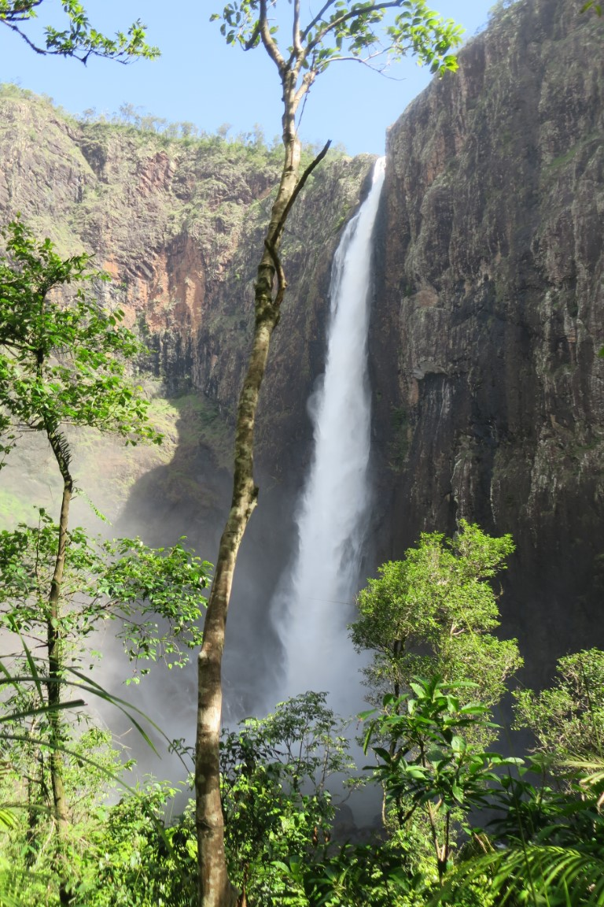

Last time we were in Townsville, we had some friends recommend Crystal Creek but didn't have time to go up there. So we made sure we stopped in on our way past this time. Everything was super green - not surprising after the floods.

Little Crystal Creek was an awesome little spot. The water was a bit cool, but a great little swimming hole. The waterfall was suprisingly strong and hard to swim over to due to the current flowing away from it.

We went to Big Crystal Creek and the waterhole was definitely bigger, but not as nice and a bit stagnant looking in parts.

We did see a sign for something further up called Rockslides and decided to give it a quick look, and it turned out to be the best swimming spot of them all.

We stopped in Ingham for lunch. The information centre was really good and looked out over the massive [Tyto Welands](Tyto Wetlands).

From Ingham we went to visit Wallaman Falls - which after driving up the mountain you actually drive through a fair bit of rainforest. The road takes you to a lookout at the top of the falls.

The [Djinda Hike](https://www.strava.com/activities/2214274453) was signed as pretty intense 2-3 hour hike up and back. So Rachael stayed up the top and read while I went down. About half way down it changes to rainforest due to all the mist that is thrown up from the waterfall into the valley.

It was super impressive and well worth the drive and hike up and down.
