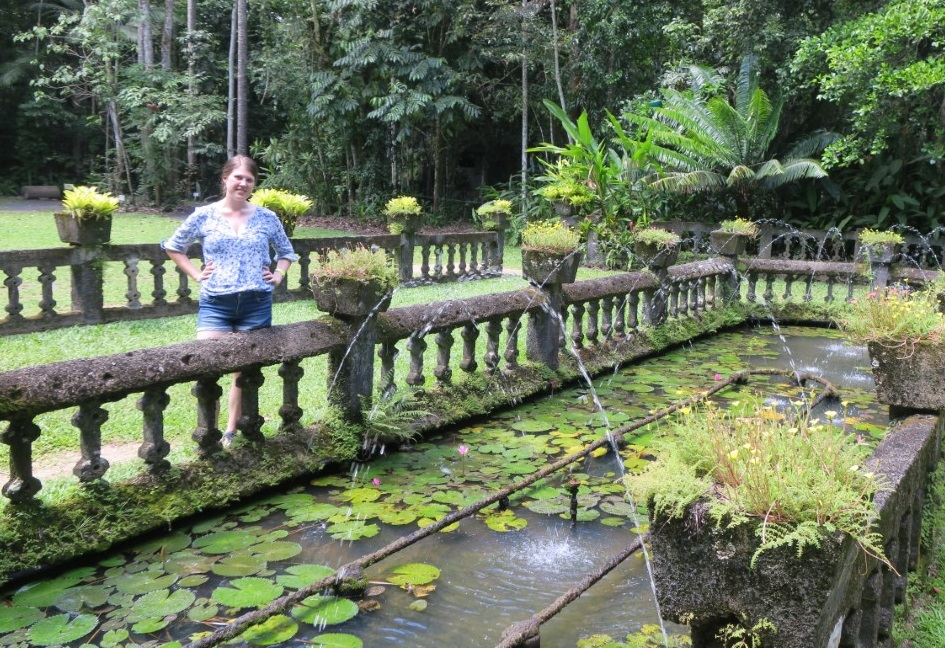
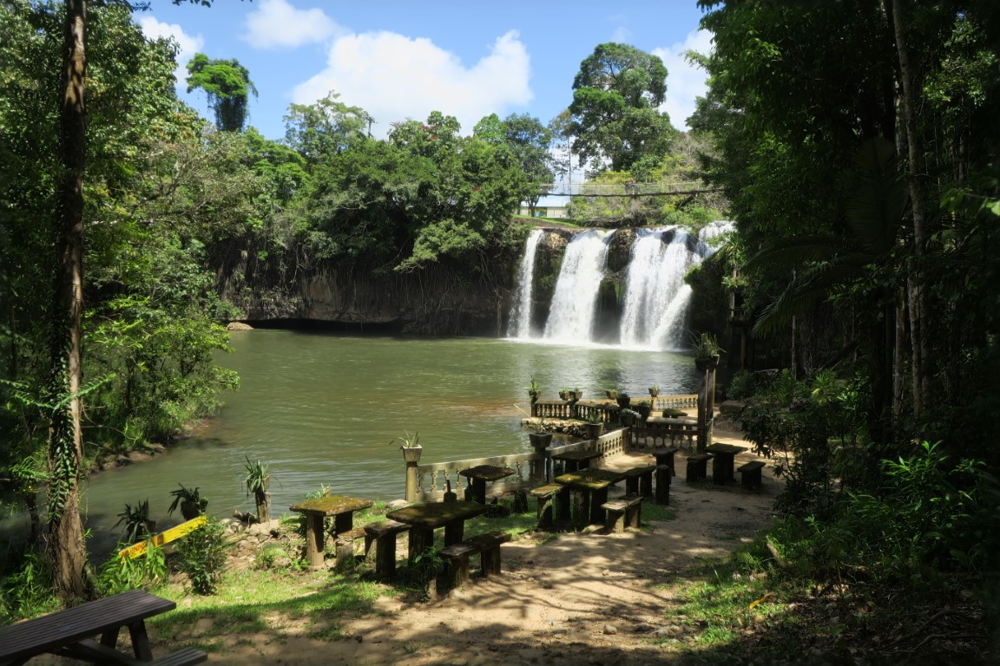
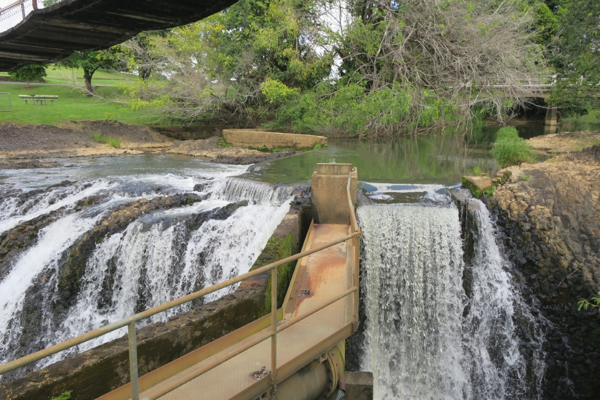
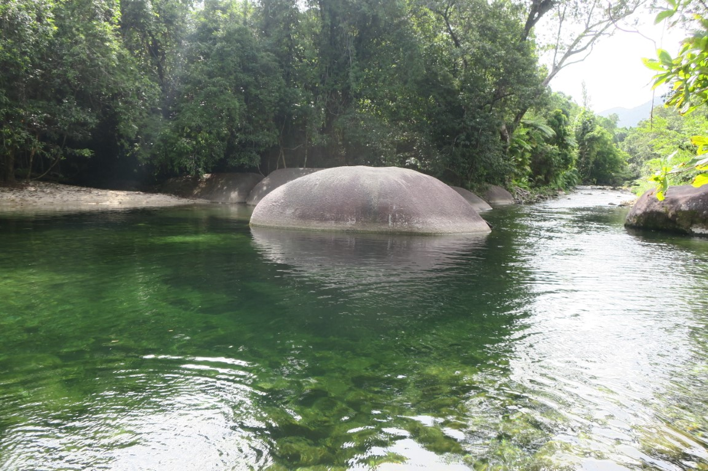
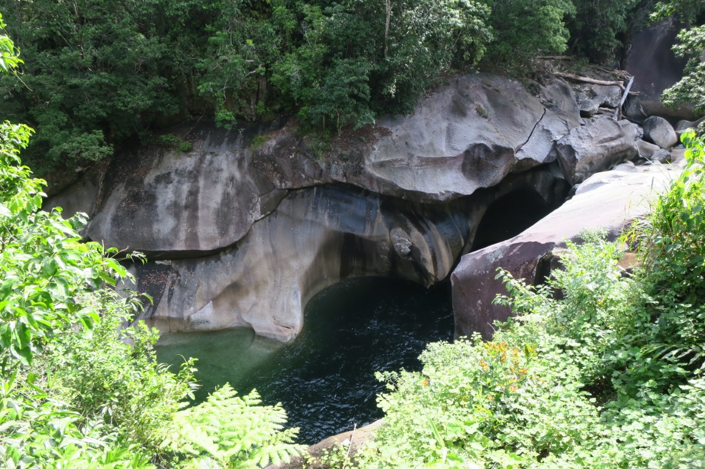

We stayed the night at Cardwell, was a nice little beach town with views of Hinchinbrook Island.
Pretty much everywhere was closed for dinner as apparently it was the "off season" so only had the pub or fish and chip shop to choose from.
There was a resort style section that looked abandonded, not unlike Seaspray at Zilzie.
We had pizzas at the pub and there were pretty good.

In the morning we did [Cardwell ParkRun](https://www.strava.com/activities/2215639214) and it happened to be the first birthday, so we got a free sausage sizzle for breakfast as well. Was a very nice run along the beach but quite hot. After ParkRun there was also people waiting around for the service for [Bismark the Crocodile](https://www.abc.net.au/news/2019-03-07/community-mourns-dead-crocodile-bismark/10875514).

One of the things Rachael was most looking forward to was visiting [Paronella Park](http://www.paronellapark.com.au/).

It was definitely worth visiting, and was particuarly interesting to hear about what it was like when it originally opened.

After Paronella Park we were keen for a swim so went to Josephine Falls. The water was lovely but it was super busy given it was a Saturday.
There was a bunch of people drinking from glass bottles (despite numerous signs about fines) and smoking. There was also a section where you were not allowed which had heaps of people swimming, and one person even had a dog (which didn't look particularly happy to be there). To be fair the waterhole above the waterfall where you were not allowed did look very inviting. I think it would have been much better on a quieter day.

Instead of swimming at Josephine Falls we went a bit further north to Babinda Boulders. It was also busy, but there were a few different sections and we found a quiter one where the water was really nice. It reminded me of Stoney Creek.

There was also a walking track that took you downstream (where you can't swim) which had some really cool waterfalls and rockpools.

