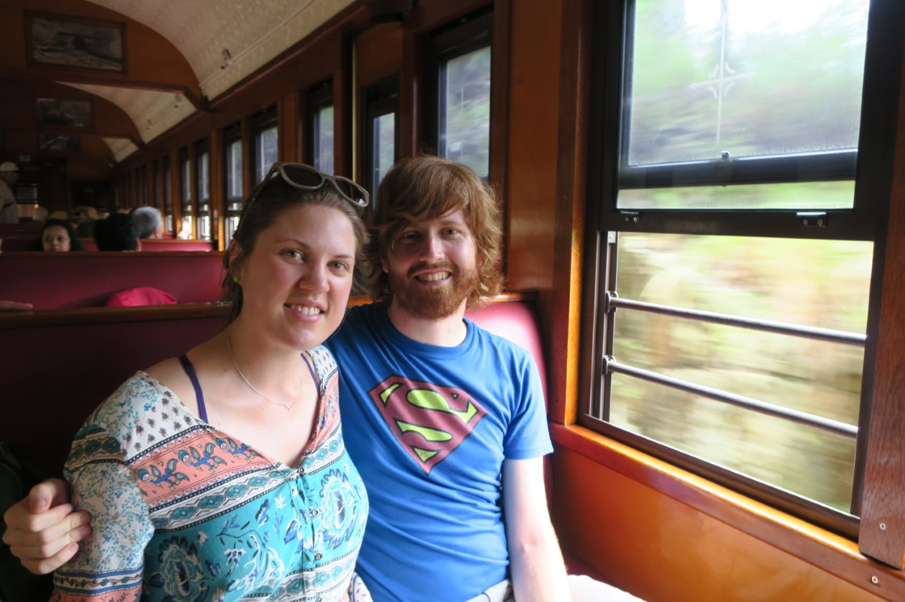
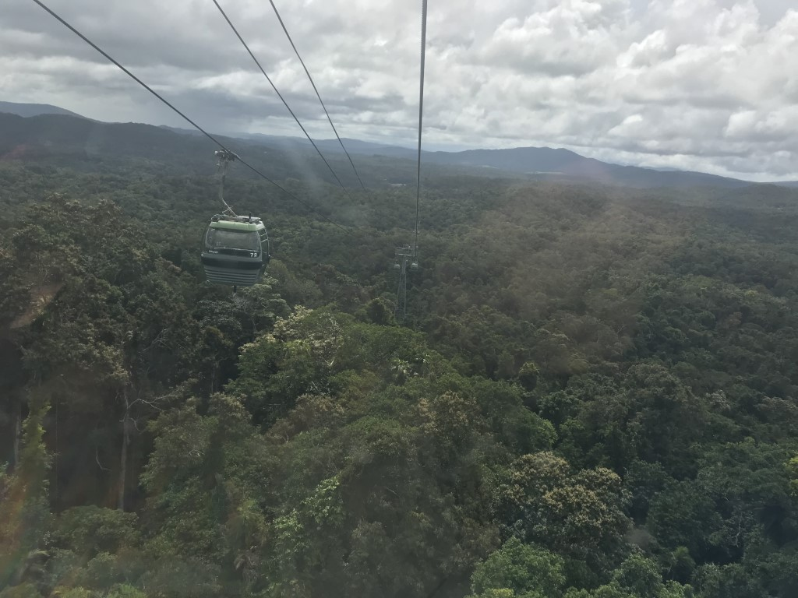
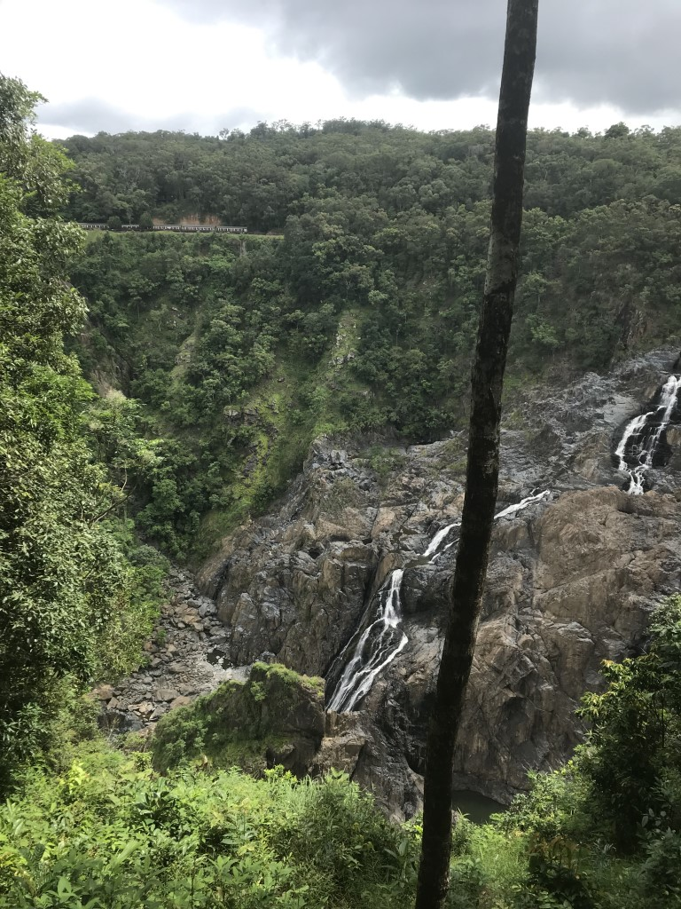
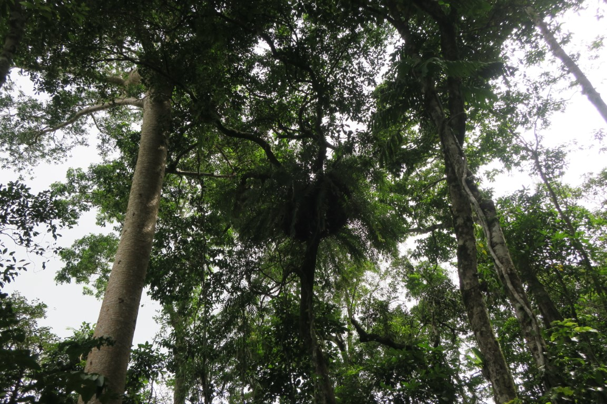

On the Sunday we got the Kuranda Scenic Railway up to visit our friend Jaimee in Kuranda.

Was a slow train, but a nice journey and impressive to think about the effort that was involved in constructing it.

Barron Gorge was a bit disappointing after seeing photos of it in flood about 2 weeks earlier.
But still nice that the train stops for 10mins to have a look.

Kuranda itself was nice, lots of markets and food places.

The Skyrail back was much cooler than the train, as you get to look down on the rainforest.

There was another stop to look at Barron Gorge, which was cooler from the other side as we saw the train come in on it's way back down.

There was a 2nd Skyrail stop where a guide talked about some of the plants along a boardwalk, which was also really good.

At the bottom there was a waterskiing park, which was cool to watch from the Gondola.

That afternoon, Rachael's uncle recommended we visit [St Monica's Cathedral](http://www.cairns.catholic.org.au/documents/peacewindows.html) to see the stained glass windows. They were by far the best stained glass windows I have seen in a church, awesome to see fish and space rather than the typical themes and well worth a visit.

