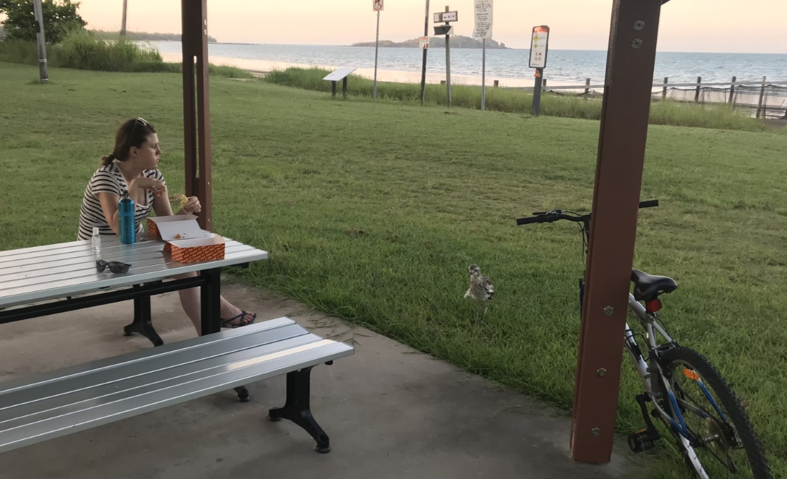
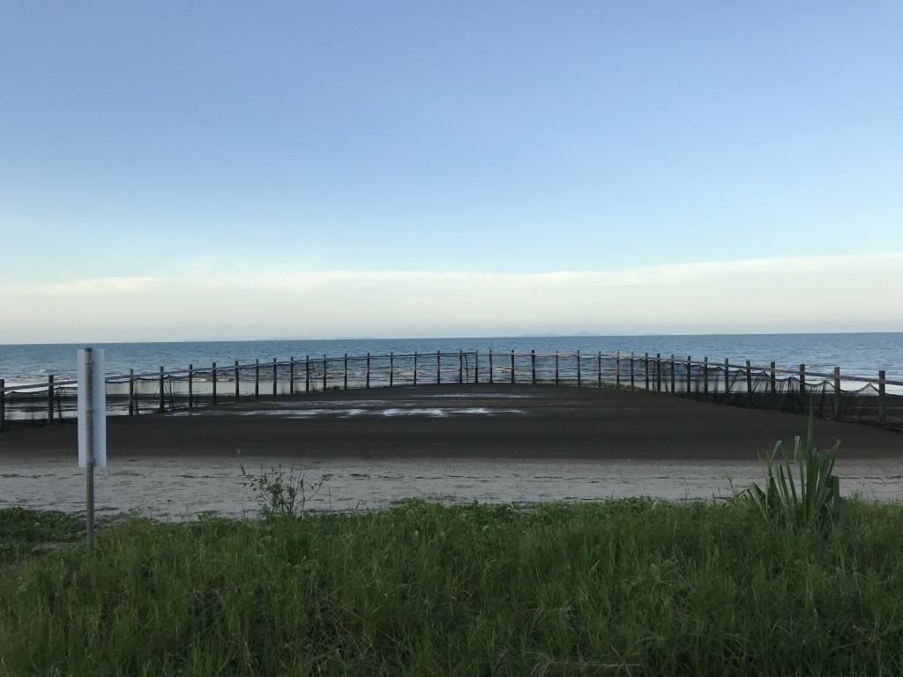
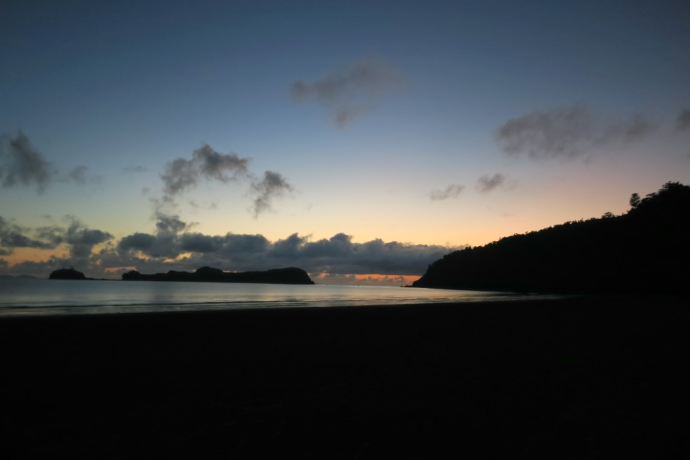
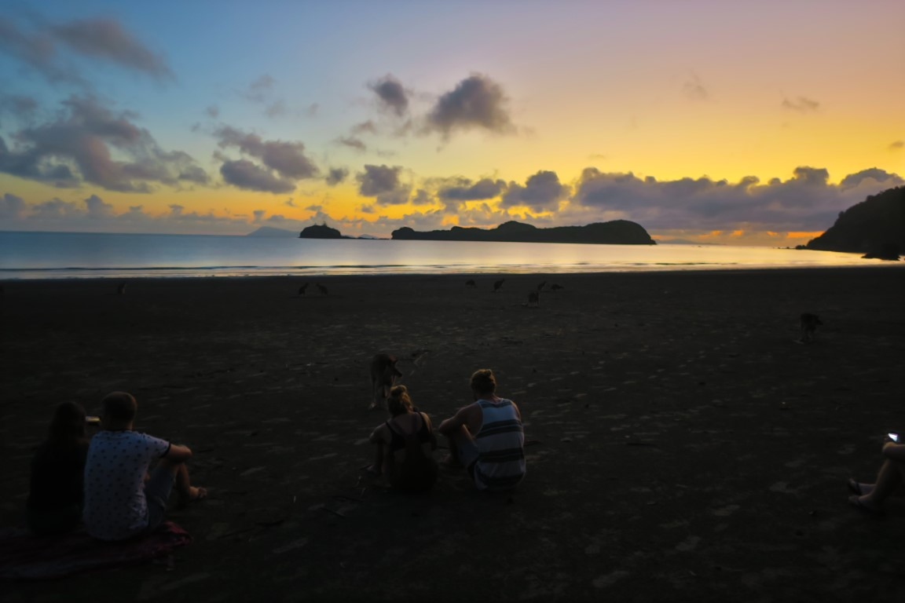
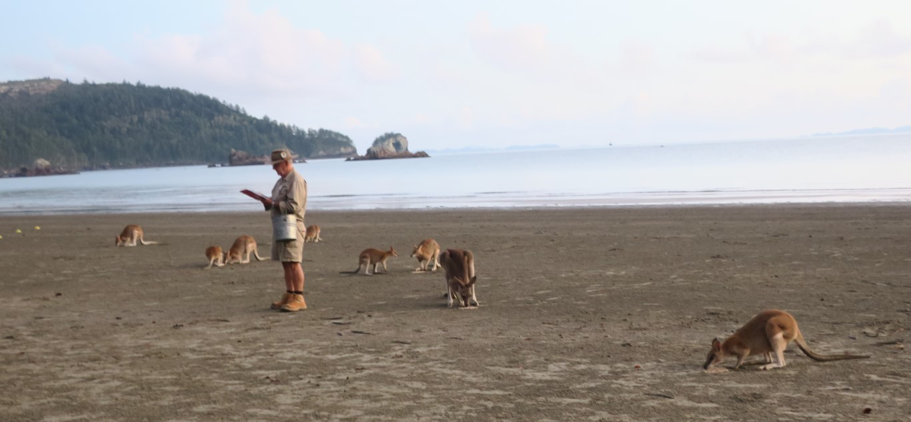
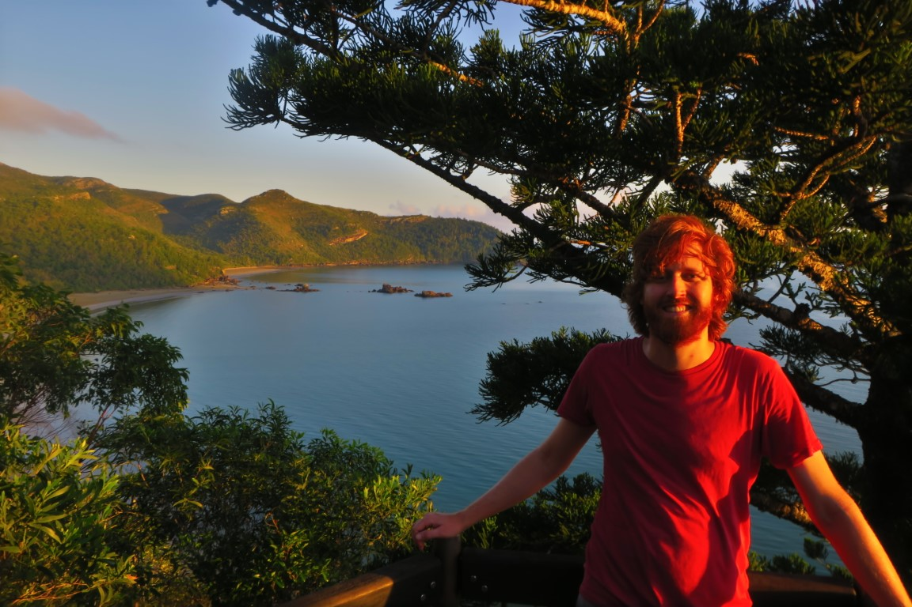
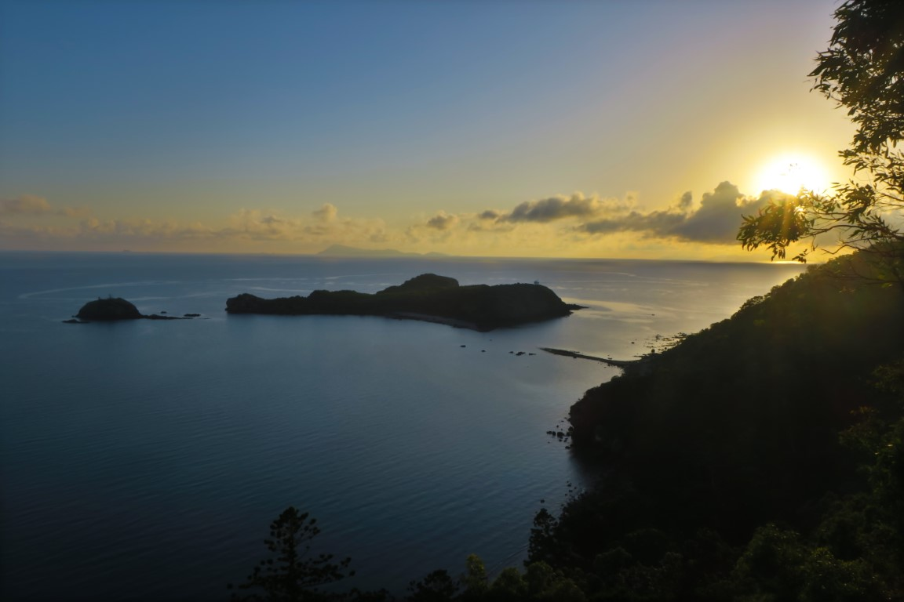
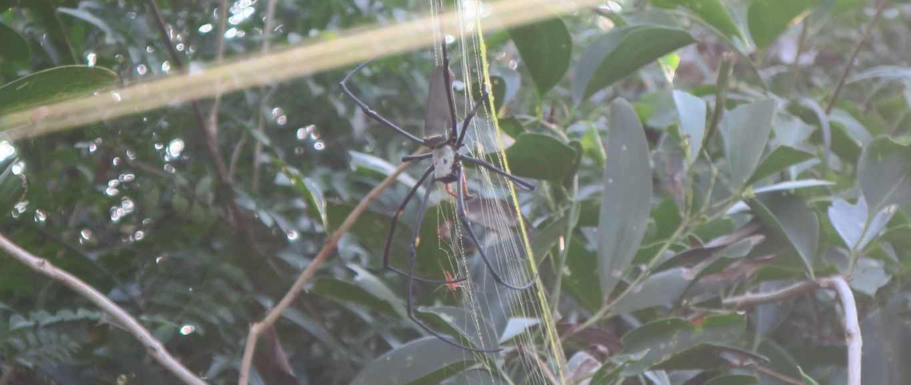
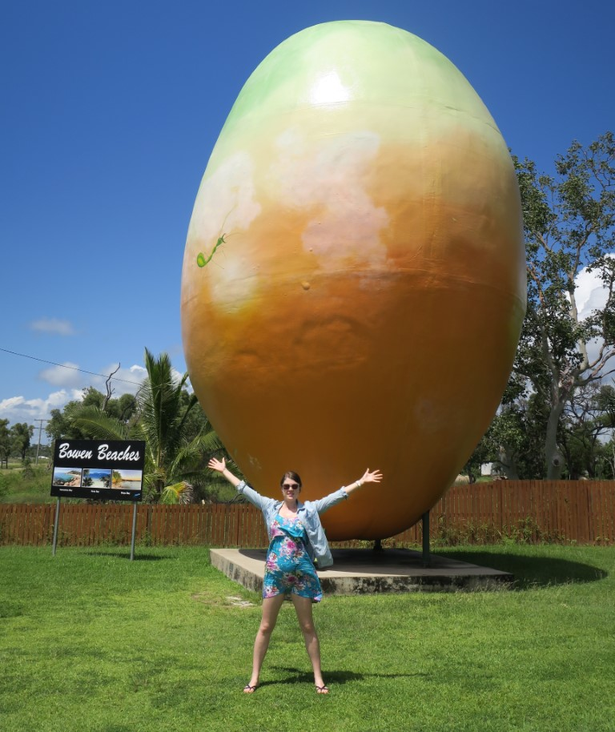
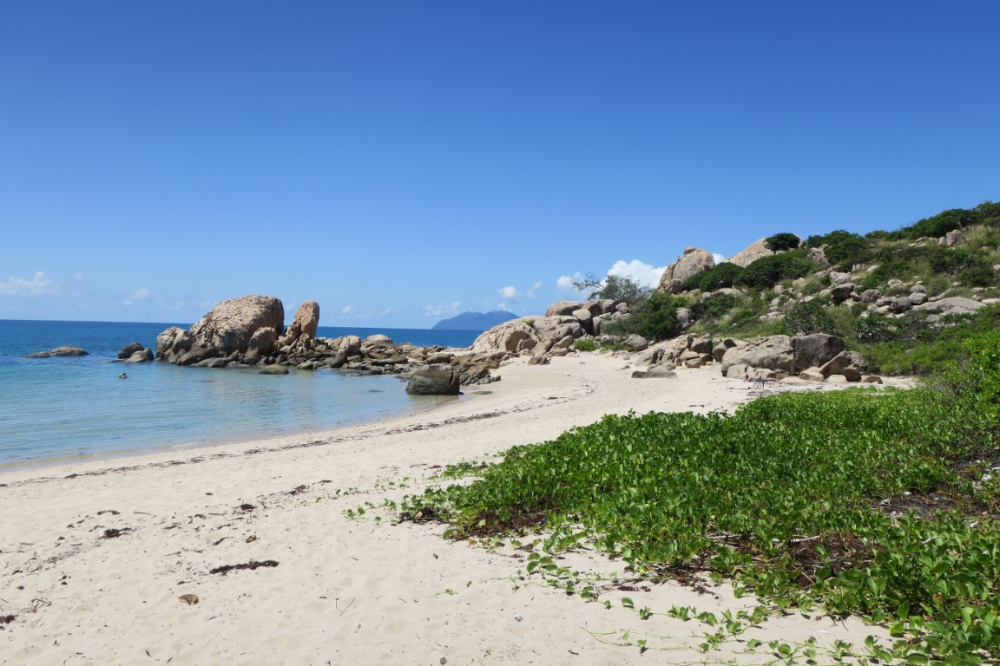

---
categories:
- Travel
date: '2019-03-14'
featured_image: posts/2019/cape-hillsborough/sunrise0.jpg
series:
- Cairns Roadtrip
slug: cape-hillsborough
tags:
- Queensland
- Seaforth
- Cape Hillborough
- Bowen
title: Cape Hillborough
---

After Eungella, we stayed the night at Seaforth. There wasn't a whole lot there.
We got fish & chips for dinner, and instead of seagulls they had curlews that bug you for some instead!

They get really big tides there as well, so the swimming net was kind of pointless if it is not high tide.

We got recommended going to Cape Hillsborough at sunrise to see the kangaroos and wallabies feeding on the beach. There was a bunch of people there and the tour guide fed them, but was a very nice sunrise.

The hike itself also was quite nice, and had some nice views.

We didn't quite make it to the last few lookouts as there was a giant spider across the path which put Rachael off.

On our way up to Townsville, we stopped at Bowen for lunch.

We got subway for lunch and went to Horseshoe Bay to eat it.
It was a really nice beach, with lots of people in swimming despite being stinger season. There was a nice lookout walk but it was super hot so we left it for the drive back.

From there we drove on to Townsville, went for a walk along the esplanade and
went to The Palmetum which was a nice gardens we didn't get to last time we visited.