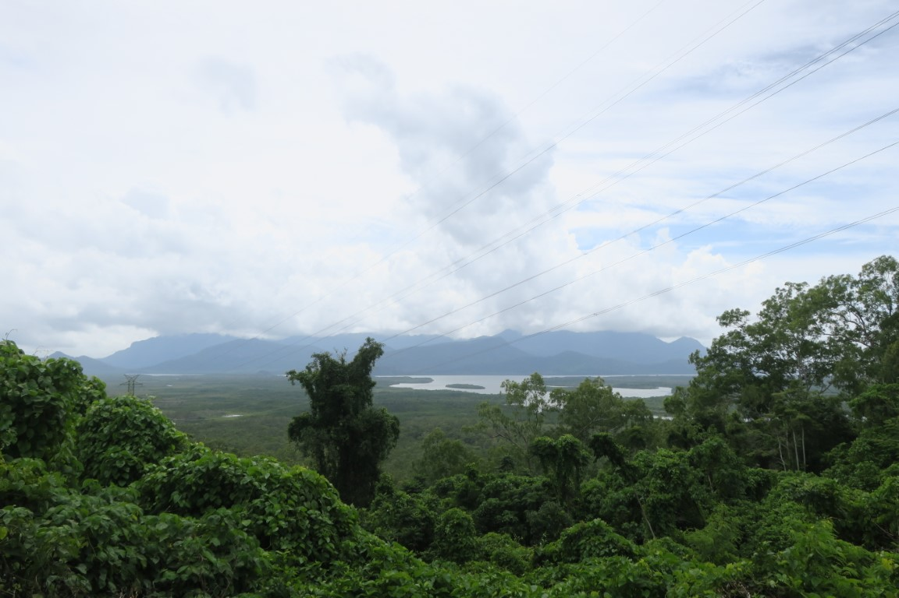
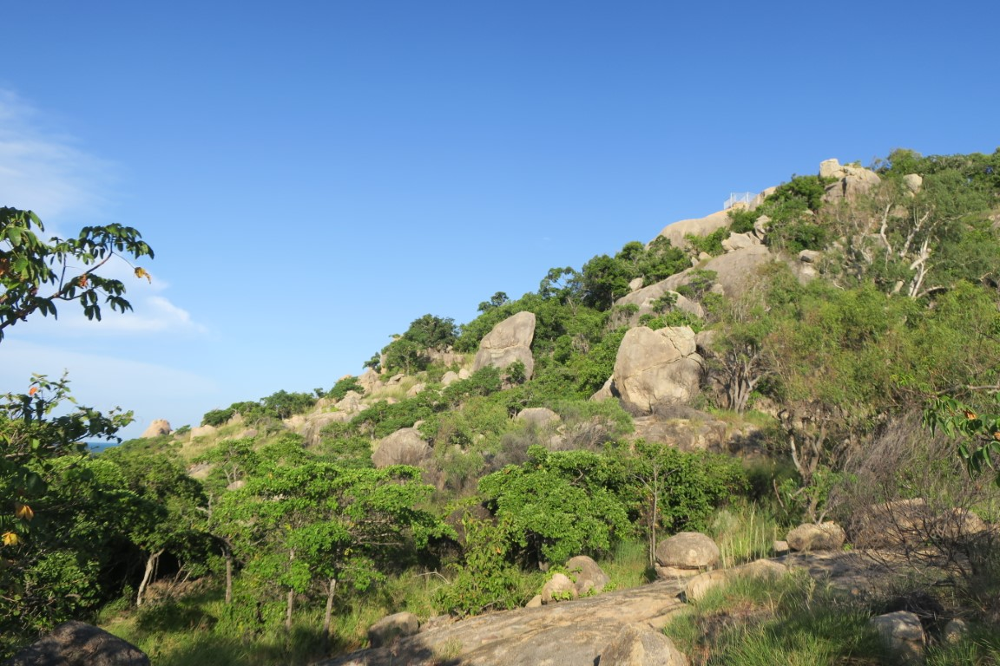
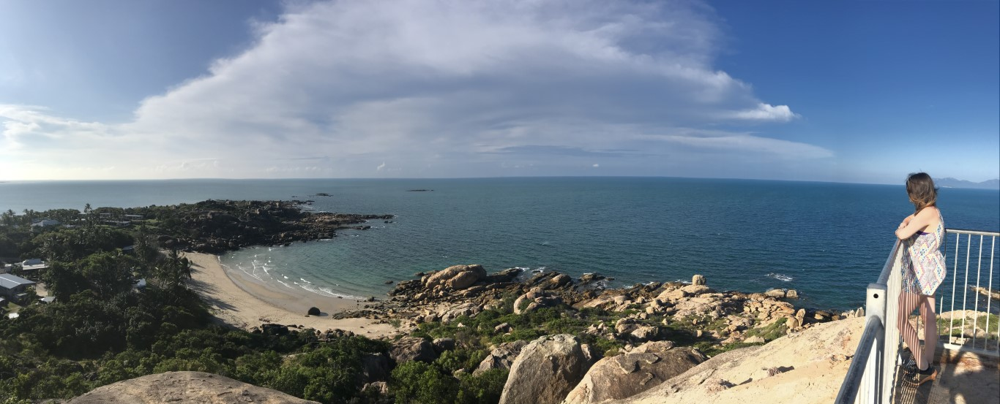
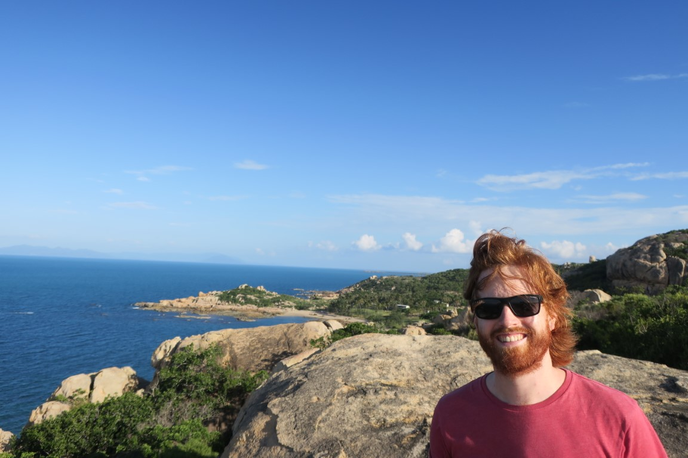
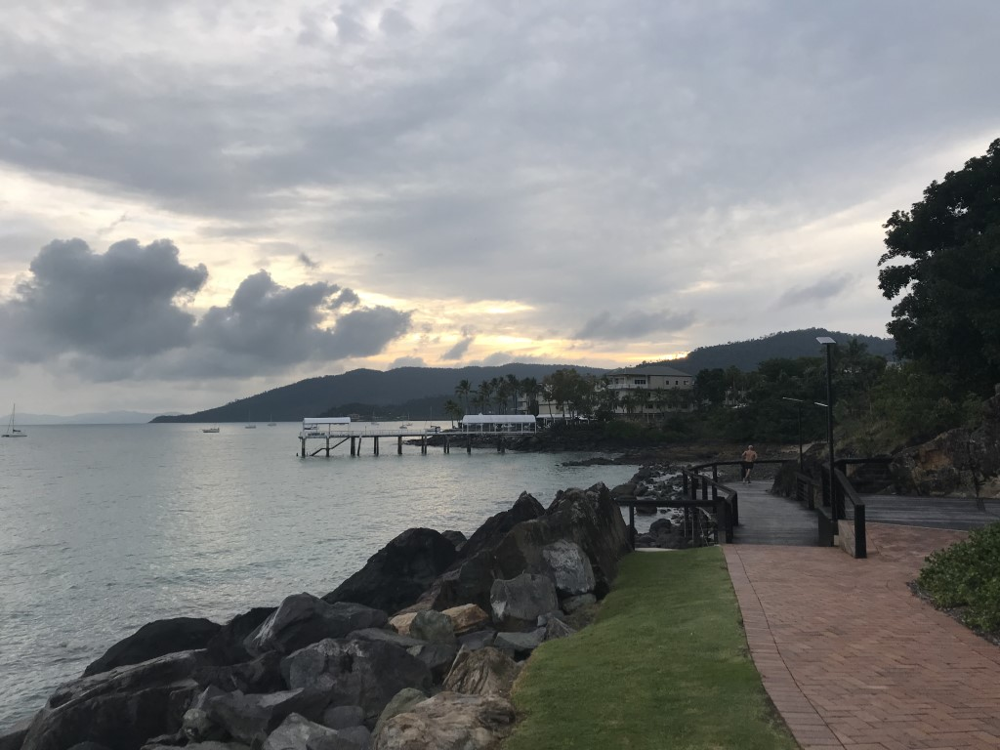
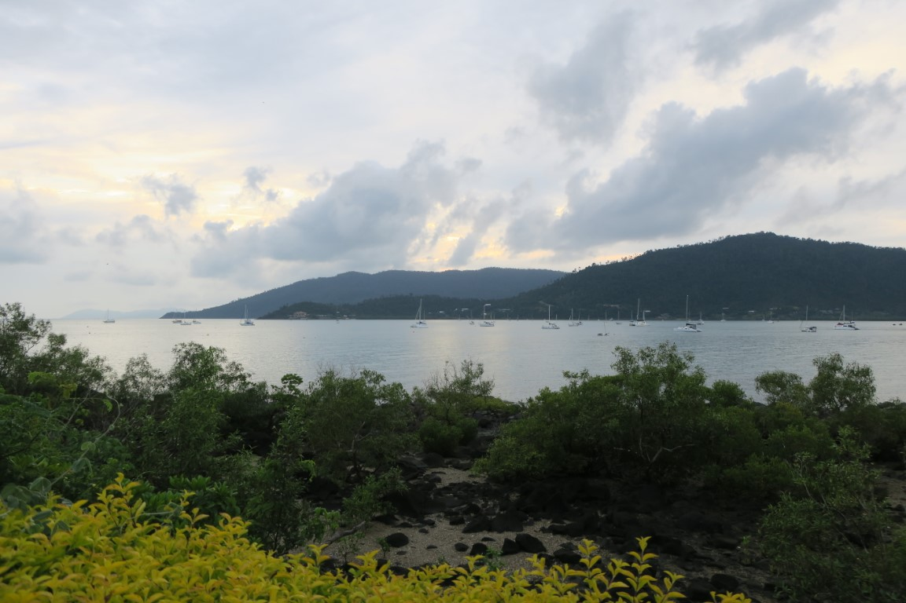
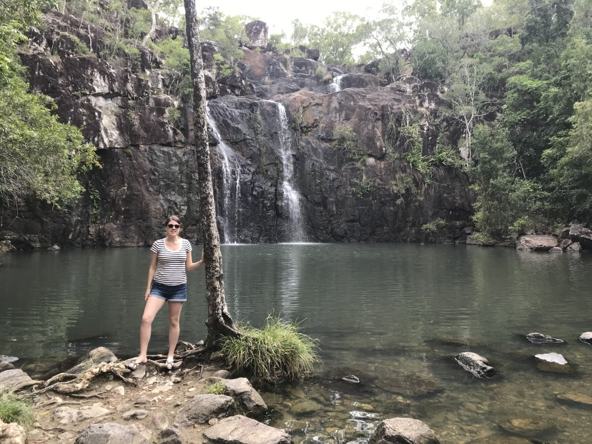
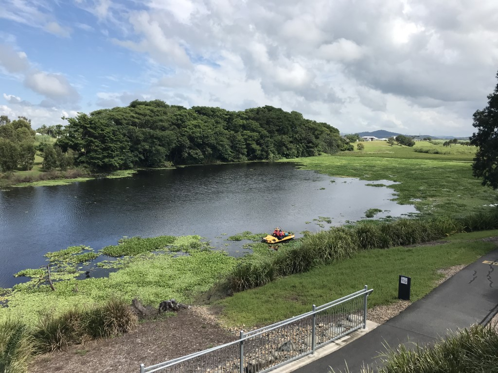
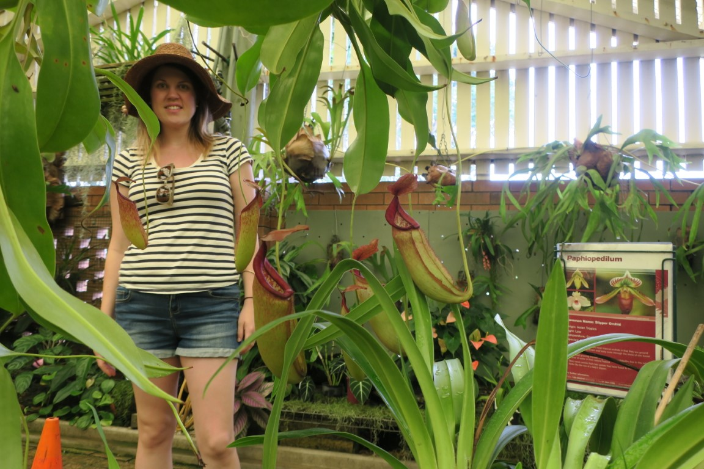
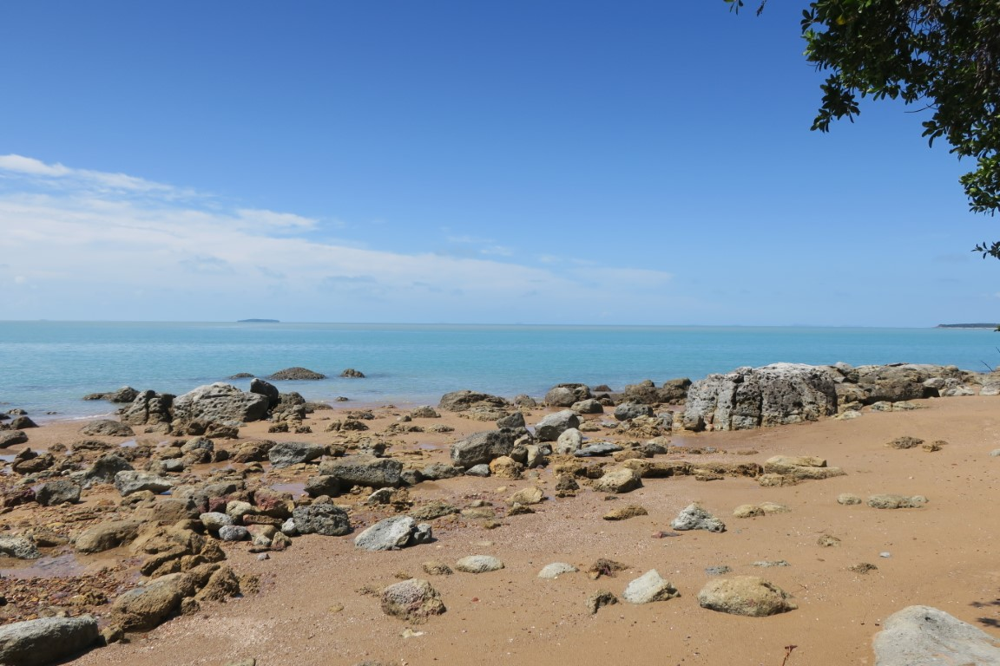

---
categories:
- Travel
type: post
date: '2019-03-21'
featured_image: posts/2019/drive-back/horseshoebay2.jpg
series:
- Cairns Roadtrip
slug: drive-back
tags:
- Queensland
- Airlie
- Mackay
title: Drive Back South
---

We tried to drive south as quickly as possible to get away from the rain.
Getting through Cairns took ages due to the traffic all being backed up, and the rain was still very heavy.

There was a bunch of waterfalls we had skipped on the way up that we had planned to visit on the way back, but we decided they it would be a bit too dangerous due to the heavy rain. We stopped at Hitchinbrook Island lookout (which we skipped on the way up) and luckily there was a gap in the rain.
The island looks super impressive, and I something we'd love to come back to visit.

It started raining again once we started driving.
We were tempted to pull in and go to Jourama Falls which you could see from the highway this time because of all the water. We missed the turn off though, so just kept driving south. After pretty much a full day of non-stop driving we got to Bowen, and the weather was finally clear so went back to Horseshoe Bay Lookout.

That night we stayed at Airlie, and then went for a walk around the marina in the morning.

On the way back to Mackay we stopped in at Cedar Creek Falls, which was a nice waterhole but had heaps of mozzies.

We stopped at Mackay Botanic Gardens which was nice.

In Queen's Park at Mackay they also had an Orchard House, which Rachael loved.

On the drive back to Rocky we made a quick detour to have a look at the ocean at Clairview. The water was an incredible light blue colour.
It's quite amazing really how little of the beach we had explored north of Rockhampton, as I haven't been to Stanage Bay.
Although that's mostly due to Shoalwater being off limits I suppose.

The cyclone but a bit of a dampner on the last part of our trip, but we were pretty happy with the amount we saw in the time we have and we still have a bunch more places we'd like to visit another time.