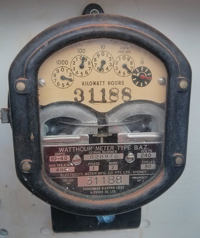
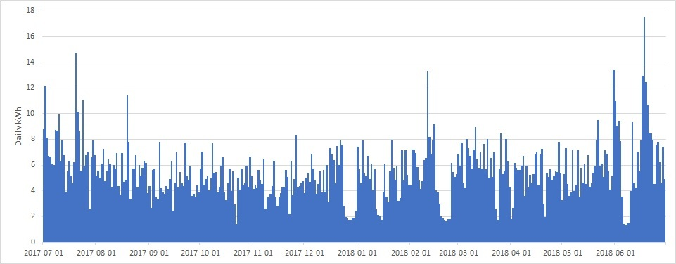
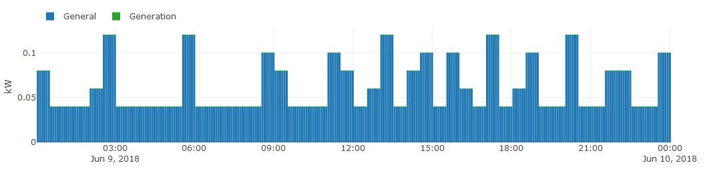
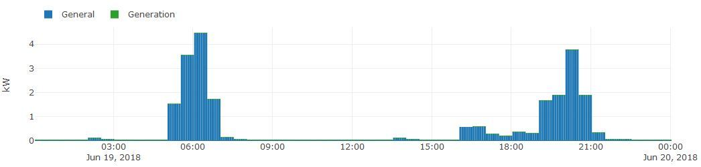
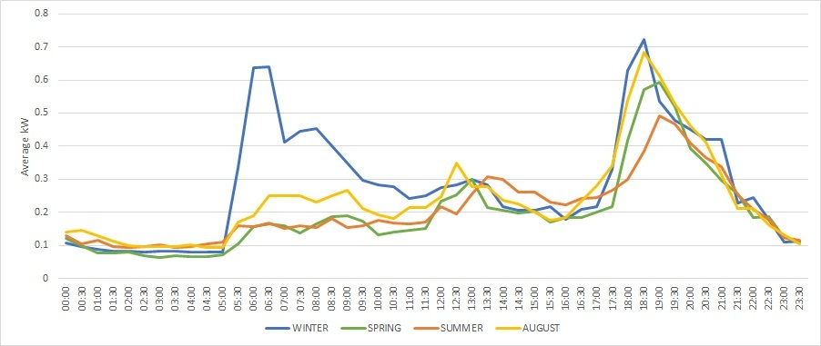
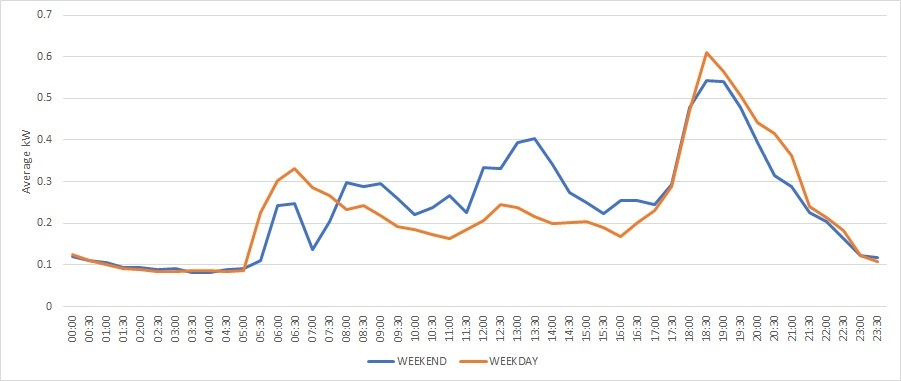
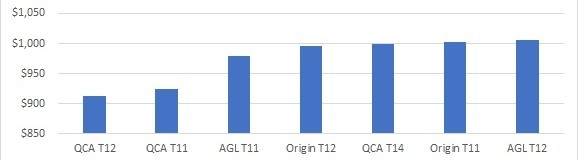

+++
categories = ['Misc']
date = '2019-10-26'
featured_image = 'posts/2019/energy-data/old_meter.jpg'
images = ['posts/2019/energy-data/old_meter.jpg']
slug = 'energy-data'
title = 'Energy Consumption Data'
type = 'post'

+++

When we moved into our house it had an old accumulation meter (read every 3 months) that was probably put in when the house was built (as it was apparently installed by the *Toowoomba Electric Light & Power Company*).

We got a 'smart' meter installed a few years ago. Unfortunately there is no way to get access to the data from it directly, so you can't really use it to do home automation or anything useful in real-time.

You can request your interval data from [Ergon](https://www.ergon.com.au/network/connections/metering/accessing-your-metering-data) or [Energex](https://www.energex.com.au/home/our-services/meters/accessing-your-metering-data) up to 4 times a year. This allows you to do some analysis and charting of your energy usage at least. Here is a [link to my data](xxxxxxxxxx_20170701_20180630_20180906143230_ERGONETP_DETAILED.csv) for the 2017-18 financial year with my NMI redacted.

When you look at daily consumption it's suprisingly easy to tell when we were away on holidays. We went to Rocky four times in the first half of 2018 and it's really easy to make these longer dips in energy usage out. There are a few shorter dips that represent weekend trips to Brisbane or the coast. You can also pick out really hot or cold days which have large spikes from the air-con.

It's even more apparent when you zoom in on the energy usage of a day when were away.

It's basically no usage except for the refrigerator compressor kicking in every now and then. Compare this to a cold workday where you can see a big spike when the heater was running before work and then afternoon usage when we got home from work.

It wasn't a particularly hot year in Toowoomba, so our average profile had a clear winter morning peak and then generally consistent afternoon peak throughout the year.

Since Rachael was working a rotating roster there wasn't a huge difference between weekends/weekdays either.

It was also interesting to compare what we would have paid on different tariffs over the year. Since we have gas hot water we don't actually use that much energy and so discounts on the kwh rate didn't make a huge difference. The price was mostly driven by the daily charges that you pay no matter what. I was suprised that Tariff 12 (Time of Use) was slightly cheaper, but saving $13 a year is probably not worth having to worry about what time of day we use energy. 

The SEQ retailers also seemed to be way more expensive, although that doesn't factor in the discounts and sign-up bonuses they offer.
