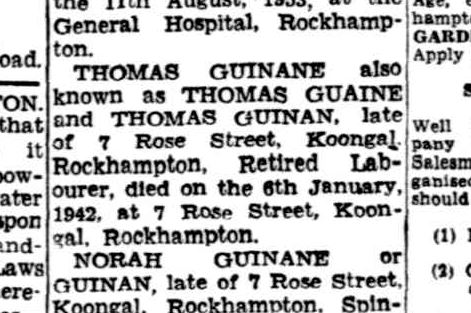

+++
categories = ['Misc']
date = '2019-05-04'
featured_image = 'posts/2019/guinman/newspaper-guaine.jpg'
slug = 'guinman'
title = "The Guinman's"
type = 'post'

+++

Part of thinking of names for a child is deciding on which surname to use. There are lots of different ways of choosing surnames other than the modern English way of taking the paternal one. The [wiki page on surnames](https://en.wikipedia.org/wiki/Surname) is supringly detailed.

After having a unique name like Guinane, I didn't want Newman as a surname because it's too common. Looking at [US Census Data](https://www.census.gov/topics/population/genealogy/data/2000_surnames.html) it's not actually as highly ranked as I was expecting, but still a lot more popular then Guinane.

Name   | Rank    | Count
------ | ------  | -------
NEWMAN  | 273    | 100,491
NEUMANN | 1,992  | 16,697
GUINAN  | 16,571 | 1,595
GUINANE | 69,428 | 264

I also don't think the story behind Newman is particularly inspiring given it just means that you are the new man in town.

Rachael didn't want to follow the patriarchy and use Guinane or that everybody has trouble trying to spell it. My g-g-grandfather (who the name comes from) moved to Australia from Ireland and  [didn't even know how to spell it](https://trove.nla.gov.au/newspaper/article/57273677) - as most Catholics in Ireland in the mid 1800s were illiterate.

Neither of us liked the idea of Guinane-Newman. I really wanted for us to come up with a completely new name, and we both liked the idea of [name blending](https://en.wikipedia.org/wiki/Name_blending). So about a month ago Rachael and I changed our surnames to Guinman - which is a [portmanteau](https://en.wikipedia.org/wiki/Portmanteau) of Newman and Guinane.