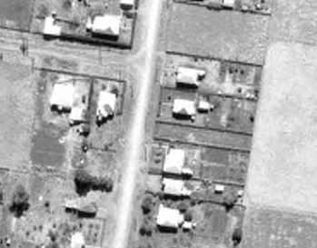
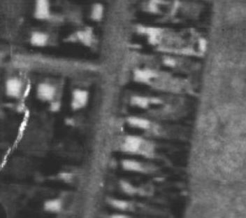
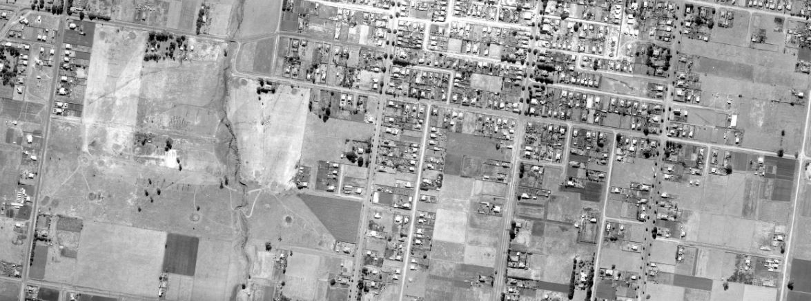
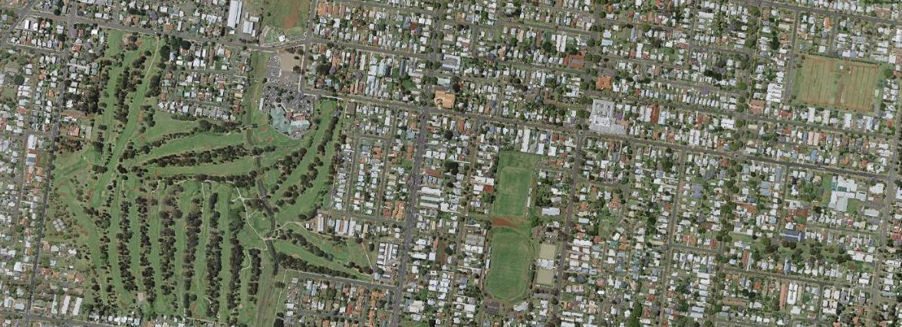

---
categories:
- Misc
date: '2019-10-27'
featured_image: posts/2019/historical-aerial-imagery/1946.jpg
slug: historical-aerial-imagery
title: Toowoomba Historical Imagery
---

When we bought our house the real-estate agent said it was "Post WWII" (after 1945) but didn't really know exactly when it was built. The survey plan we got for the block said it was updated in 1952, so it's a safe bet it was about then.

Looking at historical aerial imagery that the Toowoomba Council publishes [as an ESRI map](https://maps.tr.qld.gov.au/WAB/IDP/), you can see it appear sometime between the 1946 and 1955 imagery.

We consider our place to be pretty close to the city centre, but back when it was built it was basically the outskirts of town.
It it pretty crazy to think about how much everything has expanded in just 70 years.

[QImagery](https://qimagery.information.qld.gov.au) has aerial imagery from other places in Queensland also, although it's harder to navigate. Looking at the Rockhampton imagery was interesting, since I remember some of the development occuring.
