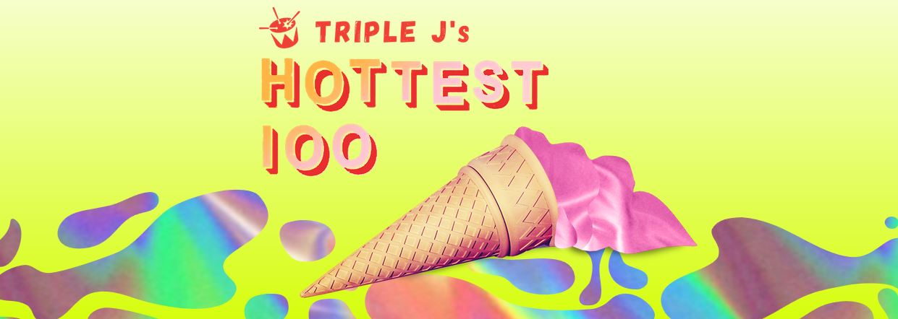

---
categories:
- Misc
type: post
date: '2019-01-20'
featured_image: posts/2019/hot-100-votes-2018/hot-100-2018.jpg
slug: hot-100-votes-2018
tags:
- Hottest 100
- Triple J
title: Hottest 100 Votes for 2018
---

1. Holy Holy - [Faces](https://www.youtube.com/watch?v=StcAgrFk7Jk)

    Such an awesome riff.

2. Ocean Alley - [Confidence](https://www.youtube.com/watch?v=PGGjXdlbW58)

    This is the [warm tunas](https://100warmtunas.com/2018/) pick for #1 spot, and well deserved. Also considered voting for [Knees](https://www.youtube.com/watch?v=v-m5RTM8d6A) or [Baby Come Back](https://www.youtube.com/watch?v=ubAbewMTUUw)  (which was easily the best Like A Version for the year).

3. Childish Gambino - [This is America](https://www.youtube.com/watch?v=VYOjWnS4cMY)

    Rachael is dissapointed I've voting for this, but it's a great song and and even better video clip.

4. Didirri - [Bird Sounds](https://www.youtube.com/watch?v=kX__NnXaj8s)

    Didirri was the support for Vance Joy when we saw him earlier this year - but we didn't really know the songs and weren't overly impressed. The exception being this song and [I Can't Get Last Night Out of My Head](https://www.youtube.com/watch?v=F9TulM_yqyM) which have got better with each listen.

    We also heard [Sometimes](https://www.youtube.com/watch?v=N_jQ_mb84zA) by Cub Sport that night for the first time and didn't like it - and yet it's grown heaps on me also.

5. Vance Joy - [Saturday Sun](https://www.youtube.com/watch?v=uKqMNQkjHmI)

6. Skeggs - [Up In The Clouds](https://www.youtube.com/watch?v=r72uIs69DHg)

7. Ziggy Albers - [Laps Around The Sun](https://www.youtube.com/watch?v=xJEwoYd-sTE)

8. Ball Park Music - [The Prefect Life Does Not Exist](https://www.youtube.com/watch?v=3fGyjSVGw4E)

9. The Rubens - [Never Ever (ft. Sarah)](https://www.youtube.com/watch?v=5RtMam-4pdg)

10. Methyl Ethel - [Scream Whole](https://www.youtube.com/watch?v=uwrvs193BTw)

Heaps more on my shortlist this year, and was very difficult to narrow down.