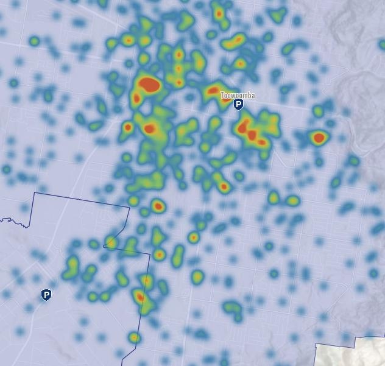
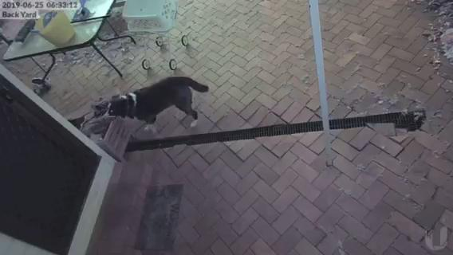

+++
categories = ['Misc']
date = '2019-07-11'
thumbnail = 'posts/2019/security-cameras/mia-box.jpg'
lastmod = '2020-04-14'
slug = 'security-cameras'
title = 'Security Cameras'
type = 'post'

+++

**Uptype: post
date:**  Ubiquiti have discontinued UniFi Video. The cameras [from reolink](https://store.reolink.com/au/poe-ip-cameras/) seem to be basically the same, but cheaper. I'd probably get them instead. Very annoyed that they made it end-of-life just after I bought the NVR.

Recently I ended up installing some IP security cameras at our place, and since a few people have asked about them I thought I'd do a quick summary on here.

It's something we talked about for a while, since we had an incident one holidays. Dad and I were doing work under the house, we all went to lunch and then when we came back we found a credit card under the house that wasn't there before. We took it to the police station and it turns out there had been someone running from the police that was hiding under our house while they were looking for him - and he must have dropped his credit card.

We also know of a few people that have been broken into recently, so thought it would be a good investment. QPS actually have a pretty cool [interactive crime map](https://www.police.qld.gov.au/forms/crimestatsdesktop.asp).

It's also good to be able to check up on Mia - but Rachael finds it a bit depressing because she generally just waits for us at the back door and sooks until we get home. We did catch her opening a box to get her toys out - pretty clever.

I ended up doing a bit of research because the requirements I had actually made it pretty hard to find cameras that did everything I wanted.

The [Ring](https://au-en.ring.com/pages/security-cameras) and [Xiaomi](https://www.xiaomistore.pk/yi-outdoor-security-camera.html) looked okay - but recordings aren't stored locally so you need to pay for a cloud subscription to be able to record things. It also means that you use a bunch of data uploading the footage.

In order to record things locally you need something called Network Video Recorder (NVR) software. I ended up buying Ubiquiti cameras and they have free UniFi Video NVR software, but it only works with their cameras.

I didn't want to be locked in to that though - you can also use something like ZoneMinder (free) or Blue Iris (paid) and they appear to support most IP cameras, although I haven't try either. The unifi cameras support streaming to other software - although you have to use their software first to enable this. Another requirement was that it had to work with Home Assistant, which [the Unifi cameras do](https://www.home-assistant.io/components/uvc/).

I originally was running the free NVR software on my NAS, but it was a bit underspecced and made the NAS run slow and filled up the HDD. When the power went out the NAS wants you to check the disk before it starts it up again which also helpful for a security camera when you are away. So I ended up buying their [hardware NVR](https://www.umart.com.au/Ubiquiti-UniFi-NVR-2TB-Network-Video-Recorder_44608G.html) to use instead.

**Uptype: post
date:** Annoyingly, they discontinued the NVR and replaced it [with this](https://www.ubnt.com.au/unifi-cloud-key-gen2-plus) a few months after I bought it.

Another requirement was that I preferrably wanted to use Power over Ethernet (PoE) which means you don't have to have a power point it just has an ethernet cable that powers it and does data transfer. But it meant I had to buy a new [network switch that supports PoE](https://www.umart.com.au/Ubiquiti-UniFi-8-Port-60W-with-4-Ports-POE-OEM_39604G.html) as well and they are also expensive. You can just buy a standalone [PoE injector](https://www.umart.com.au/Ubiquiti-POE-Injector--24VDC--12W_38532G.html) for each camera ($10 each) but that makes things a bit messy as you would have a bunch of them and need a switch anyway if you don't have enough ethernet ports.

If you get the [Flex model](https://www.umart.com.au/Ubiquiti-UVC-G3-FLEX-UniFi-Video-Camera_44406G.html) the cameras themselves weren't that expensive. I did get one of the more expensive models for the backyard beacause of the mounting design, but I don't think the quality is any better, even the night-time quality seems similar.

It ended up being a lot more expensive then I would have thought, but pretty happy with the setup overall now that everything is installed.