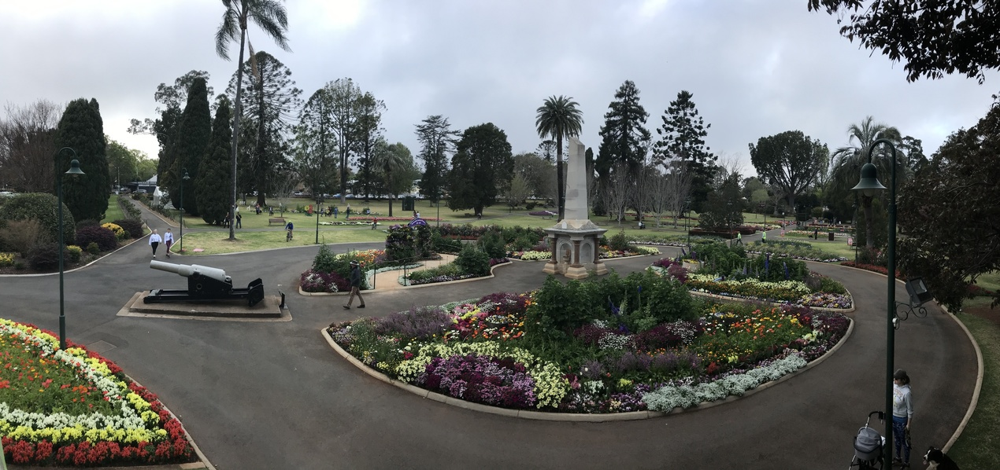
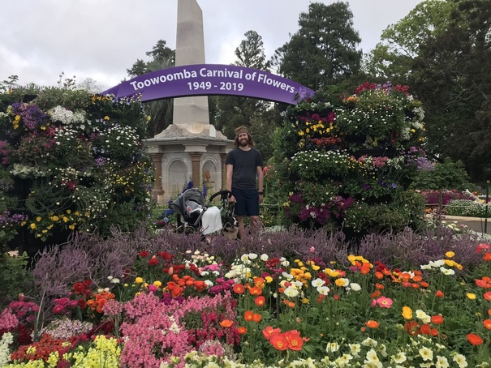
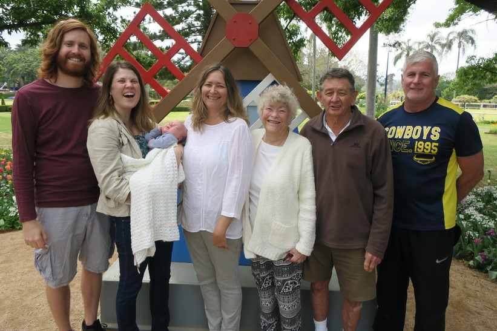
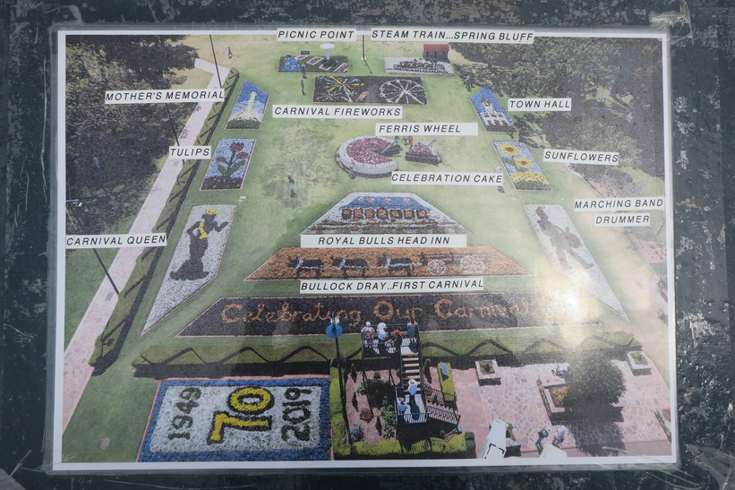
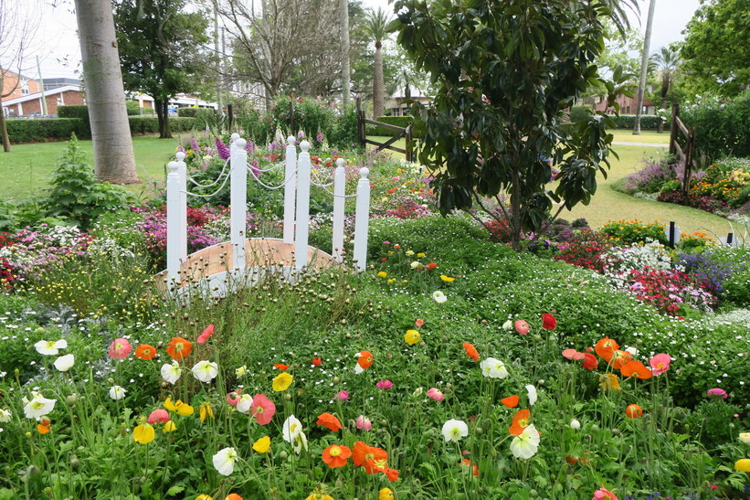
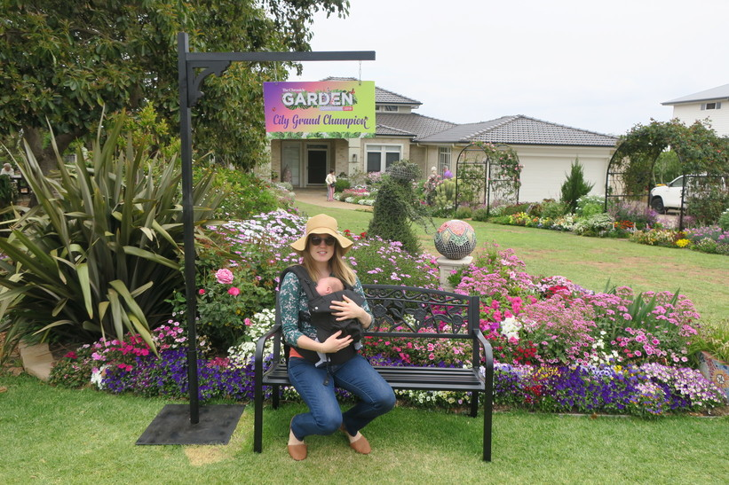
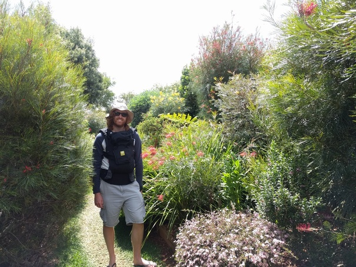

+++
categories = ['Misc']
date = '2019-09-28'
featured_image = 'posts/2019/tcof-2019/queen2.jpg'
slug = 'tcof-2019'
tags = ['TCOF', 'Flowers', 'Toowoomba']
title = 'Toowoomba Carnival of Flowers 2019'
type = 'post'

+++

This was the first year since we moved to Toowoomba where we haven't been to the wine festival, but we were still able to enjoy the gardens.

Mum and Dad brought my grandparents down this year to see the flowers (and Lyra).

It was 70 years of the Carnival this year, so that was the theme at [Laurel Bank Park](https://www.youtube.com/watch?v=L9a9gGq2MFo)

And we even managed to visit a few prize gardens.

