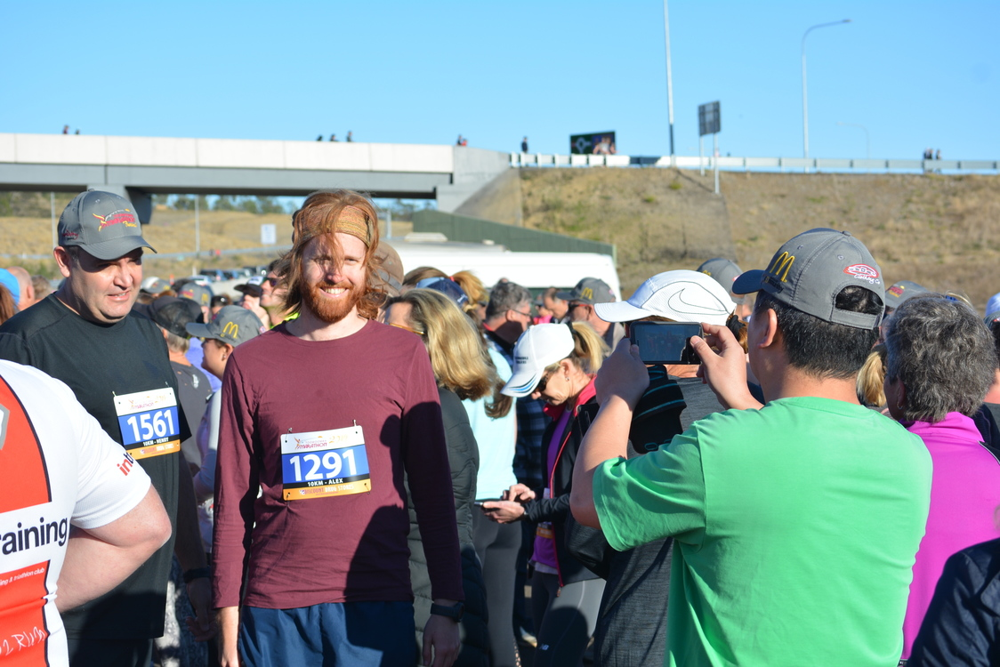
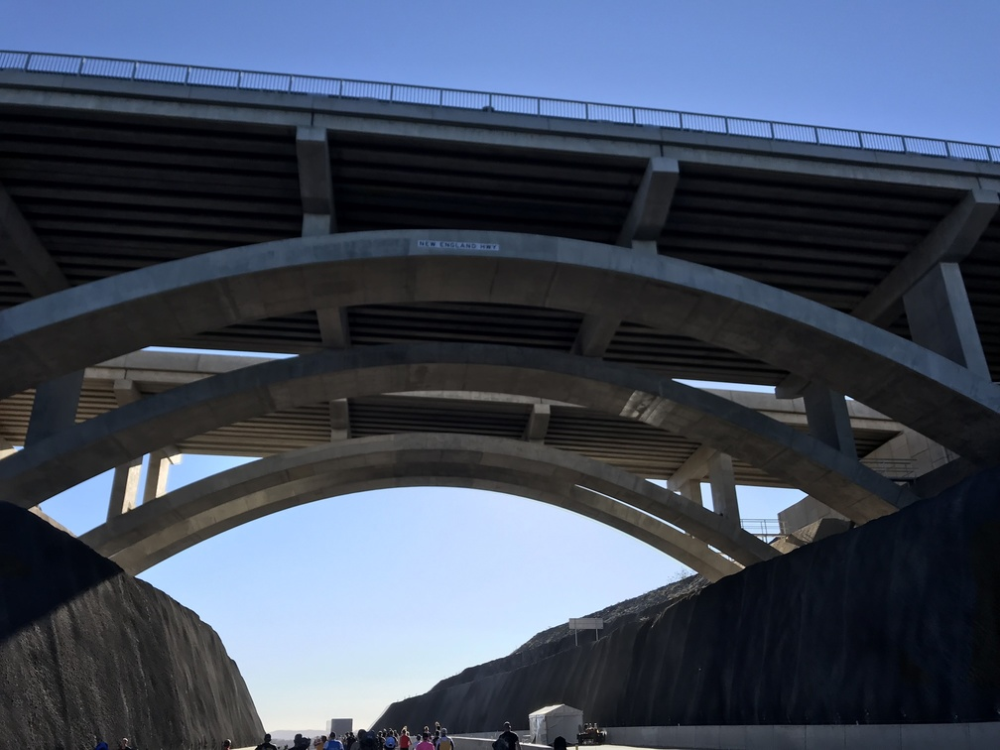
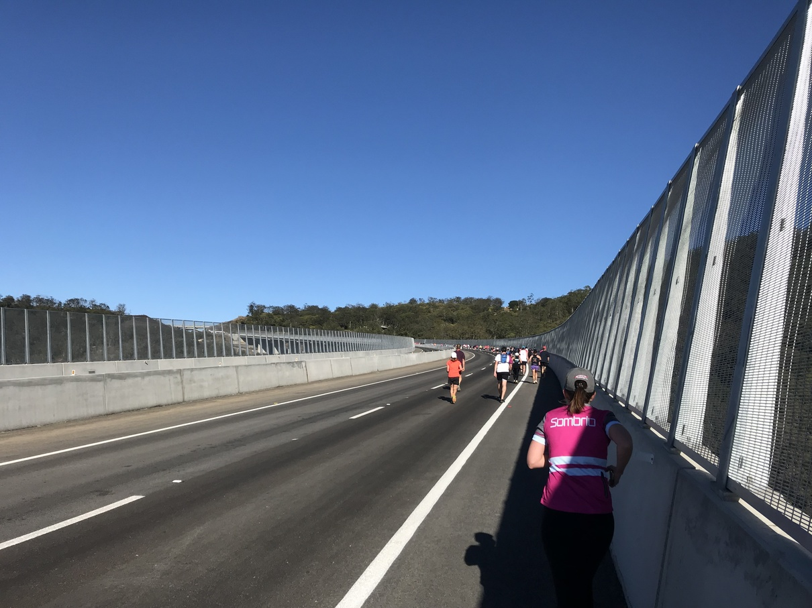
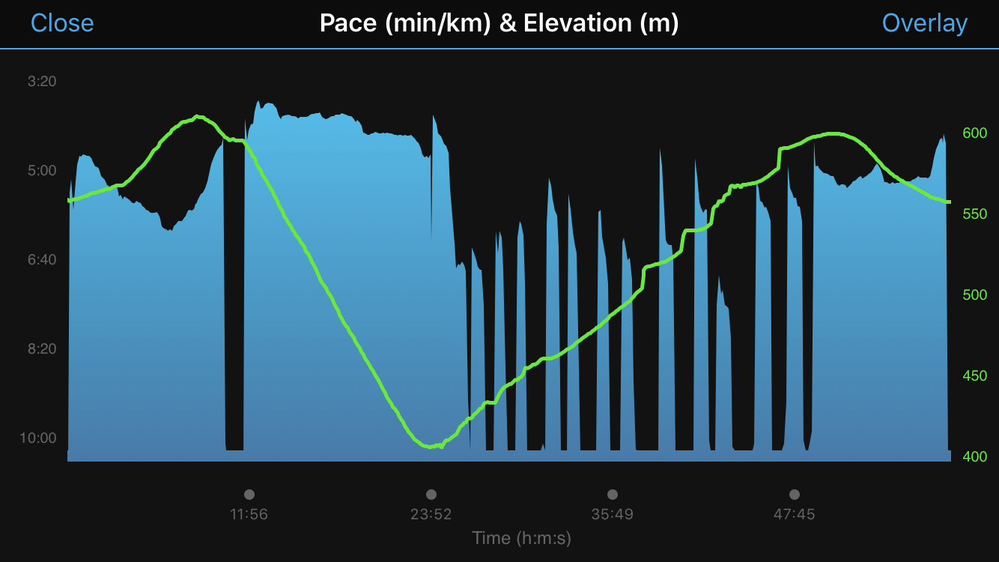
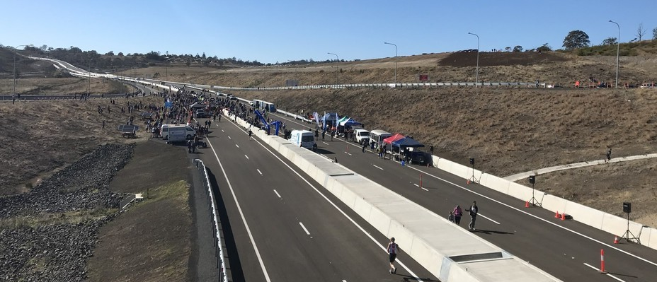

---
categories:
- Misc
type: post
date: '2019-09-08'
featured_image: posts/2019/tsrc/before.jpg
slug: tsrc
title: Toowoomba Second Range Crossing Marathon
tags:
- Toowoomba
type: post
---

The TSRC opened on the Sunday with a marathon (there was a also a bike race and open day on the Saturday that Mark and Julie went to). I only signed up for the 10km as I (correctly) assumed I would still be sleep deprived on the day.

The bypass was pretty impressive, although it was hard to see much from the eastbound lane.

The downhill was okay (after a quick pee stop), but at the turnaround point the uphill was disgusting. It was super windy and a massive headwind with an uphill climb was unpleasant and I had to keep stopping to walk.

Despite the challenging second half I finished [just under an hour](https://www.strava.com/activities/2688817635) which I was prety happy with. The [official race times](http://www.racetecresults.com/myresults.aspx?uid=16228-100-3-11559) had issues apparently, so it has it a few minutes slower.

Was a pretty cool opening event, I doubt they will have it again though.

