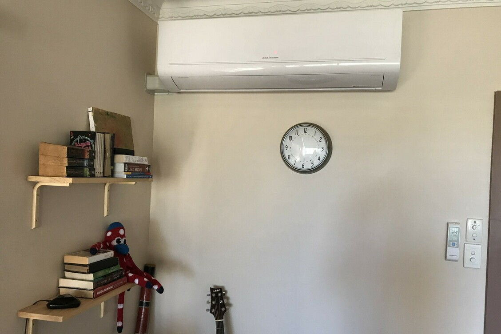
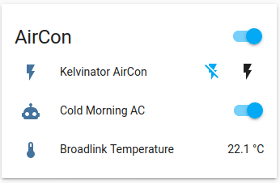

---
categories:
- Misc
type: post
date: '2020-05-02'
slug: air-con-automation
title: Air Con Automation
featured_image: posts/2020/air-con-automation/aircon.jpg
tags:
- Home Automation
---

When I first started playing with [Home Assistant](https://www.home-assistant.io) the first thing I thought to automate was our air-conditioner. When we bought the air con for our living room it cost way more for the "smart" ones that you could control with your phone and we didn't think we would use it anyway, so we just got a [dumb one](https://www.kelvinator.com.au/air-conditioning/split-system/ksv70hrd). But since it can take up to five minutes or so before the heater works, it's definitely good to have it automatically turn on on cold mornings, or turn it on from your phone in bed.

Luckily, since you turn it on with a remote, all you have to do is buy a universal remote with WiFi. I got the Broadlink RM2 Pro from eBay for about $40. The [Logitech](https://secure.logitech.com/en-au/product/harmony-hub) ones are probably much better, but cost way more.
There are also products like [Sensibo](https://sensibo.com) that are designed just for air cons but are also way more expensive.



The app isn't very good and setting it up with home assistant is a little bit painful. You have to work out the code the remote sends to turn it on, which for our air con was:

```
JgAkAQABJ5MWEhUTFBMVNxQUFBMVExUSFDgUFBMUFDgUExUTFRIVExQTFRMVExQTFBQUNxUTFBQTFBUTFBMVExU2FRMUOBQTFBQUNxQUFQACkBQTFBQUExQUFBQTFBQUFBMVExUSFRMVEhUTFRMUExQUFBMVExUSFRMVEhUTFRMUExQUFBMVExQTFDgVNxQTFDgUAAUhAAEmlBQTFBQUExU3FRIVExUTFBMUOBQTFRMVNxQTFBQUExUTFRIUFBQTFRMUFBQ3FRMUExUTFBMUFBQUFDcVNxQ4FBMVExQ3FBQUAAKRFBMVExQTFRMVEhQUFBQUExQUFBMVExQTFBQUExUTFRMUExQUFBMUFBUSFRMVEhUTFRMUExQUFBMUOBQ4FBMVNxUADQUAAAAA
```

The Broadlink Remote actually has a temperature sensor in it as well. So I set up an automation so that it will automatically turn on the air-con in the morning if the temperature is below 10°C.



It's been running nicely for a couple of years, but broke when I changed the WiFi a few months ago. It's been pretty cold the last 2 days so went through the painful process of re-pairing to the WiFi and it's all happy and working again now. Next job will be automatically heating Lyra's room.
