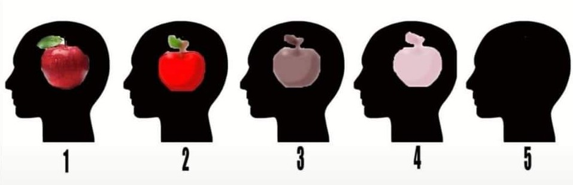

---
categories:
- Misc
type: post
date: '2020-03-05'
slug: aphantasia
title: Aphantasia
featured_image: posts/2020/aphantasia/aphantasia.jpg
---

Last year I came across this [reddit post](https://www.reddit.com/r/tifu/comments/c4i94n/tifu_by_explaining_my_synesthesia_to_my_boyfriend/) (just before going to bed) which completely blew my mind (like the boyfriend in the post). So many sayings and things from movies (flashback scenes) finally made sense, but I still thought I must be understanding something and that the minds-eye visualisation described was exaggerated. I was eventually able to get to sleep but first thing in the morning I made Rachael watch [this video](https://www.youtube.com/watch?v=ewsGmhAjjjI).

So turns out that Rachael can visalise things, but I can't. Which made perfect sense and explained so many things at the same time as completely blowing both our minds.

I ended up reading a bunch of stuff online, like [this post](https://www.facebook.com/notes/blake-ross/aphantasia-how-it-feels-to-be-blind-in-your-mind/10156834777480504) in which he can't even "hear" sounds in his head. This was actually pretty helpful as I can 'hear' sound in my head but cannot do the same thing with vision. It helped solidify that we were talking about the same thing when we meant you can 'see' things with your mind in the same way - and that I definitely can't.

Interestingly he mentioned in that section that he does have an inner monologue but that the audio has no texture. But then last month [this article](https://insidemymind.me/2020/01/28/today-i-learned-that-not-everyone-has-an-internal-monologue-and-it-has-ruined-my-day/) did the rounds about some people not having inner monologues either. It seems like nothing about how our brain works can be taken for granted.

The next thing Rachael and I did was start asking everyone about whether they had Aphantasia or not. Dad has it, but no-one else in the family. Only one of the nurses at Rachael's work had it. A bunch of my engineering friends did have it. I wonder if there is a correlation with some professions, [this article](https://www.bbc.com/news/health-47830256) suggests 1 in 50 people have it. There is also a [TED Talk](https://www.youtube.com/watch?v=arc1fdoMi2Y) about Aphantasia, which suggests that the concept is pretty new.

Shortly after this Lyra was born, and in the sleep deprivation of the first few weeks I realised that I could visualise things as I was drifting into sleep (and then woken up again). I couldn't really control what I was seeing though so Rachael quickly shot this down as just dreaming and not the same thing. I still can't do it while awake though and day-dreaming is such a crazy word to me now.
