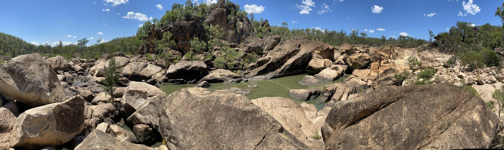
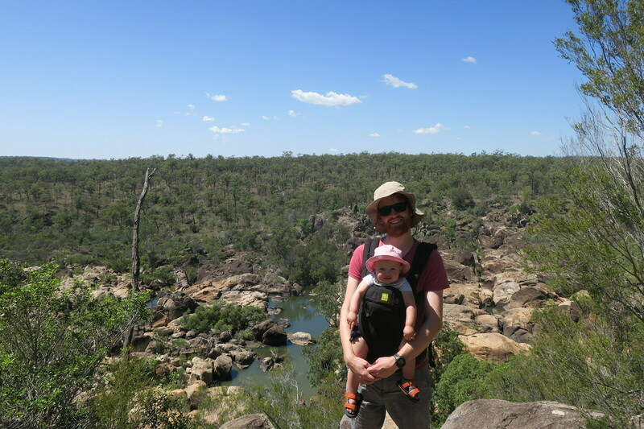
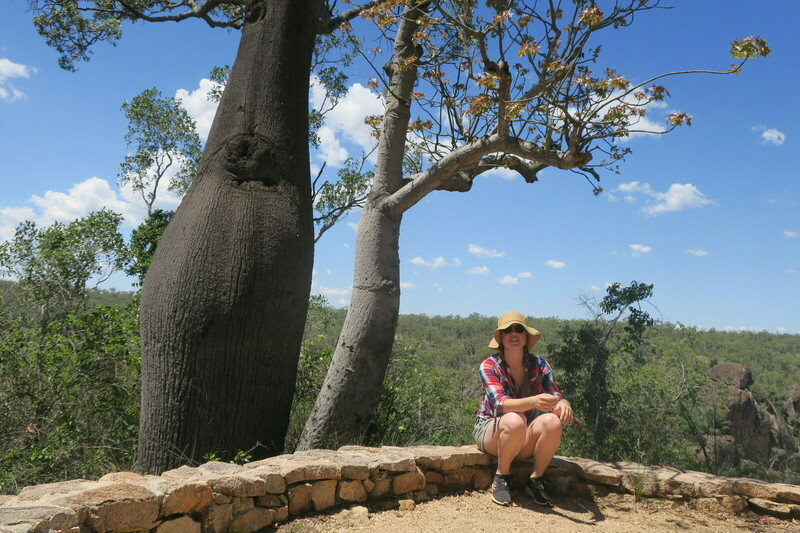
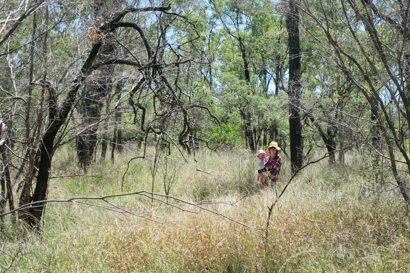
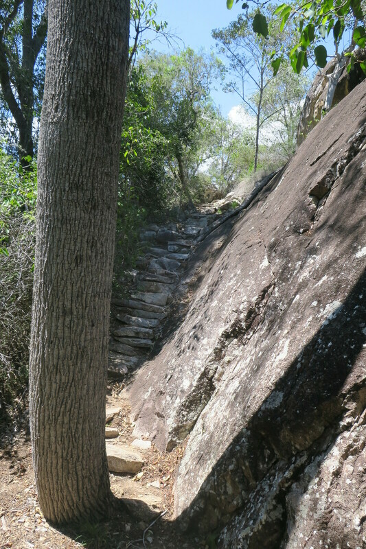
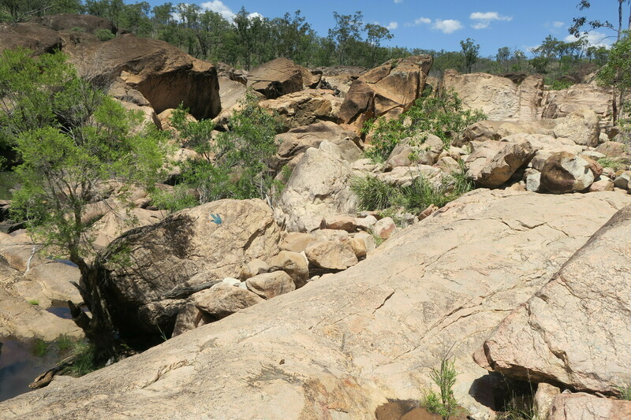
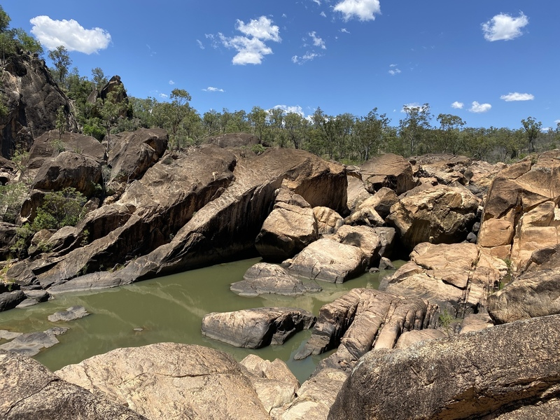
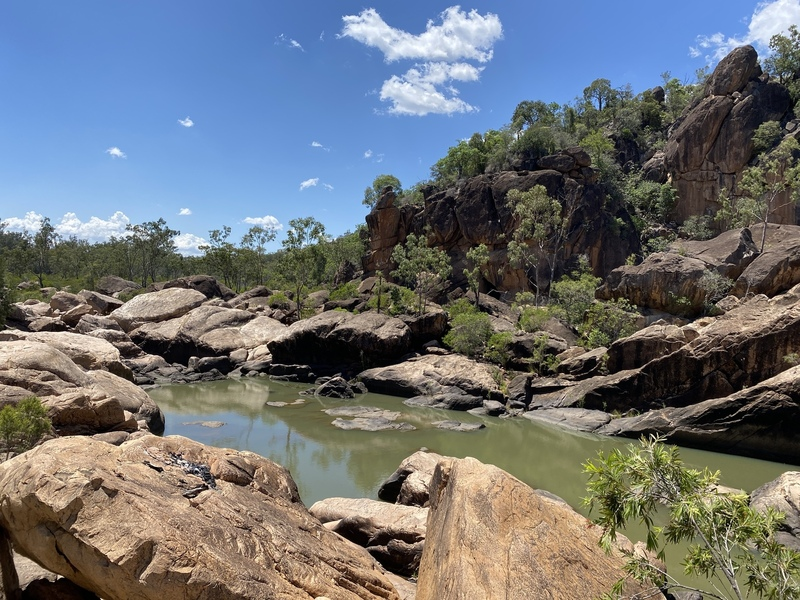

---
categories:
- Travel
date: '2020-11-02'
slug: auburn-river
title: Auburn River
featured_image: posts/2020/auburn-river/riverbed-1.jpg
tags:
- Queensland
- Hiking
---

We made a quick stop at [Auburn River National Park](https://parks.des.qld.gov.au/parks/auburn-river) on our drive to Rockhampton.

We started with the Gorge Top Walk which was not overly exciting but had a spectacular view at the lookout at the end. Even though we got there pretty early in the morning it started getting really hot so Lyra did not enjoy being in the carrier.

The walk to the Gorge lookout was a much much shorter and easier one, but the view was not as impressive.

The signage put us off taking Lyra down to the Rockpools, so I quickly jogged down while Rachael went back to the car. The rock pools at the bottom were really cool but I was suprised by the lack of water after some rain the week before. It would be much more impressive after more rain and if the water was flowing.

)

