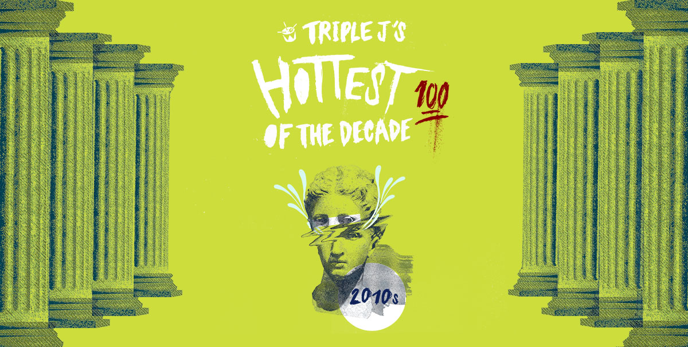

+++
title = "Hottest 100 Votes for the Decade"
date = "2020-02-24"
slug = "hot-100-votes-decade"
type = "post"

[taxonomies]
categories = [ "Misc",]
tags = [ "Hottest 100",]

[extra]
image = "posts/2020/hot-100-votes-decade/hot100.jpg"

+++

Like always I limited it to one song per artist.

1) Ball Park Music - It's Nice To Be Alive (2011)

I came close to going for Coming Down (2012) but went for the one more likely to get in the Top 10.
They had a bunch of songs from across the whole decade so hopefully they place highly.

2) Bluejuice - Act Yr Age (2011)

Bluejuice likewise had a bunch of hits I could have voted for, but chose this as the top pick.

3) Matt Corby - Brother (2011)

Still hasn't gotten old even after hearings lots of drunken renditions.

4) Haim - Falling (2013)

The Wire is probably more likely to get in the list, but I like this one more.

5) Lorde - Royals (2013)

6) The Preatures - Is This How You Feel (2014)

Was tossing up between this and a bunch of Saskwatch songs.

7) Tame Impala - The Less I Know The Better (2015)

In the yearly poll I struggled to decide between this and Let It Happen and was the same this time.

8) Methyl Ethel - Ubu (2017)

Once I hear this song it gets stuck in my head for ages.

9) Alex Lahey - I Haven't Been Taking Care Of Myself (2017)

10) Ruby Fields - Dinosaurs (2018)

I didn't vote for this in the yearly poll but it has grown on me since.

Some other songs that were on the short-list but not mentioned above:

* Adele - Someone Like You (2011)
* Busby Marou - Five Rocks (2010) or Underlying Message (2010)
* Childish Gambino - 3005 (2013) or Redbone (2016)
* Florence + The Machine - Delilah (2015)
* Gang of Youths - Let Me Down Easy (2017) or Magnolia (2015)
* Jarryd James - Do You Remember (2015)
* Kanye West - Runaway (2010)
* King Gizzard & The Lizard Wizard - Rattlesnake (2017)
* Little Red - Rock It (2010)
* Marus Marr & Chet Faker - The Trouble With Us (2015)
* Vance Joy - Riptide (2013)