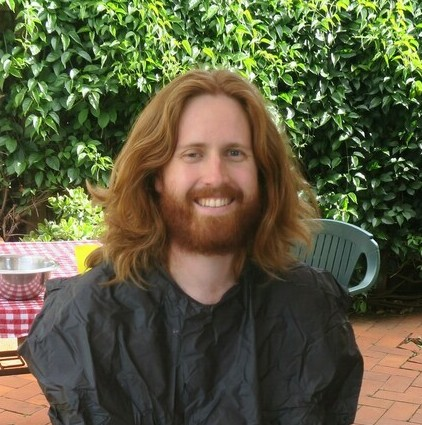
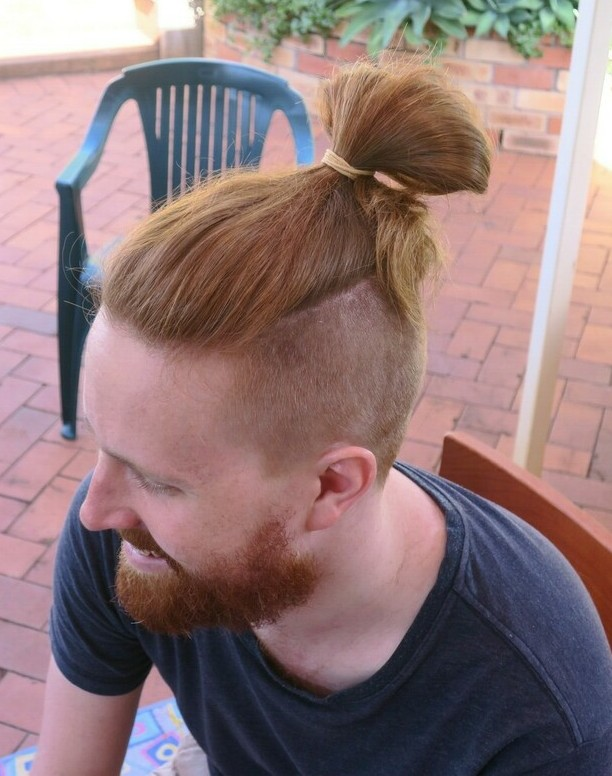
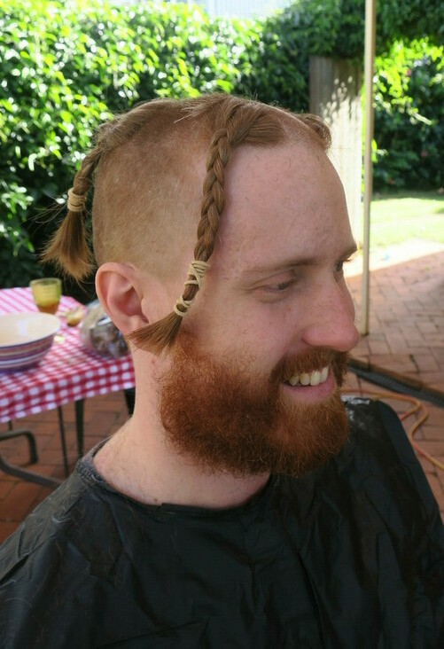
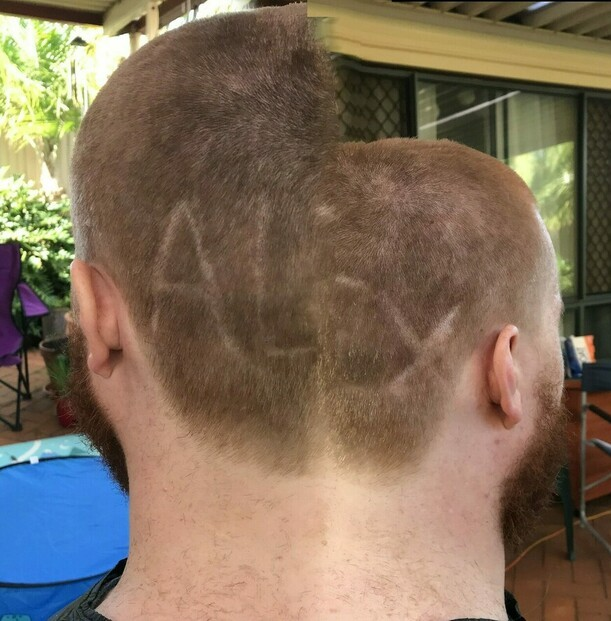
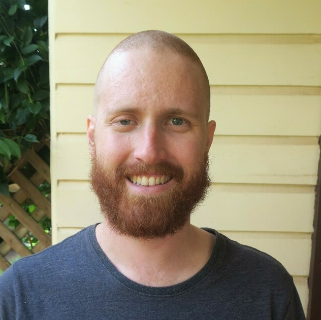

---
categories:
- Misc
type: post
date: '2020-03-15'
slug: shave
title: World's Greatest Shave
featured_image: posts/2020/shave/after.jpg
---

On the weekend I took part in the World's Greatest Shave.
Thanks to everyone that donated, we were able to raise $1,847 for the Leukaemia Foundation.

Anna won the honours of operating the clippers. Below is a video timelapse, I thought she did a great job with some interesting intermediary hair styles.



And the final product...

If you like, you [can still donate](http://my.leukaemiafoundation.org.au/alexguinman) for the next few weeks!