+++
categories = ['Travel']
date = '2020-07-07'
featured_image = 'posts/2020/zamia/trailhead.jpg'
slug = 'zamia'
tags = ['Queensland', 'Hiking']
title = 'Zamia Walk'
type = 'post'

+++

The [National Parks Website](https://parks.des.qld.gov.au/parks/mount-archer/about) doesn't have any info about this walk for some reason. There were signs at the top and bottom with information though.

The ascent trail starts at First Turkey just past the waterhole and toilet block for the mountain bike tracks, with a sign that says to allow for 4 hours each way. We were staying with Rachael's parents whilst in Rocky so I just walked from there with the plan to meet Rachael at the top for lunch.

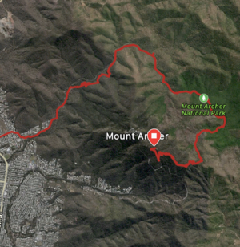

The waterhole and creek were bone dry (as it often is). You can ride your bike on the first part as the national park doesn't start until further up.

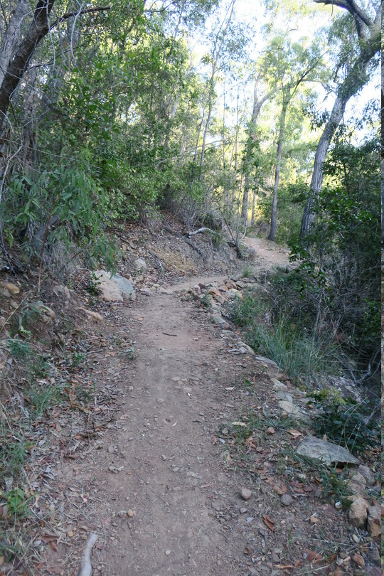

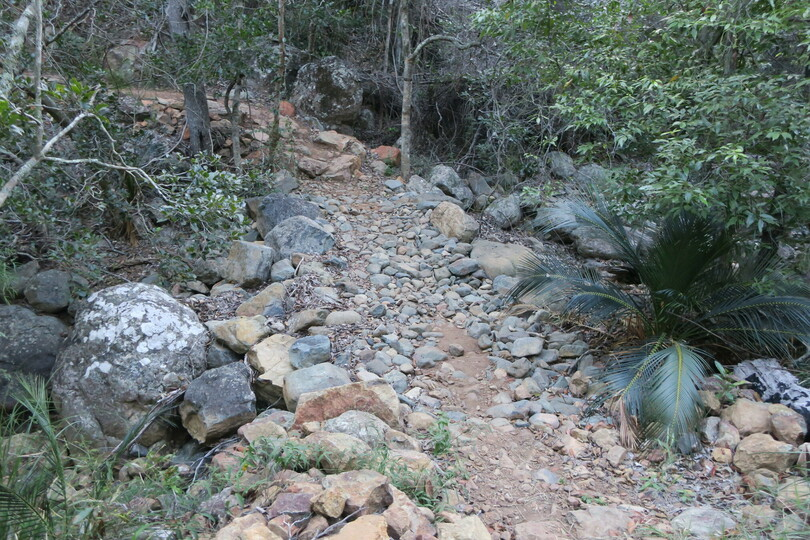

You walk along a service road for a while next to the creek.

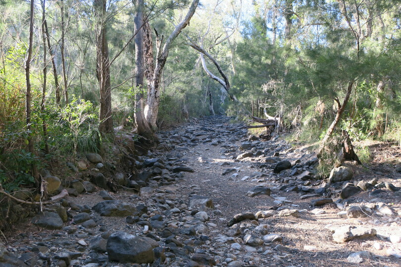

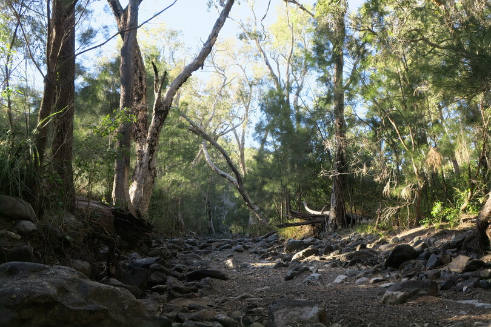

Eventually, the trail leaves the service road and there are a few creek crossing and staircases (both up and down).

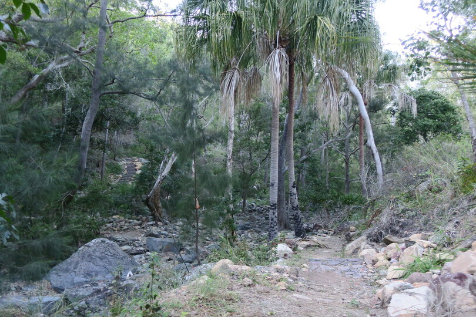

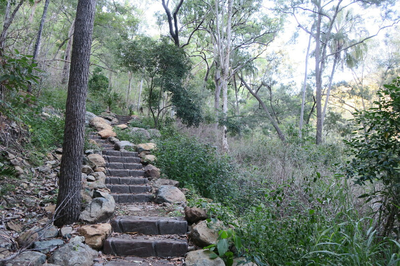

There was actually bits of (stagnant) water in places as you got further upstream. The walk would definitely be much nicer after some rain.

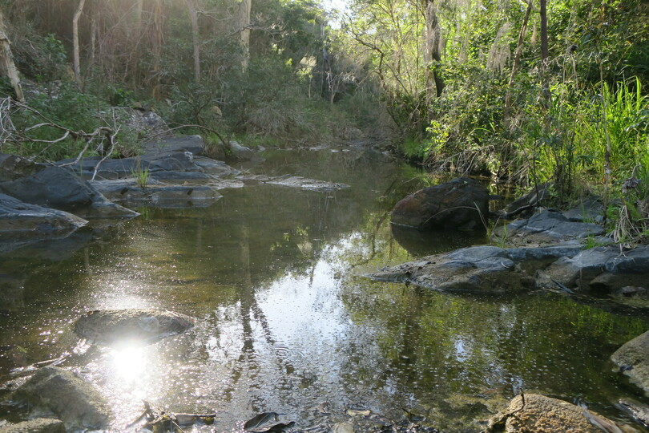

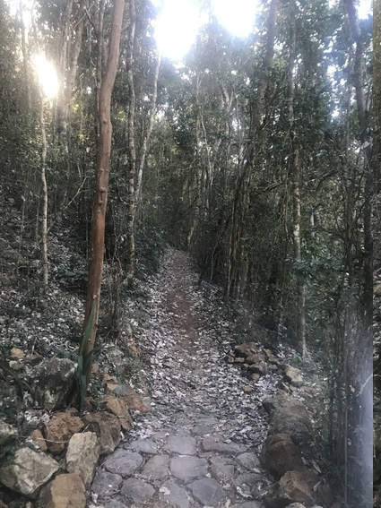

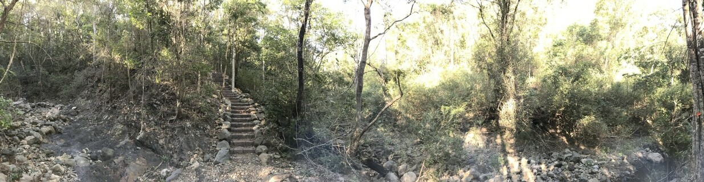

The ascent up the mountain proper was a bit overgrown and not as enjoyable as walking along the creek. There was some nice views if you stopped and turned around.

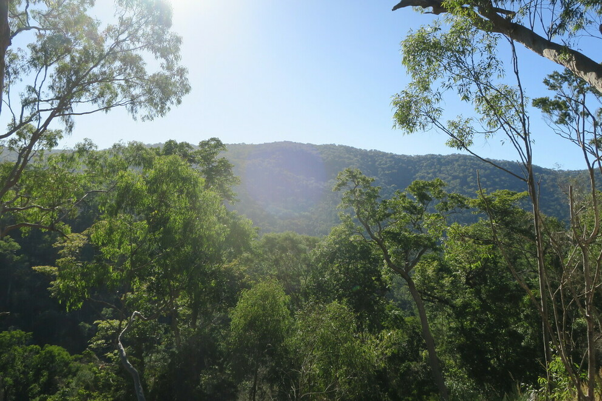

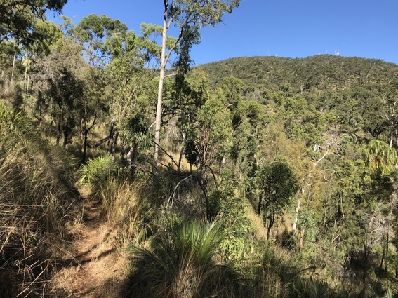

Mt Sleipner Lookout wasn't as exciting as I was expecting. Definitely good news but not that much better then you can get from the top of the hike.

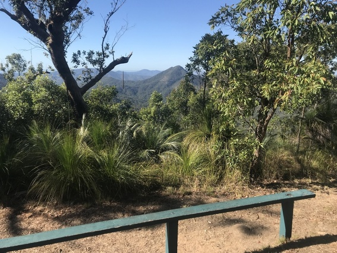

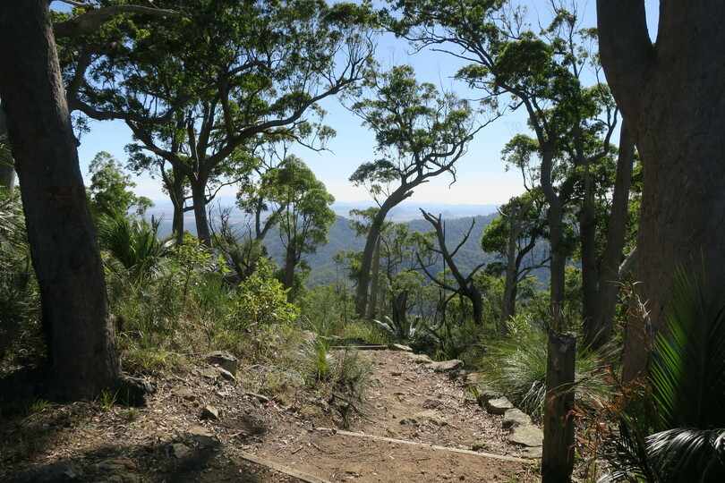

The lookout at the top has had a bit more work since [last time](/posts/2018/rocky-again/) we went. And it was surprisingly busy for a weekday, everyone must still be enjoying the lifting of lockdown.

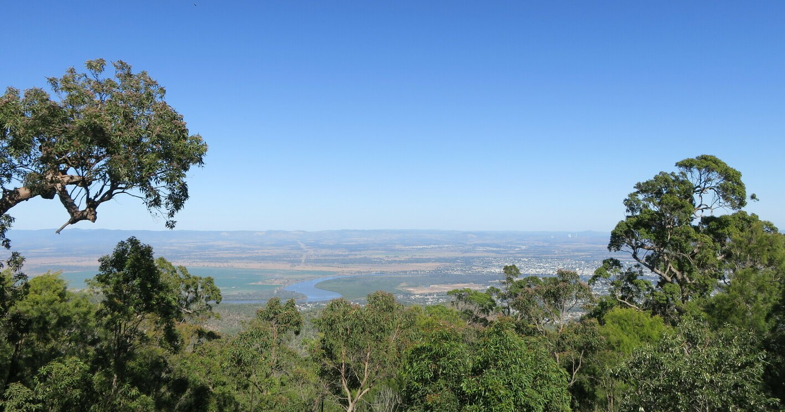

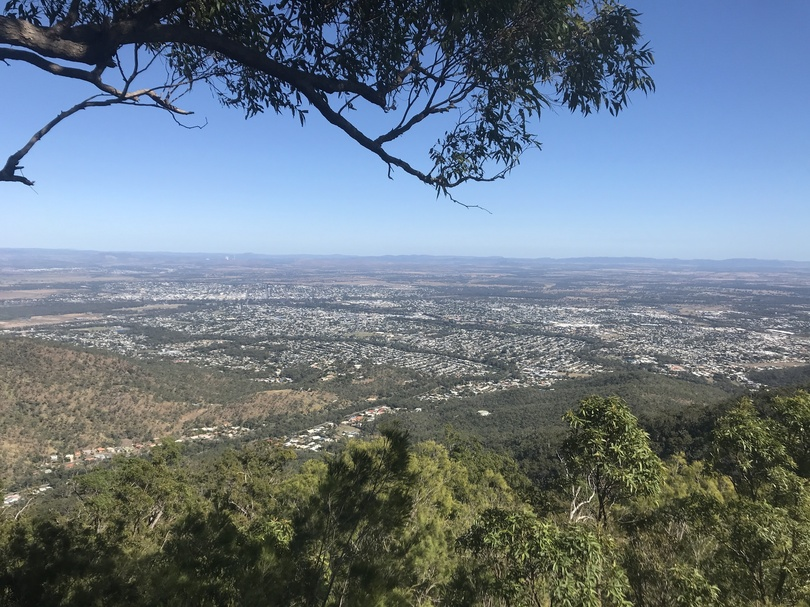

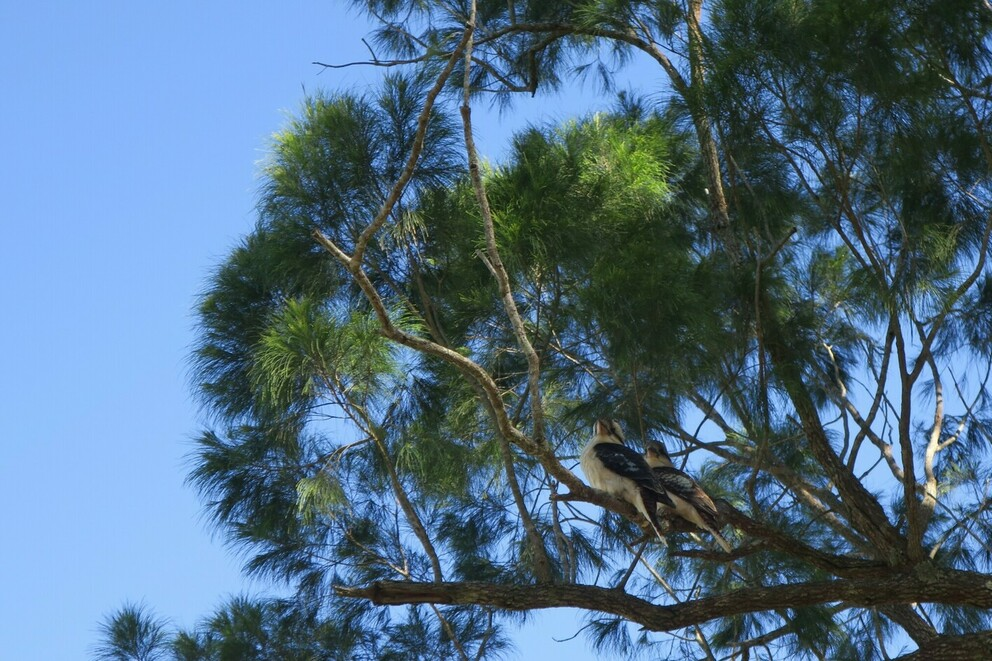

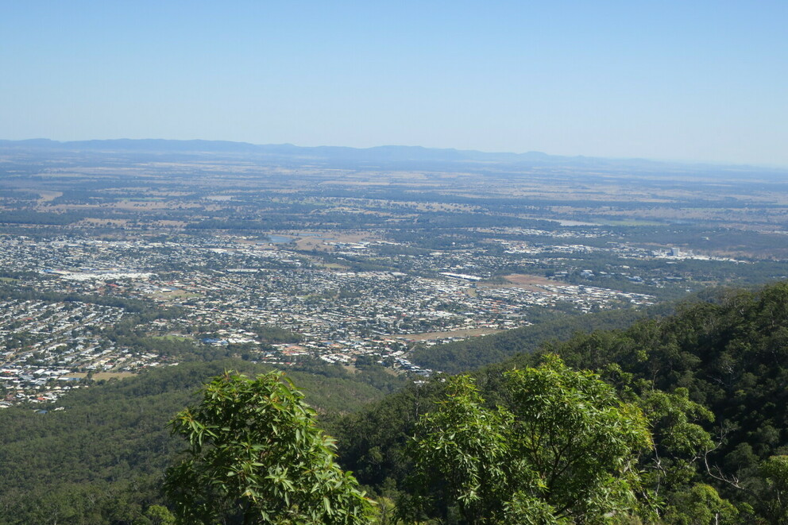

The highlights were definitely the dry rainforest part of the upper creek, and the views from the top of Mt Archer. I enjoyed it but would skip the ascent next time. The majority of the trail isn't too steep. It's just the last bit with a steep climb.

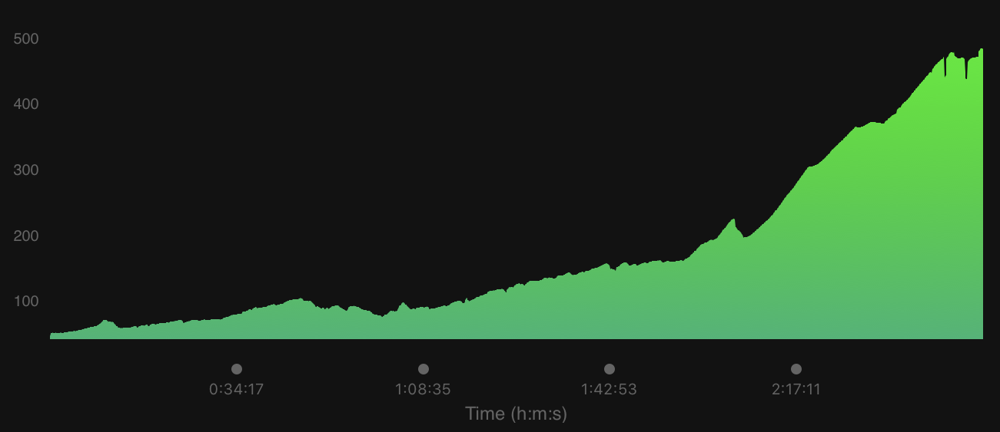
