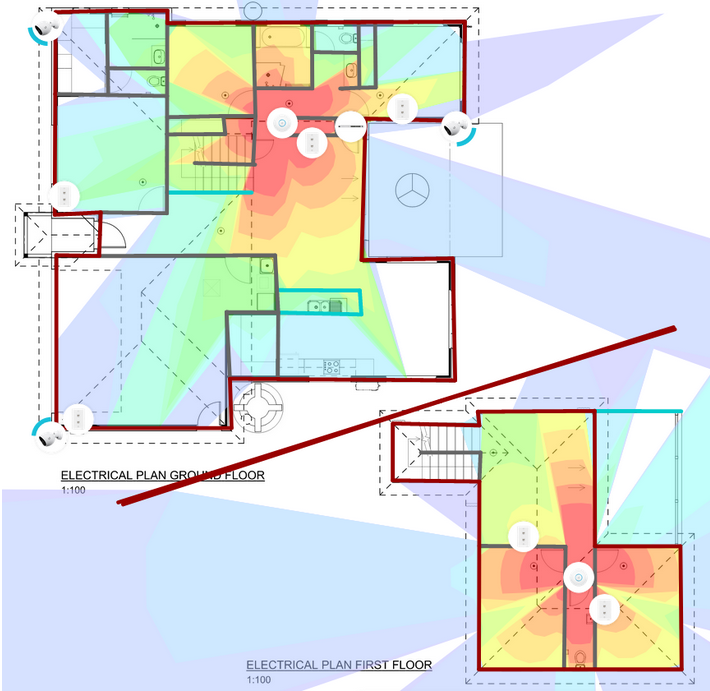
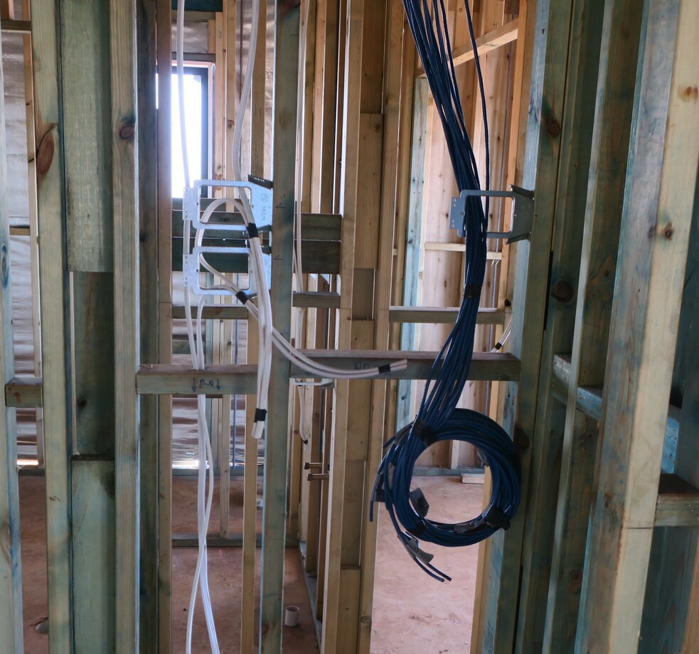
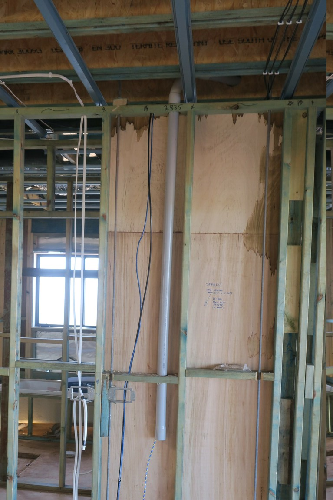
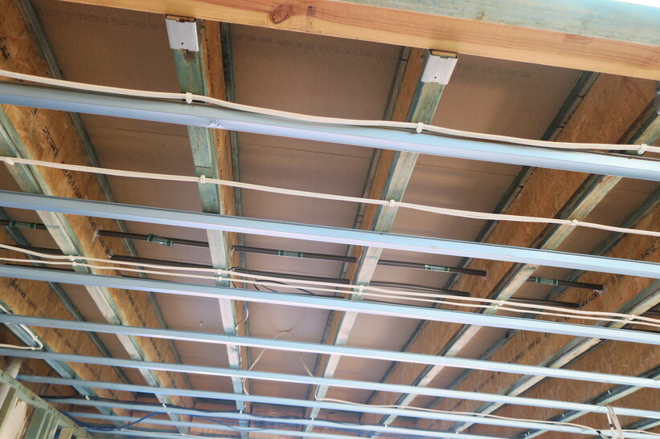
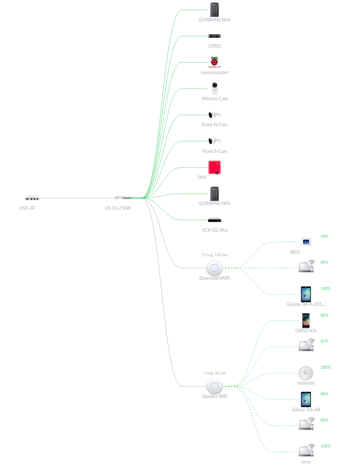

+++
categories = ['Misc']
date = '2021-04-16'
thumbnail = 'posts/2021/house-electrical/cat6.jpg'
slug = 'house-electrical'
tags = ['House Build']
series = ['House Build']
title = 'House Electrical'
type = 'post'

+++

One thing I did want to do properly that isn't part of the standard inclusions is running Ethernet cable to most of the rooms. Since it's two storey I also wanted to run proper WiFi access points and put in cables for [our PoE cameras](/posts/2019/security-cameras/) that we'll bring from the old house. I used [this guide](https://www.troyhunt.com/wiring-a-home-network-from-the-ground-up-with-ubiquiti/) as a starting point to get an idea of how best to do it. I used the [Ubiquity Design Center](https://design.ui.com/) to work out Wifi AP placement. 

We are running all the cables back to the cupboard next to the downstairs TV. Originally I was going to run it to the cupboard under the stairs but the builders thought they would need to add in a bulkhead across the hallway to do that. 

I also got them to put in a conduit (pipe) so that we can put HDMI /audio cables through to the TV later. 

It will basically be impossible to add wiring in the downstairs ceiling after the fact, so the other thing I wanted to add was speaker cable in case we decide to put in surround sound. We got a quote for some good quality ceiling speakers but decided we'd just stick with the cabling for now and add them later if needed. With a baby in the house, we haven't been watching many movies lately anyway.

**Update**:

Getting 2 WiFi APs ended up being overkill, as whilst it does provide stronger reception, running the upstairs one by itself covers the whole house okay. The actual cabinet itself looks pretty good.

