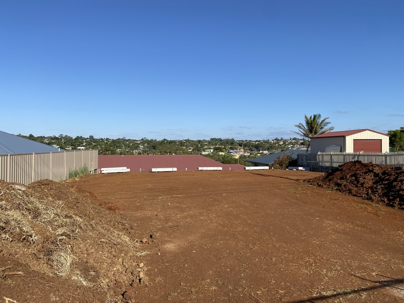
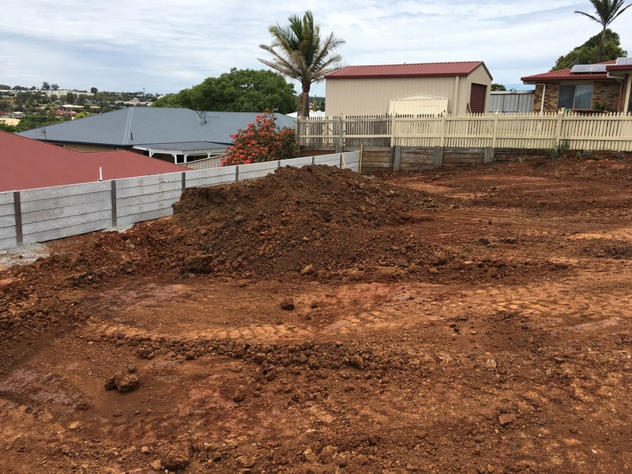
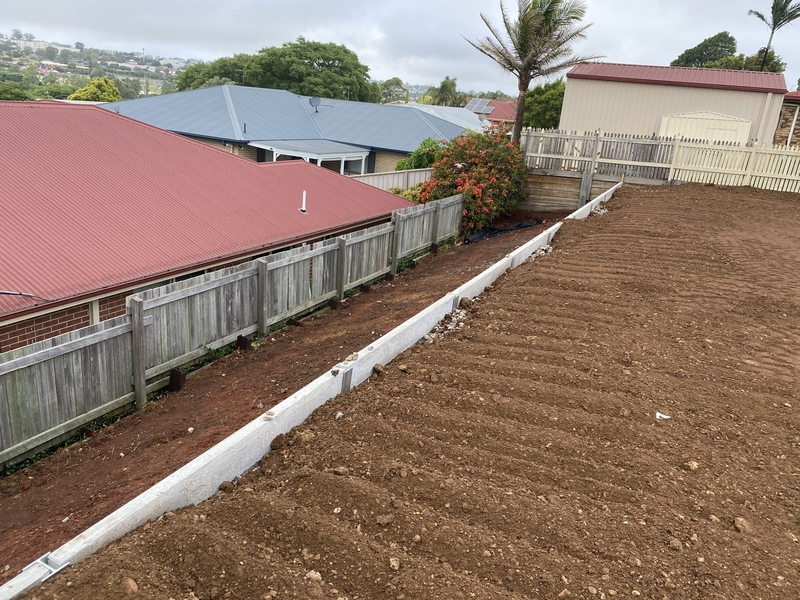
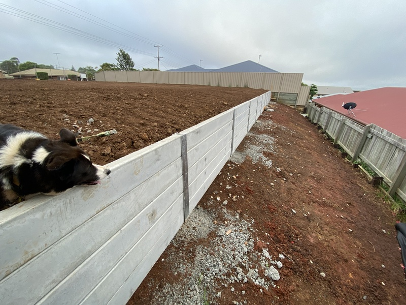
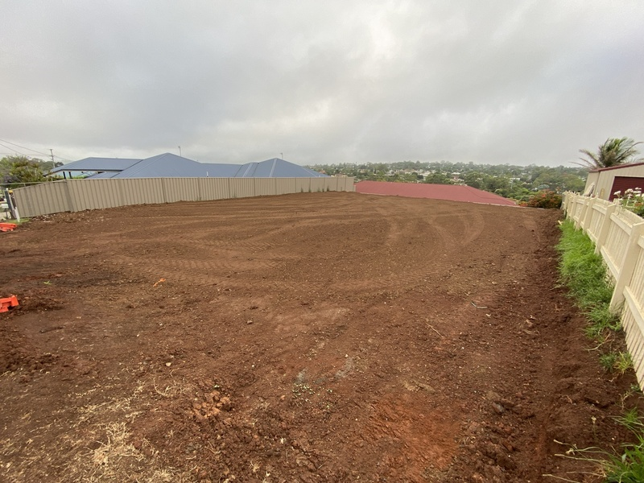
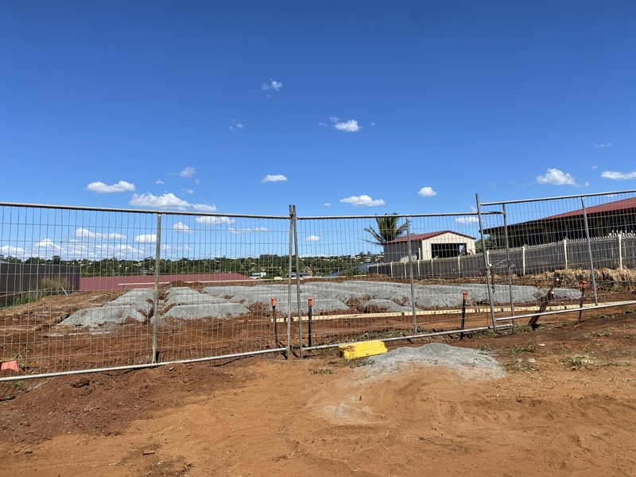
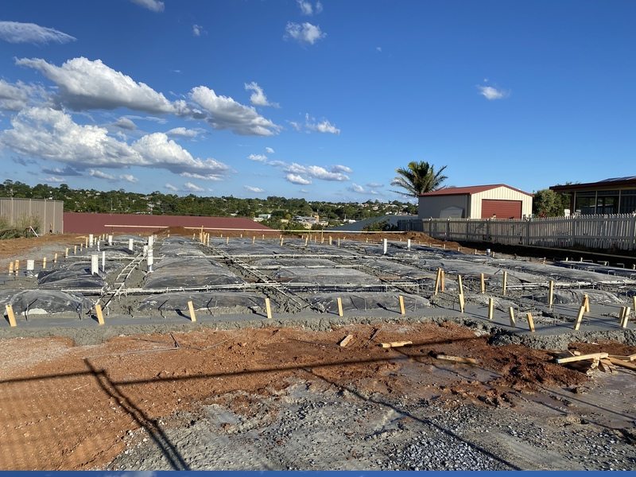
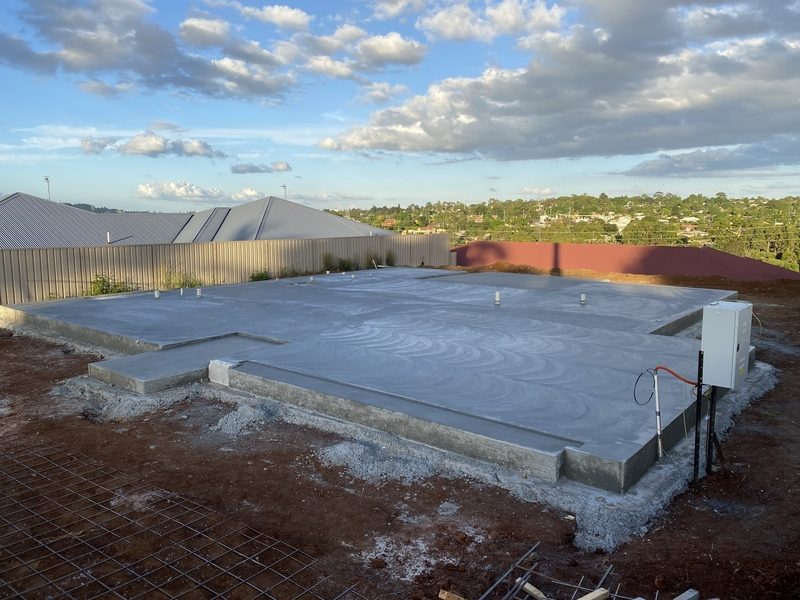

---
categories:
- Misc
date: '2021-02-03'
slug: house-foundations
title: House Foundations
featured_image: posts/2021/house-foundations/slab-3.jpg
tags:
- House Build
---

Before Christmas they started doing the earthworks and retaining wall at the back of the block.

We also had to pick all our selections before Christmas.
It wasn't actually too bad as the interior designer had a showroom with most of the selections to choose from. And then we had to go to a couple of other stores like Tradelink for a few other selections but overall much simpler then I expected.

And finally they started the slab on Australia Day.
So should be much easier to start planning our landscaping and stuff now that we have a good idea of how much space the house will take up.

