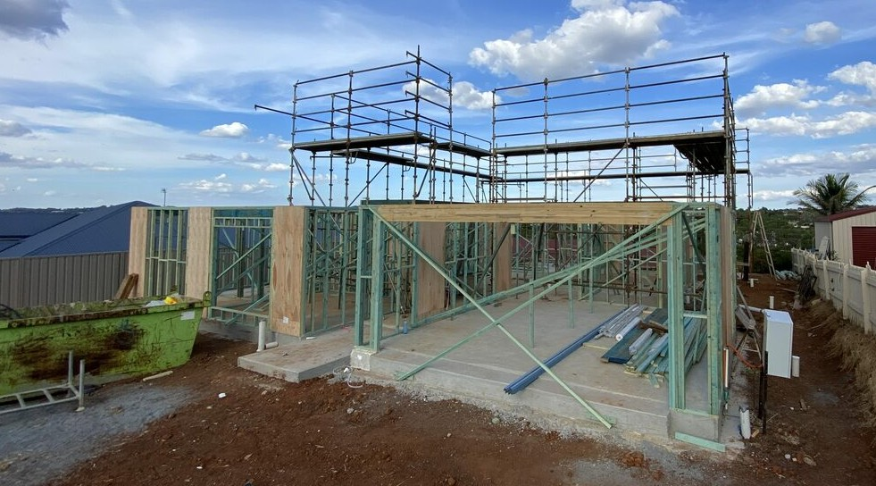
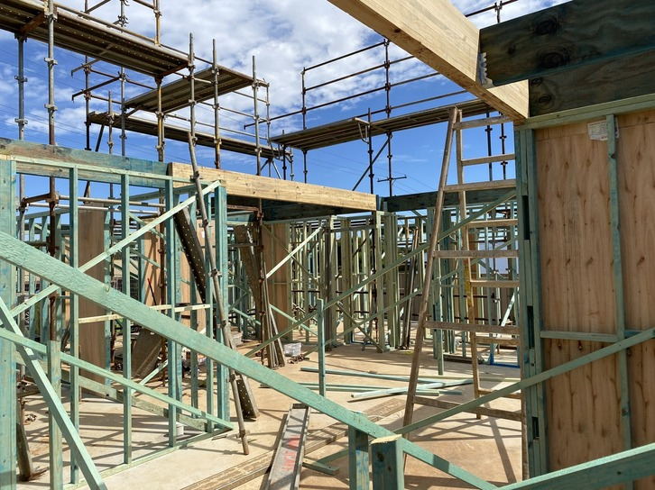
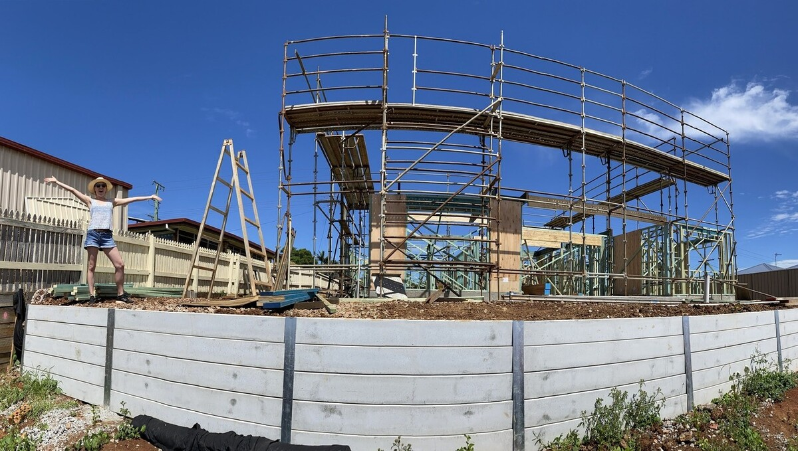
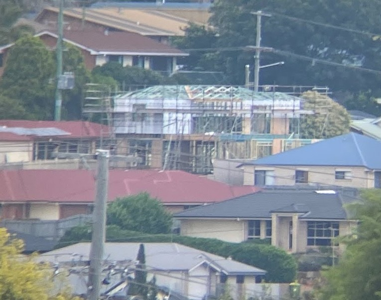
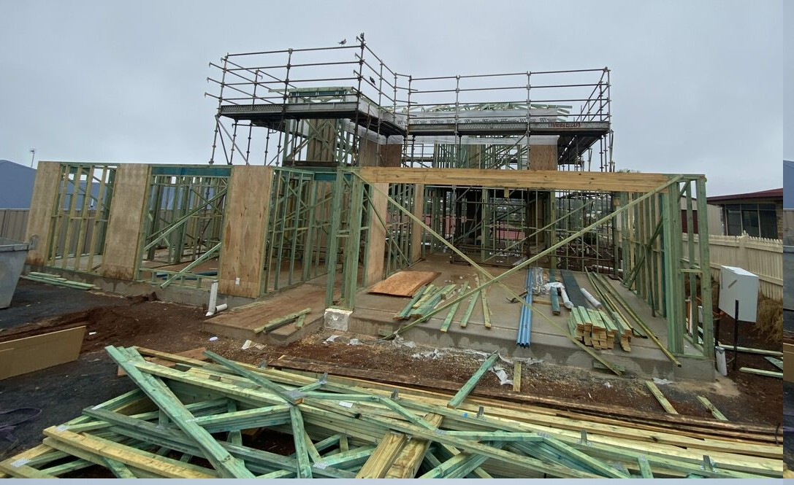
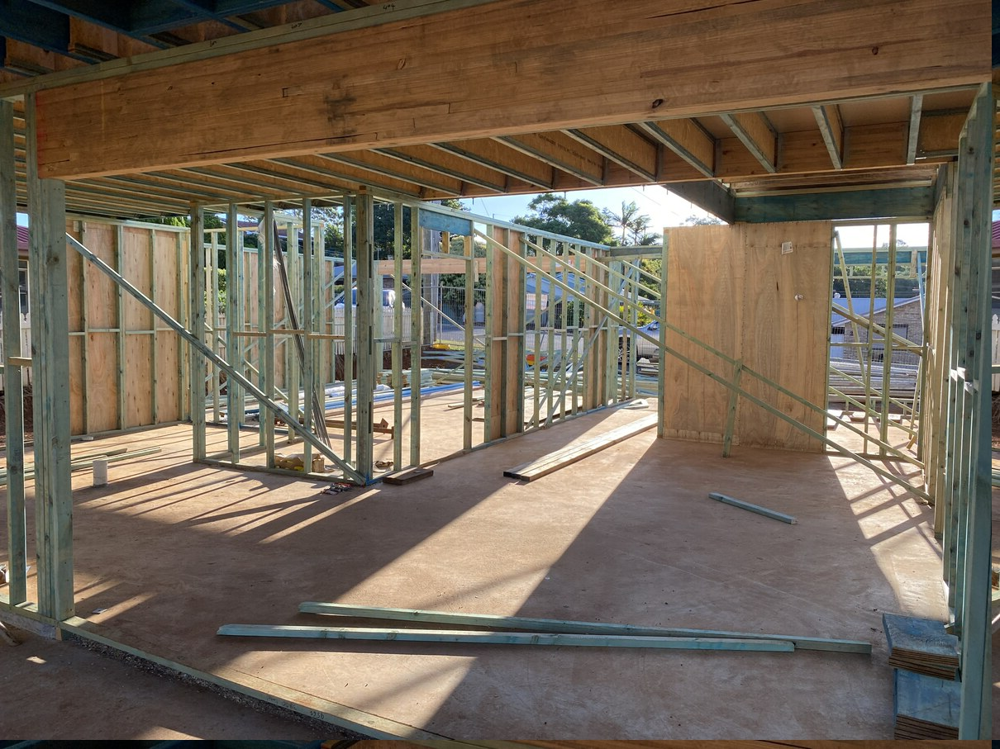
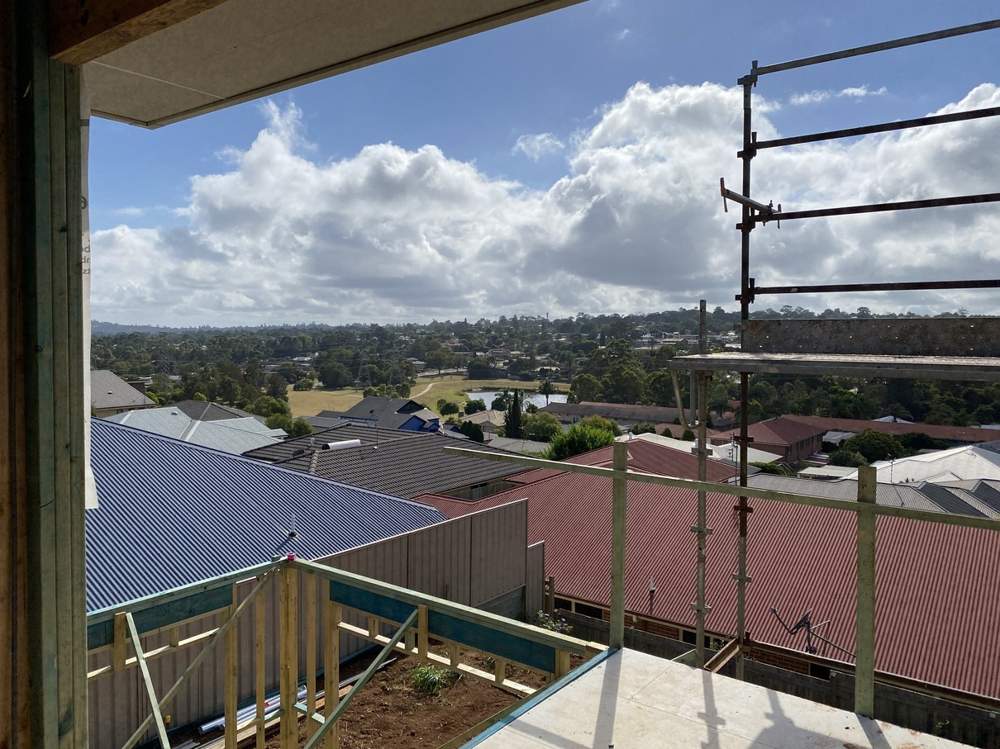
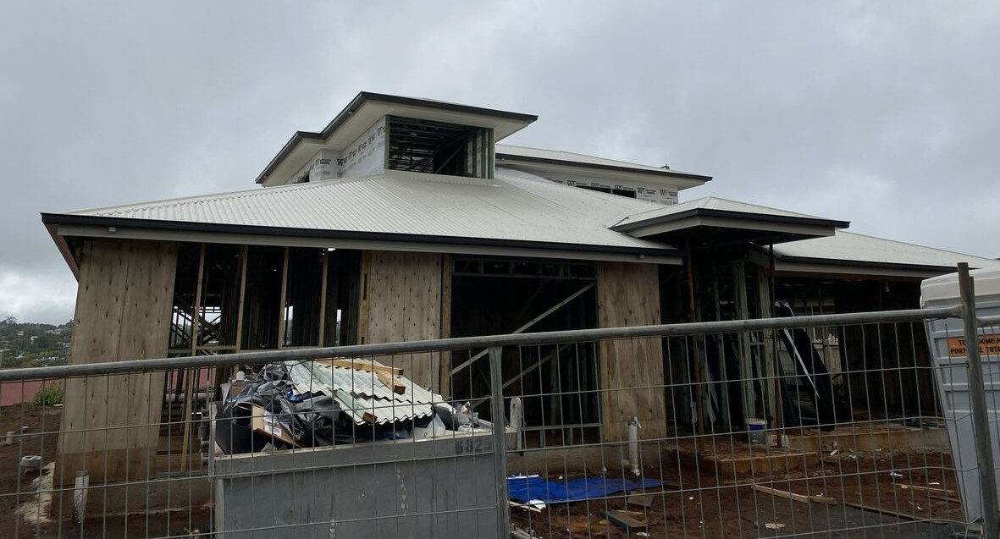
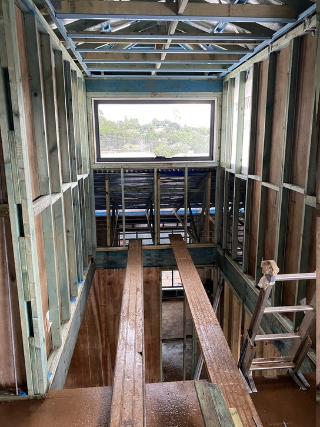
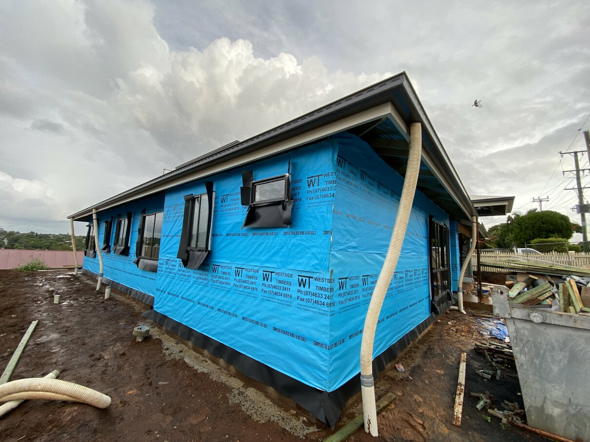

+++
categories = ['Misc']
date = '2021-04-14'
thumbnail = 'posts/2021/house-frame/frame05.jpg'
slug = 'house-frame'
tags = ['House Build']
series = ['House Build']
title = 'House Frame'
type = 'post'

+++

After putting the slab down, getting the frame up all happened pretty quickly. There was a few delays from rain but the roof and windows and everything were on by the end of March.

Due to the scaffolding and bright weather proofing, it's actually suprisingly easy to spot the house from various places around the area. We worked out you can even see it from out the back of our current house (with binoculars).

One of the main reasons we wanted to buy the block was that we thought it would have a good view from the second floor. We are pretty happy with how the terrace view should turn out. 

The bricks and everything should be done in the next few weeks and it will be ready for lockup. We are definitely able to get a better feel for how big everything will be now the walls are up. It was very hard to get a feel for the space when it was just a slab.
