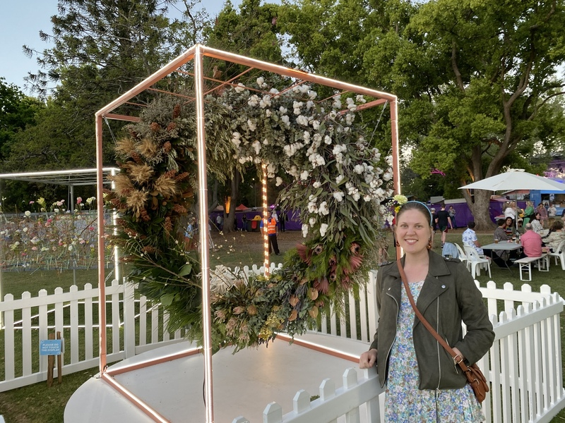
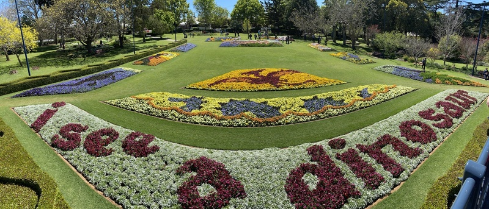
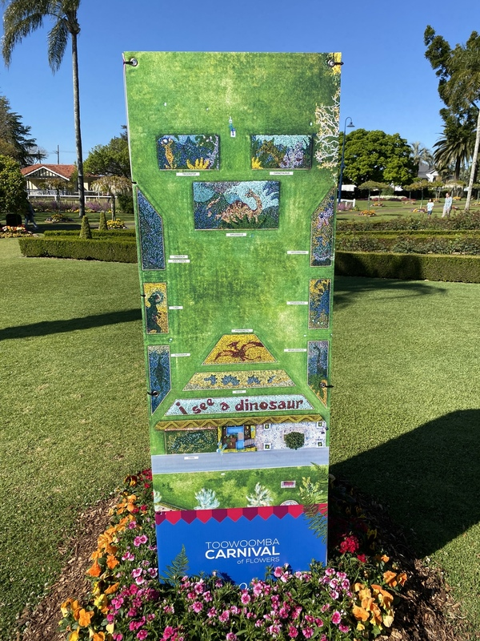
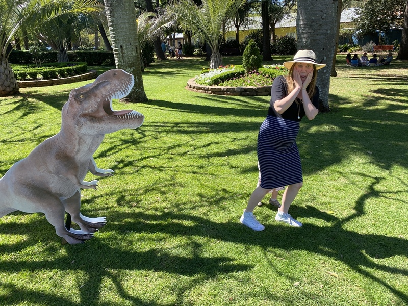
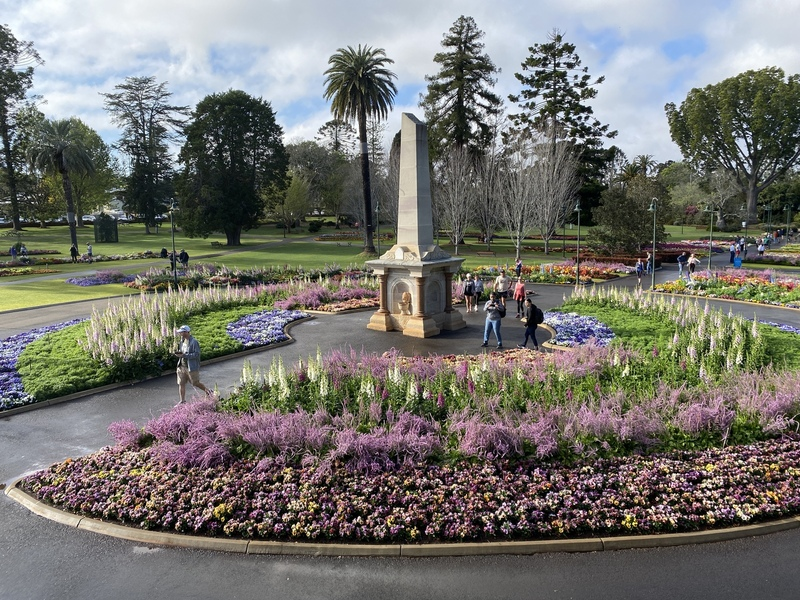
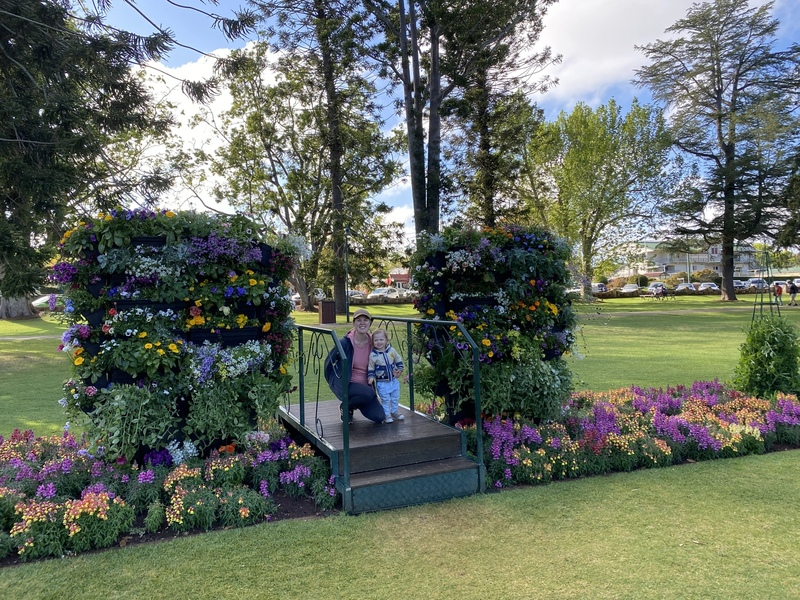
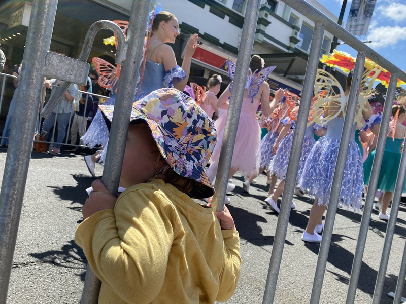

---
categories:
- Misc
type: post
date: '2021-09-25'
featured_image: posts/2021/tcof-2021/lb1.jpg
slug: tcof-2021
title: Toowoomba Carnival of Flowers 2021
tags:
- TCOF
- Flowers
- Toowoomba
---

It was great to go to be able to go to the food and wine festival again this year, after last year was cancelled and we had a newborn the year before that. Unfortunately they had to change the lineup last minute due to border closures, so it was mostly bands I'd already seen several times.

Lyra really liked the dinosaur theme at Laurel Bank Park this year.

We even went to the parade for probably the first time [since the we moved here](/posts/2012/tcof-parade/). It wasn't much different, but Lyra really enjoyed it.

