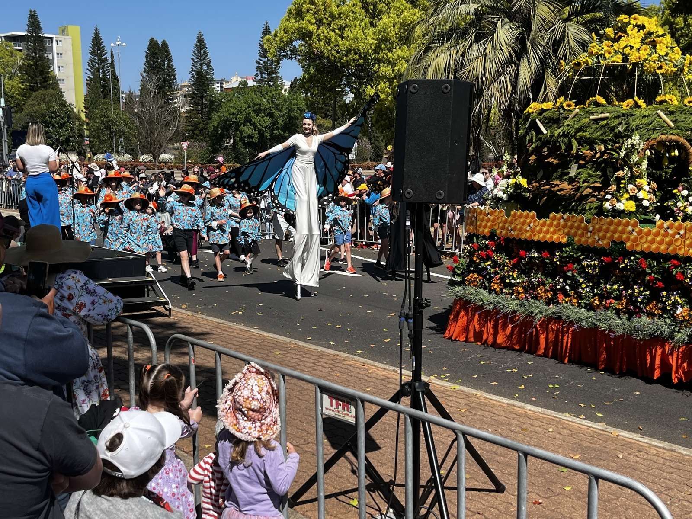
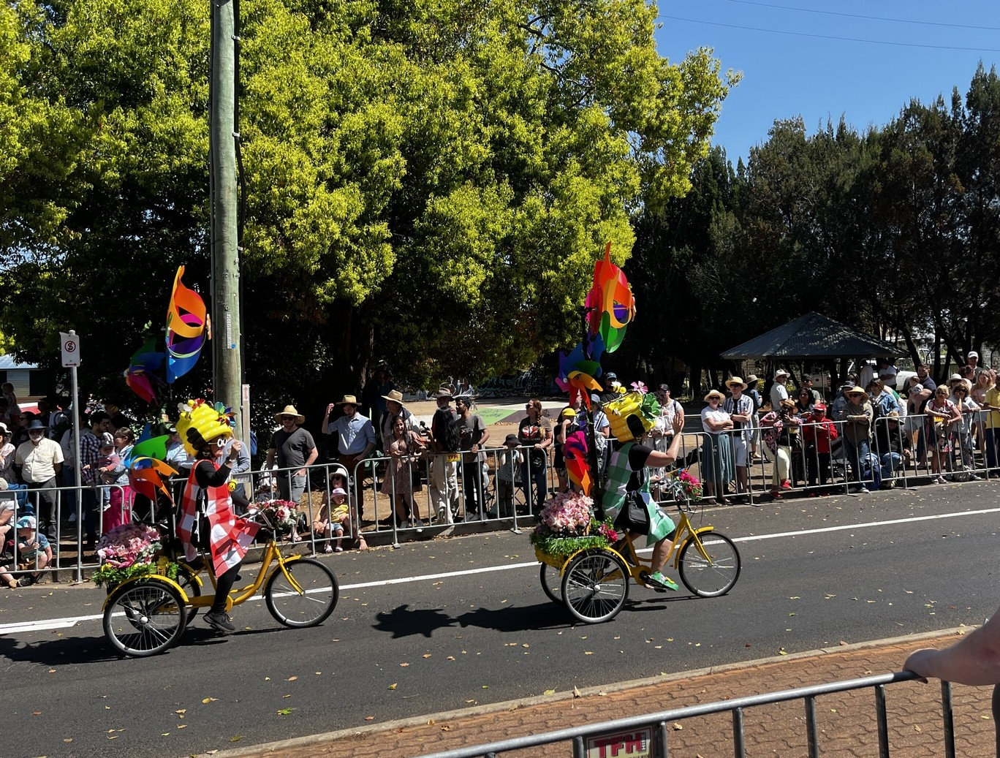
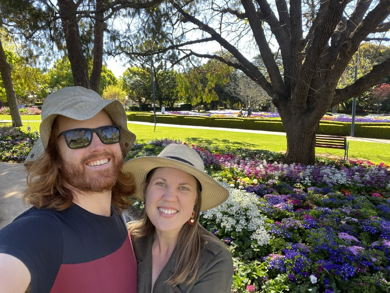
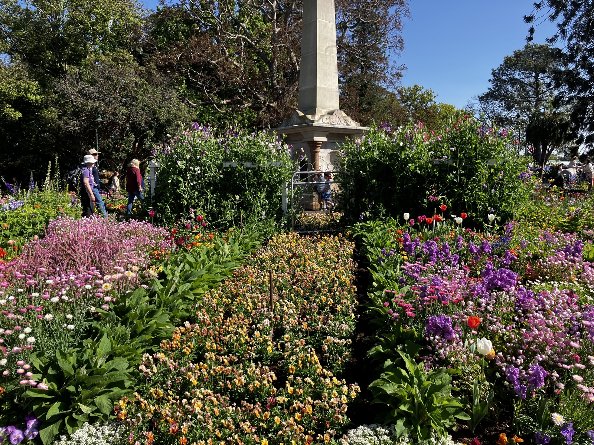
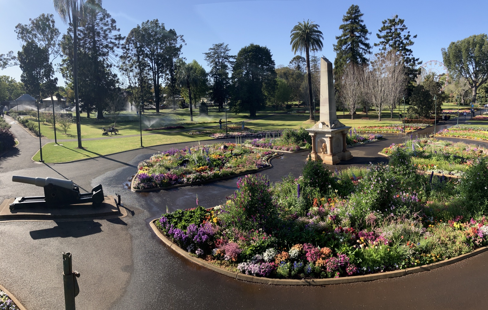
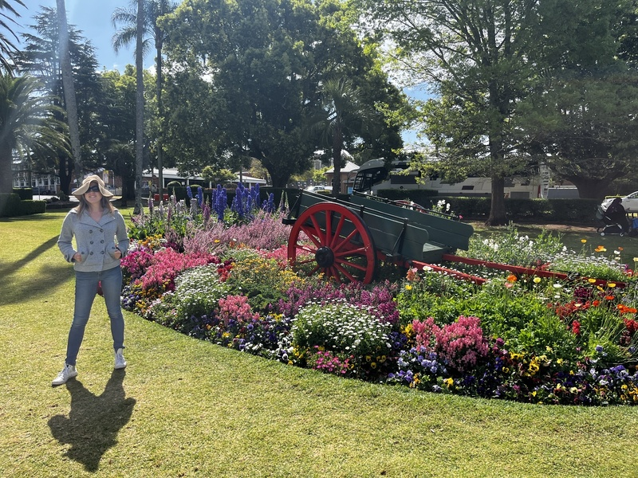
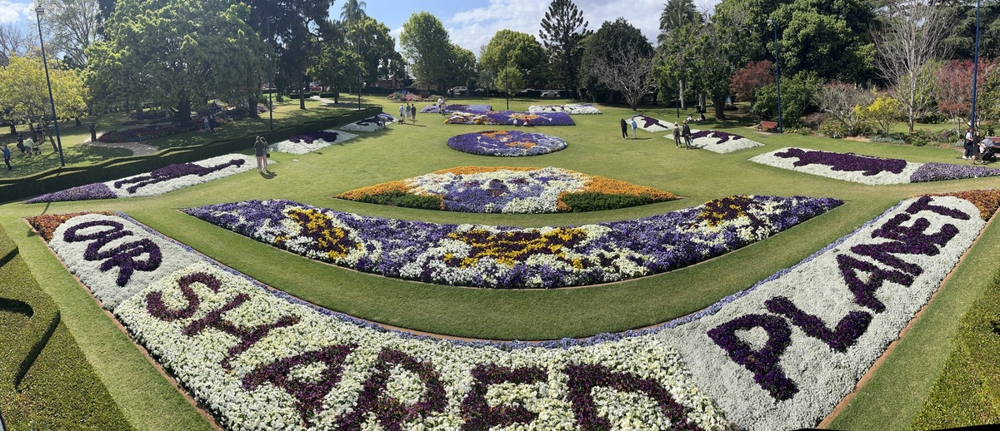
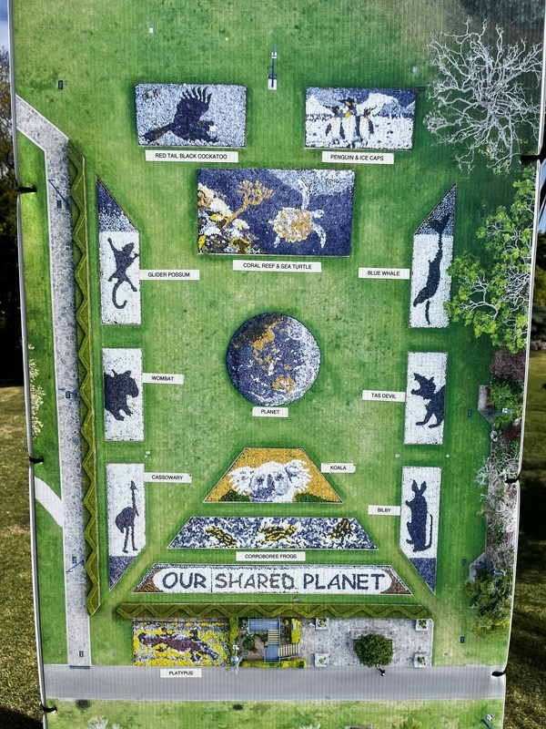
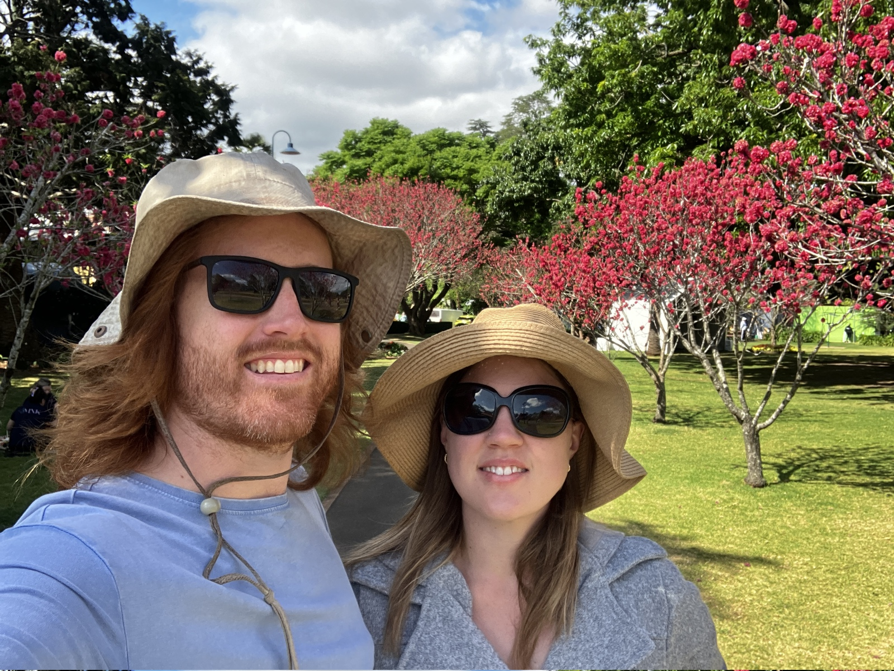

+++
title = "Toowoomba Carnival of Flowers 2023"
date = "2023-10-01"
slug = "tcof-2023"
type = "post"

[taxonomies]
tags = [ "TCOF", "Toowoomba",]
categories = [ "Misc",]

[extra]
image = "posts/2023/tcof-2023/20230921_075103.jpg"

+++

We had a very busy September this year, I was in Cairns for work the first week and so we didn't try to go to the food and wine festival. 
Rachael was then in Melbourne visiting Lauren the following weekend when the parade was on, but I still rode in with the kids for it and they loved it. Was so much nicer riding in and not having to worry about parking with all the streets closed.

 

 

We didn't make it to any home gardens, but the council parks were great as always. 

 

 

 

 

 

 

