+++
title = "Toogoom"
date = "2023-11-28"
slug = "toogoom"
type = "post"

[taxonomies]
tags = [ "Queensland",]
categories = [ "Travel",]

[extra]
image = "posts/2023/toogoom/20231124_170438.jpg"

+++

We had a family holiday to Hervey Bay, with a house booked at Toogoom and took the oppurtunity on the shorter drive up to visit some of the places on the drive north we hadn't got to yet.

The [Muntapa Tunnel](https://www.tr.qld.gov.au/facilities-recreation/parks-gardens/parks-by-location/cooyar-muntapa-tunnel1) was a nice quick detour - although besides the tunnel itself there isn't much to see. 

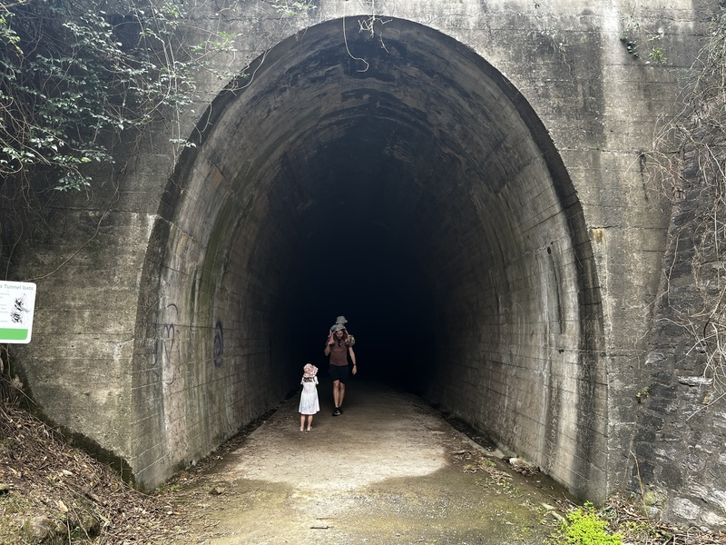 

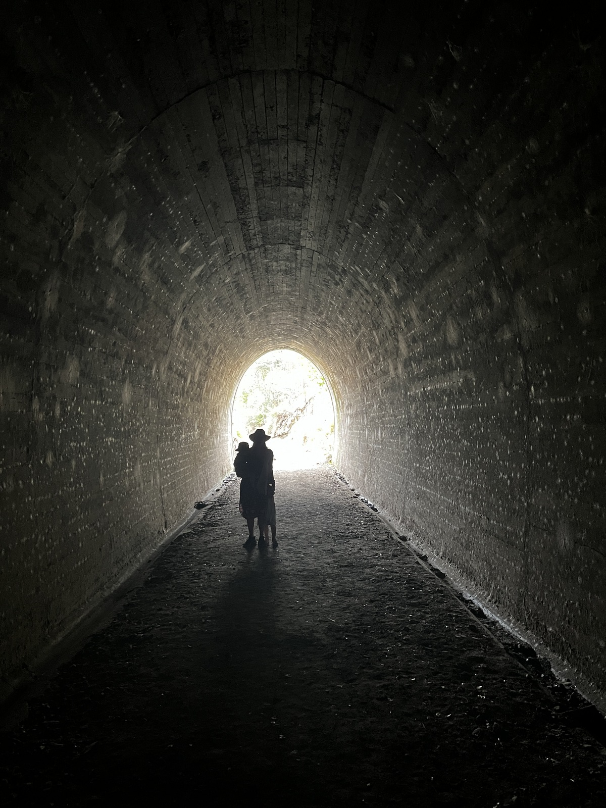 

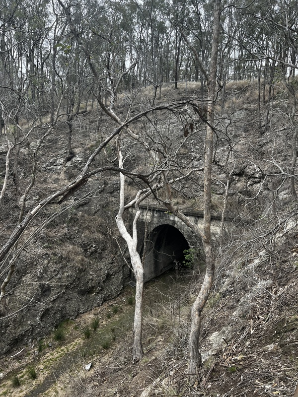 

Not far from there is the [The Palms National Park](https://parks.des.qld.gov.au/parks/palms). This one has been on our list to visit for a while but we've always had the dog with us and so couldn't go. It was a very nice, but short walk (which was perfect with the kids). 

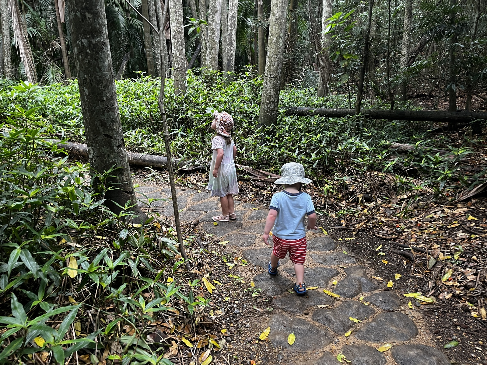 

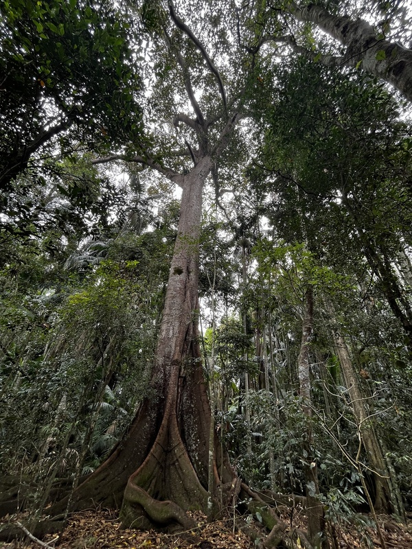 

At Toogoom we stayed at a house right on the beach. The beach itself was okay at high tide but when the water went out it went out really fast and a long way. Even at high tide the water was very shallow - but again that was good for young kids. You could probably wade out 1km and still have the water be at your waist. 

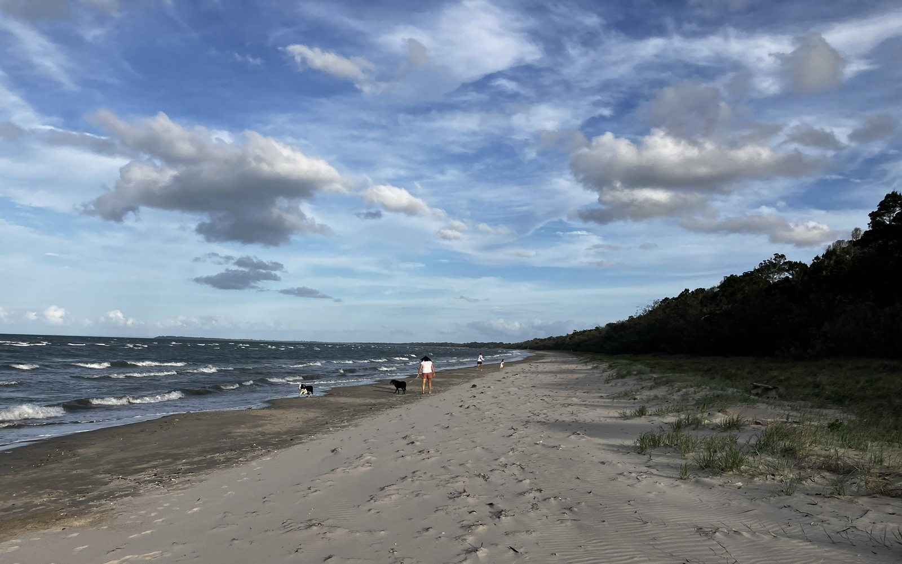 

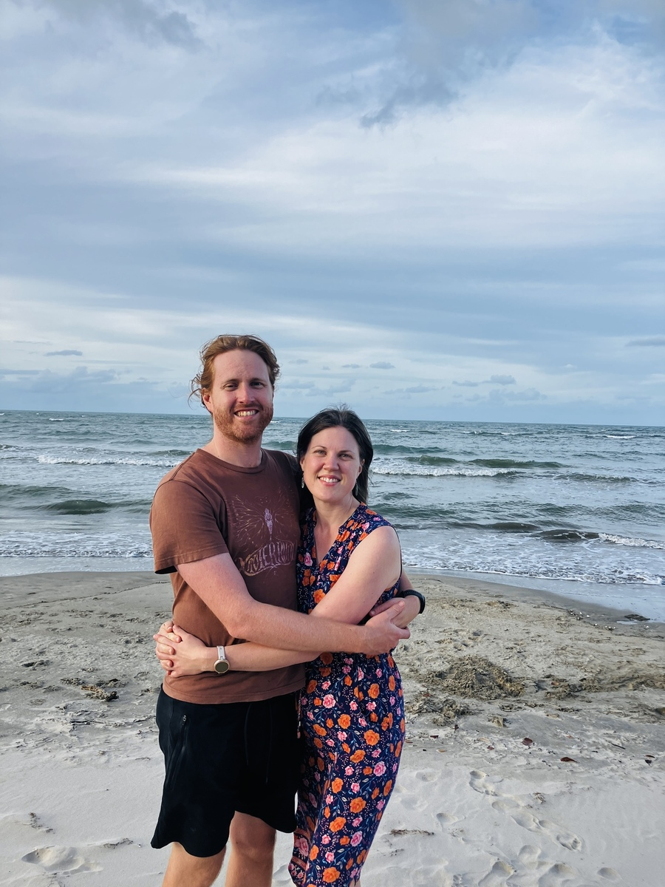 

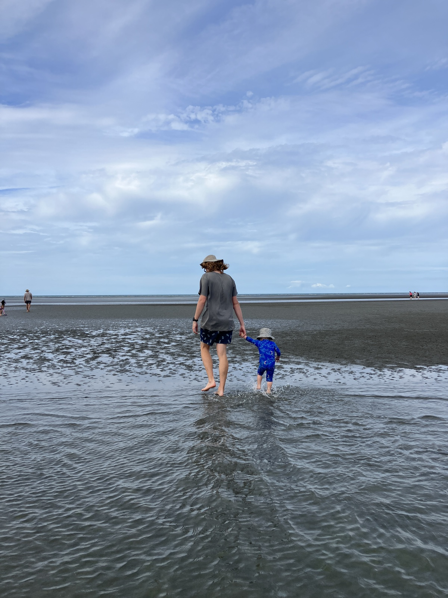 

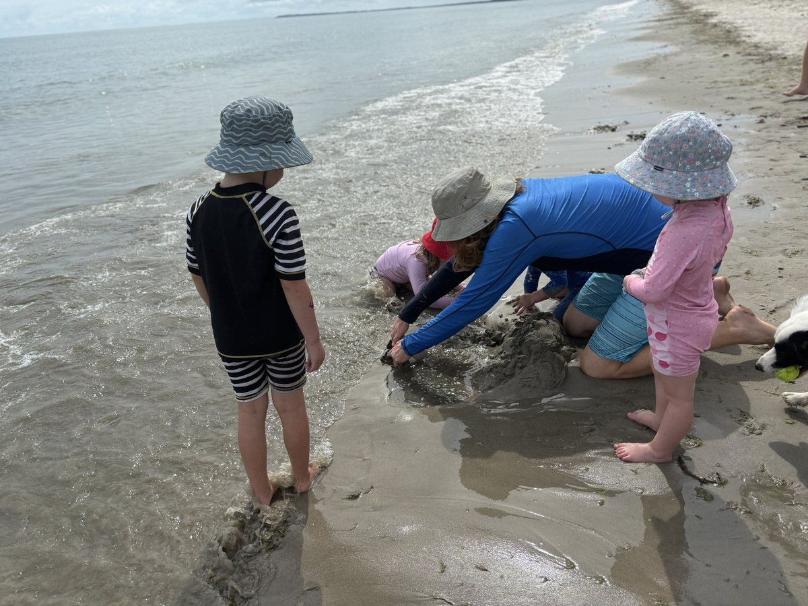 

On the Saturday we did the ParkRun at Urangan Pier, which was at high tide. We went back later with the kids on the last day and the tide was way out. With the tide out you could see all kinds of animals from the pier, including stingray, crabs and huge schools of fish. 

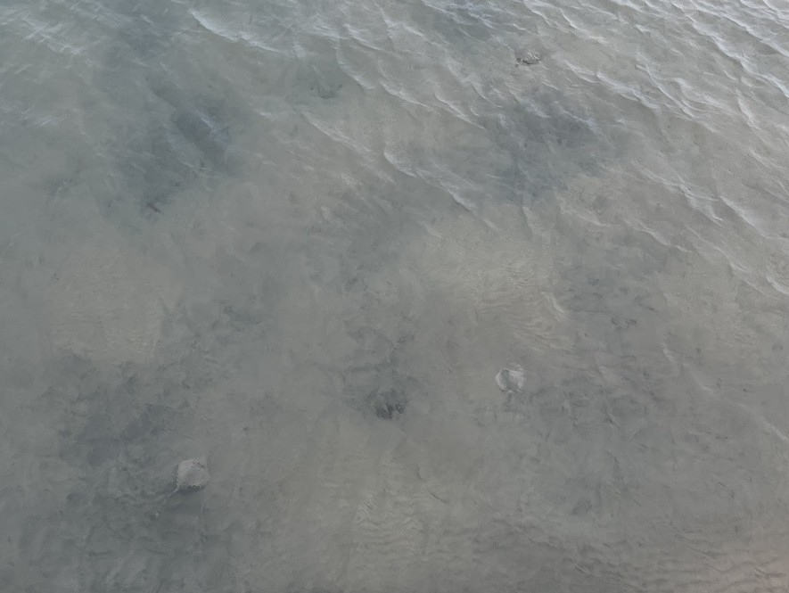 

On the drive back to Toowooomba, we stopped at [Coomba Falls](
https://www.discoversouthburnett.com.au/attractions/national-parks-and-reverves/coomba-falls/). It was beatiful and reminded me of stoney creek at Byfield - but it was raining and there was nowhere shallow where the kids could get in so we didn't stay long. We probably won't go back until the kids are both able to swim confidently. 

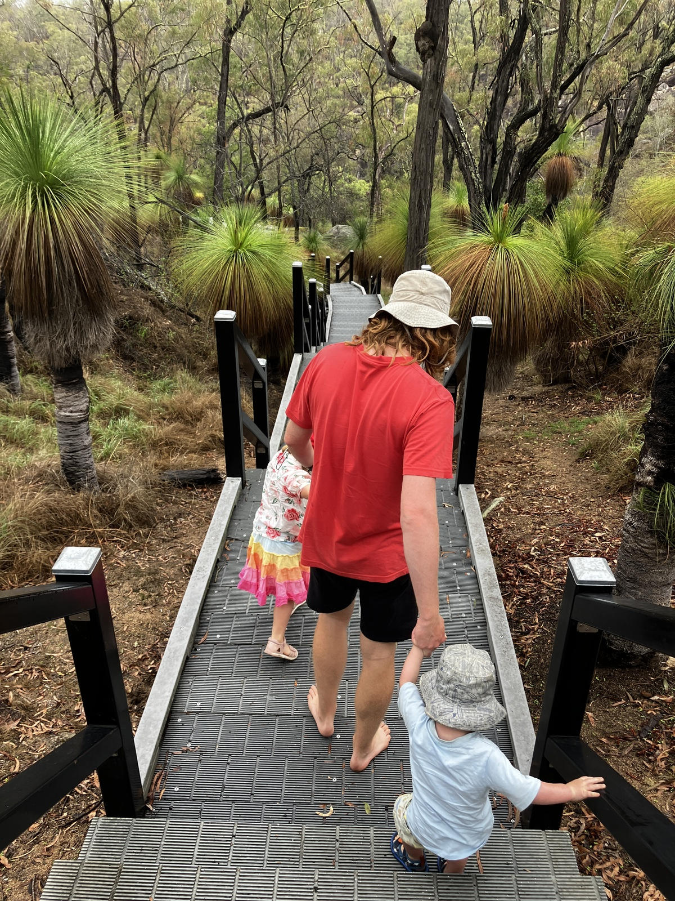 

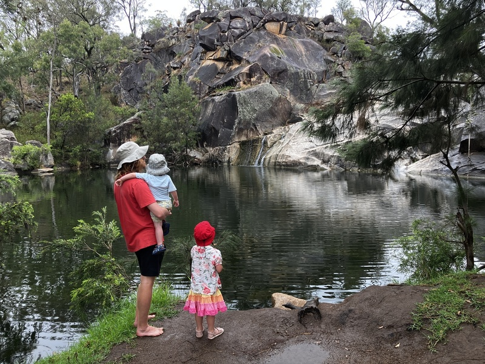 

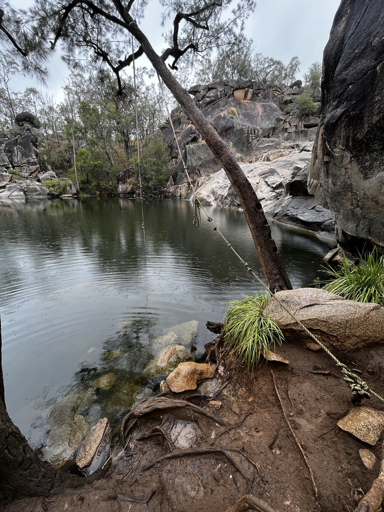 

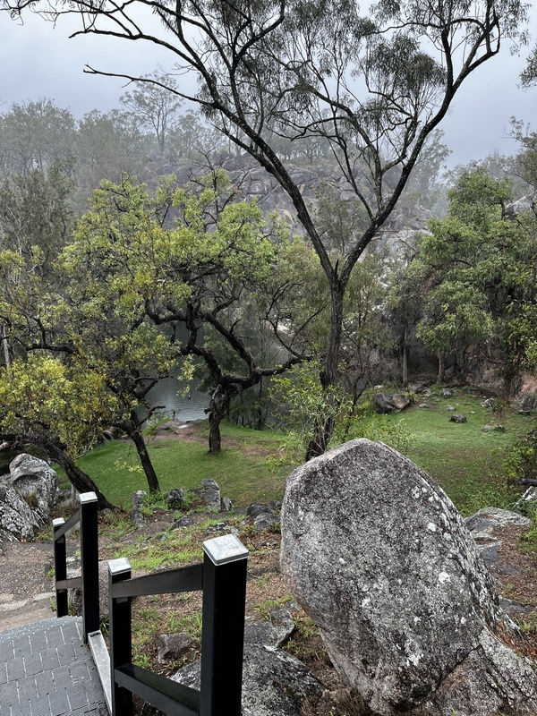