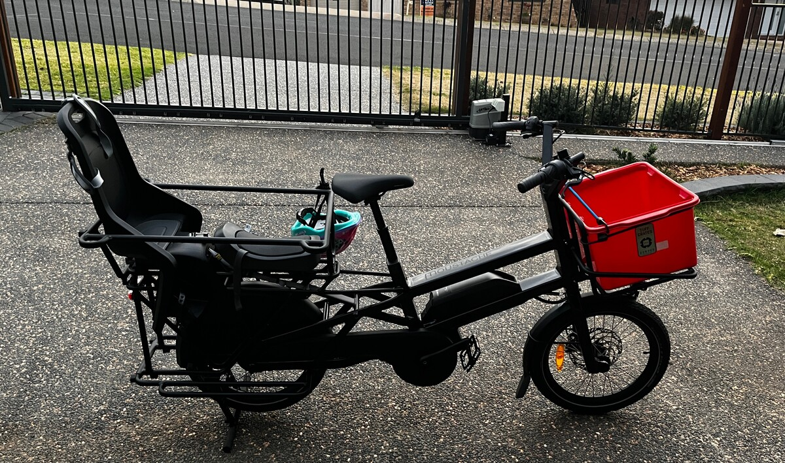
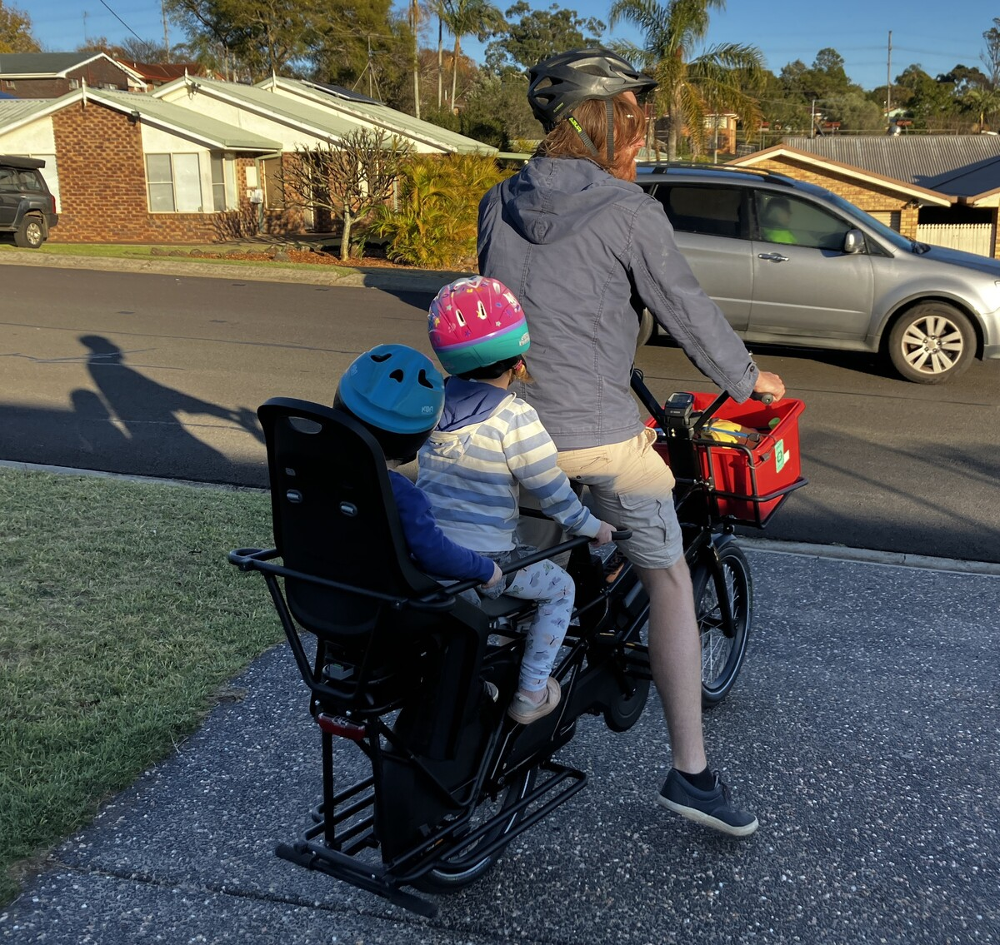
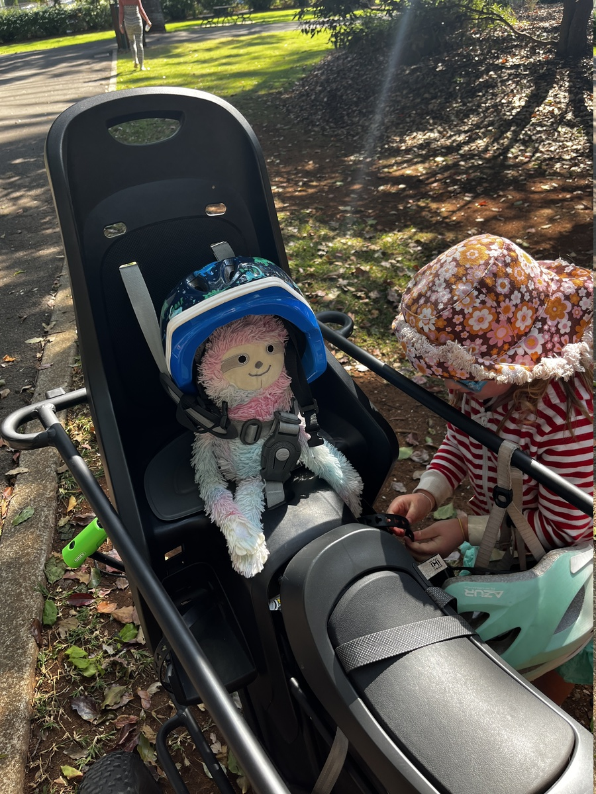

+++
title = "Cargo Bike"
date = "2024-07-20T14:00:00+10:00"
slug = "cargo-bike"
type = "post"

[taxonomies]
categories = [ "Misc",]

[extra]
image = "posts/2024/cargo-bike/bike.jpg"

+++

We have now had our Cargo Ebike for a year, and so thought I'd write a review in the vein of the posts a colleageue Simon did [[1]][se1] [[2]][se2] [[3]][se3].

[se1]: https://bq.org.au/resources/e-bikes-everything-you-need-to-know/
[se2]: https://www.linkedin.com/posts/simon-english-956ba01_it-is-amazing-how-a-simple-change-can-make-activity-6798024248465215488-IwFd/
[se3]: https://www.linkedin.com/posts/simon-english-956ba01_e-bike-update-for-those-of-you-that-have-activity-7011285785354141698--QBP/

With the kids getting bigger and Lyra no longer fitting in the bike trailer properly (not to mention it was hard work pulling 2 kids up hills) we wanted to look into getting an electic cargo bike to avoid needing to buy a 2nd car. Also putting the trailer on the bike (and taking it off) was a bit too involved to make it worth the effort for small trips like to daycare dropoff.

After trying out Chase's [Riese & Muller Load4][rm] with the kids, we were sold on the idea of a electric Cargo Bike, although a bit put off by the price and the fact that it takes up quite a bit of space in the garage (and too heavy to easily move around).
We ended up going with a [Moustache Lundi 20.5 Belt Cargo EBike][ml] which was a fair bit cheaper (but still expensive!) and much easier to manouver and store.
Having the kids on the back also feels a lot more normal to ride, although it only took a few minutes to get used to the front loader when we tried it. The dual suspension on the more expensive one was nice too, the kids aren't a huge fan of bumps on the Moustache. 

I don't think I could ride the Load4 without assist, but the Lundi is actually not that bad to ride without assist (even with kids on the back) as long as you aren't going up a hill.

[rm]: https://electricbikesbrisbane.com.au/products/riese-muller-load4-60-vario
[ml]: https://electricbikesbrisbane.com.au/products/moustache-lundi-20-5-e-cargo-bike

We managed 1,147 km over the first year, which is not a huge amount but still impressive. 
For commuting to work I primarily still use my (human powered) mountain bike and Rachael uses the e-skooter, and the Moustache is mostly just for trips with either the kids on the back or for small grocery trips. So overall pretty happy with the amount of usage, it is equivalent to riding to Brisbane and back 4.5 times.

The range was advertised as 40-90 km with the single battery and that seemed pretty accurate. The 40 km is if you ride on Turbo mode but you probably can push to the 90 km riding on Eco mode. Assuming 50 km a charge, that's 23 charges over the year or 11.5 kWh. Since we charge off solar, that's a measly $1.26 to charge it for the whole year! Even assuming charging without solar it would only be about $3. The equivalent petrol in our ineffecient Vitara would be about 133 L or $265. That's not as much petrol savings as I was expecting, but once you factor in rego etc the bike will have paid for itself within 6 years (and we went for the more expensive belt model) which isn't bad.

The bike is also a lot more conventient and fun then driving for short trips (unless it's raining). We went to a few events in the city (TCOF parade, Anzac Day March etc) and you can ride straight into the city without having to worry about road closures or parking. Rachael often uses it to ride into the library as well where you can just park it out the front. 

Another unexpected delight was looking at Christmas lights. In December we rode around looking at the houses with lights and it was much more enjoyable then doing it in a car where the kids can't really see out the window really well anyway. 

You can also ride with an adult (up to 70kg) on the back by re-arranging the seats, and I doubled Rachael a few times to events where parking would be an issue like the Peak2Park fun run.