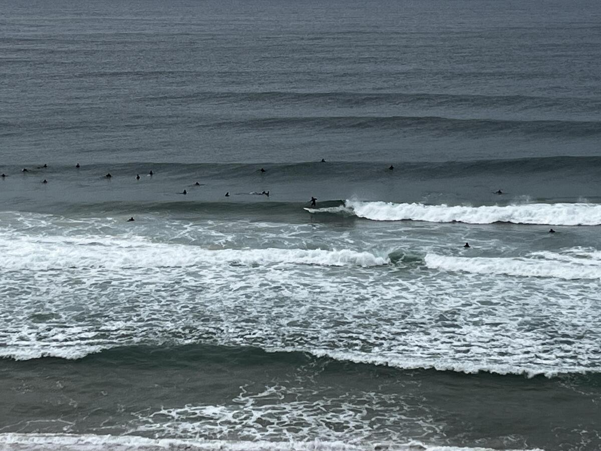
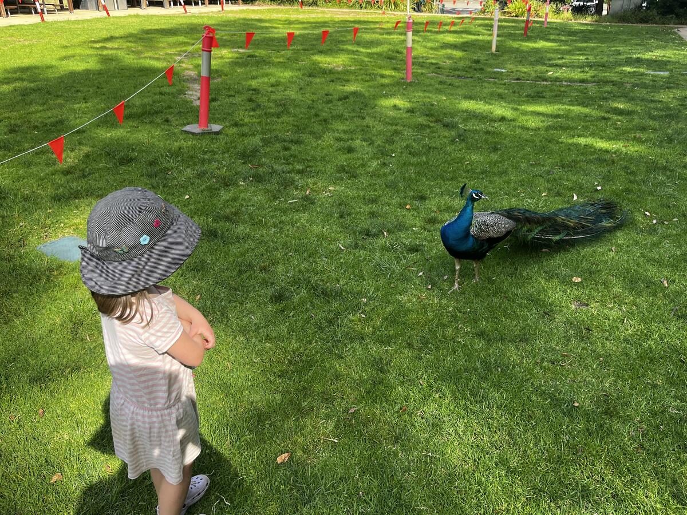

+++
title = "Newcastle"
date = "2024-11-12"
slug = "newcastle"
type = "post"

[taxonomies]
categories = [ "Travel",]
tags = [ "NSW",]
series = [ "Blue Mountains Roadtrip",]

[extra]
image = "posts/2024/newcastle/20241027_121249.jpg"

+++

We had a bit of a drive around Newcastle while the kids were asleep but spent most of the afternoon at the hotel as it had a pool. 

The next morning we met up with Rachael's cousins at Merewether Beach, and I was suprised by how good the surf was and how nice the beaches were considering they are next to a large port.

  

  

  

In the afternoon we went to the Blackbutt Nature Reserve which had a little free zoo. It had peacocks around like Rocky Zoo used to.

 

The kids both loved this [Fairy Garden](https://maps.app.goo.gl/93oZ4PaxCLva5Yqp6) we found just along the creek that someone had made out the front of their house.

 