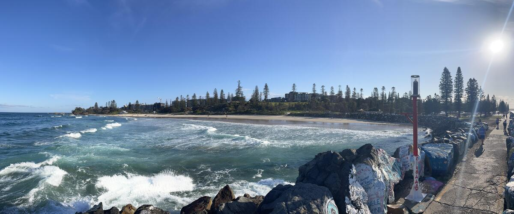
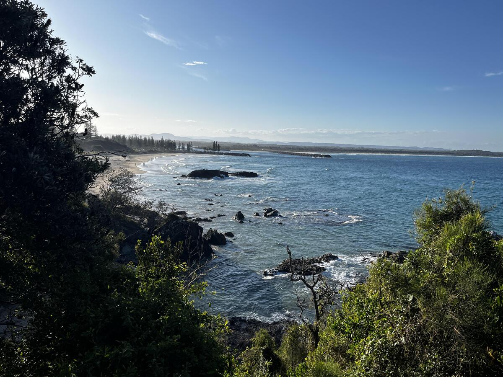
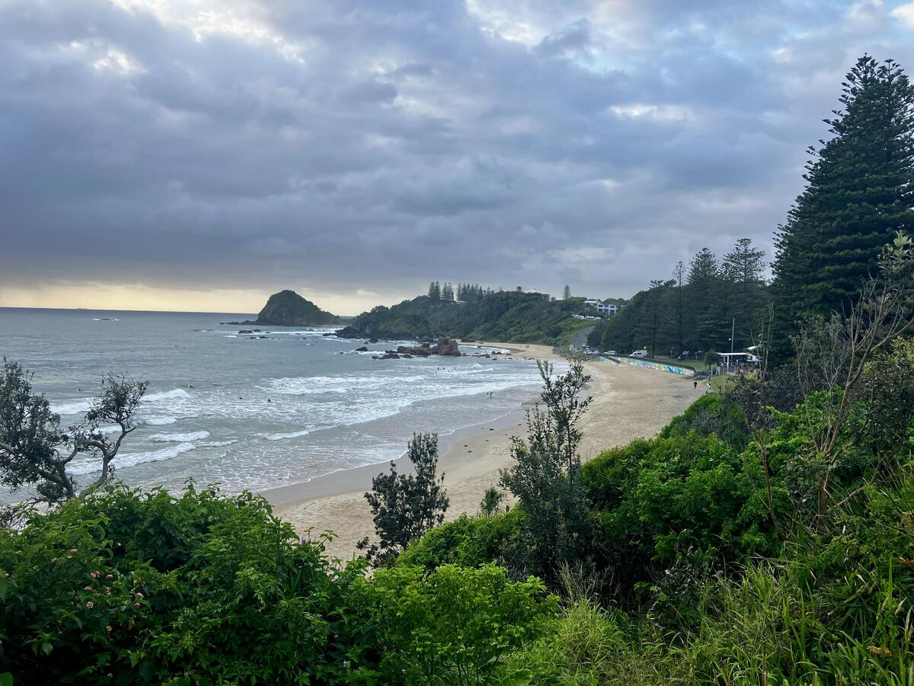
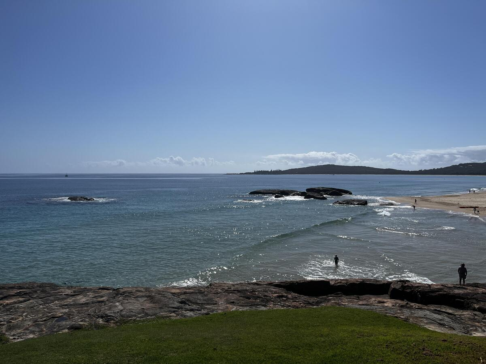

+++
title = "Port Macquarie"
date = "2024-11-13"
slug = "port-macquarie"
type = "post"

[taxonomies]
categories = [ "Travel",]
tags = [ "NSW",]

[extra]
image = "posts/2024/port-macquarie/20241029_070615-1.jpg"

+++

From Newcastle we drove through to Boomerang Beach and Booti Booti, which we briefly stopped at and looked amazing but the kids weren't interested in getting out of the car so we kept driving. 

 

At Forster we stopped at a bakery for lunch then headed up to Bennetts Head Lookout. 

   

At the lookout we could see some whales way off in the distance, so kept walking along the track and then the kids were very excited about One Mile Sand Dune.

   

Forster seemed really nice but the kids had had enough and so we then went back onto the highway and drove straight to Port Macquarie. It was a nice little town, the beaches were nice enough but not as nice as Forsters had been. 

 
 

Rachael and I took it in turns each morning doing the ocean walk and both ended up seeing whales and dolphins at sunrise (although on different days).

    

 

On our drive back north I really wanted to check out South West Rocks, and I'm glad we did as it was probably the highlight of our trip. The water was amazing so we ended up going for a swim and having lunch there. 

    