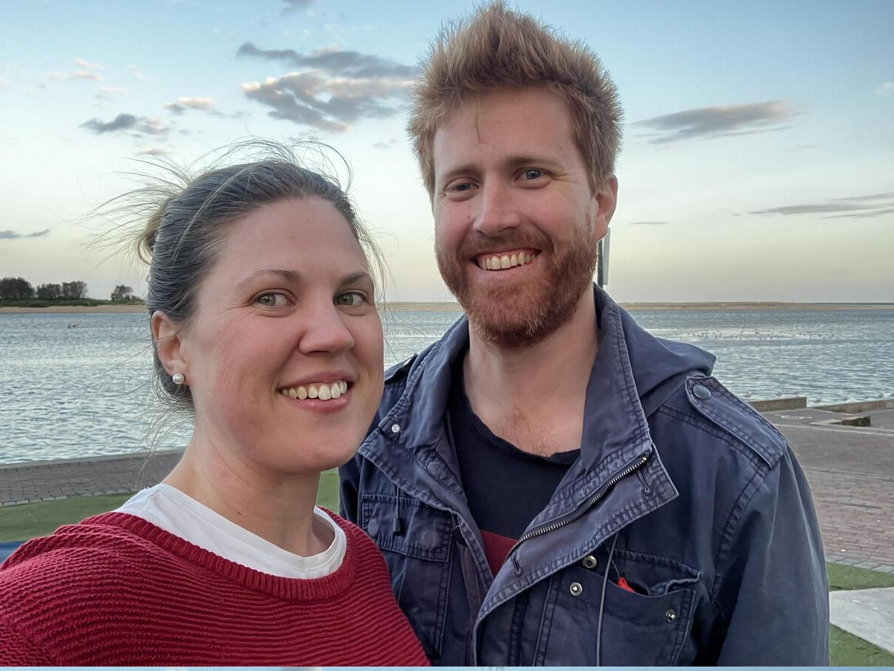
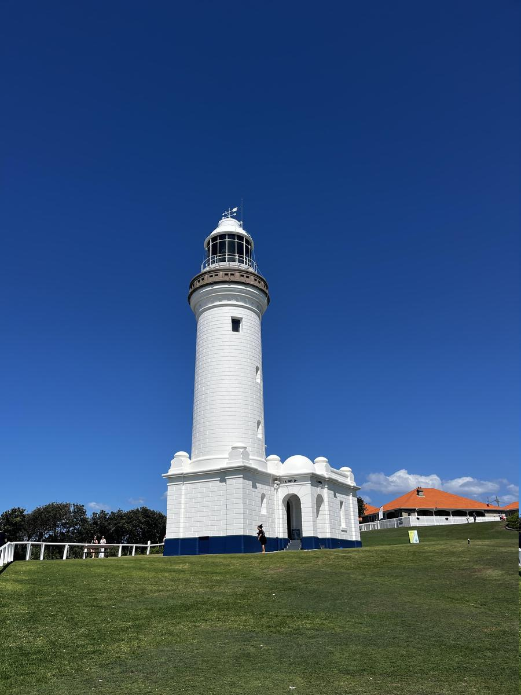

+++
title = "The Entrance"
date = "2024-11-11"
slug = "the-entrance"
type = "post"

[taxonomies]
categories = [ "Travel",]
tags = [ "NSW",]
series = [ "Blue Mountains Roadtrip",]

[extra]
image = "posts/2024/the-entrance/20241026_080441.jpg"

+++

From Katoomba we headed off to the Central Coast. To split up the drive a bit our first stop was Hornsby, where we went to the [Lisgar Gardens](https://maps.app.goo.gl/NnhNZ5VvSzCEk5a59) and a [Playground](https://maps.app.goo.gl/Gngjgv8ACfK8kYkWA).

  

We stopped for lunch in Gosford, and went to the Gosford Regional Gallery which also had a Japanese Gardens.

As it was a Friday night we struggled to book last-minute accommodation, but ended up getting one night at an apartment right on The Entrance.

The water was pretty chilly but the kids were still keen to hop in at the ocean baths.

We went for a walk and found out there was a [Chromefest](https://chromefest.org/) event on with live music which was pretty cool to stumble on.

  

   
  
I did The Entrance Parkrun in the morning which was around the lagoon side and definitely not as scenic as the ocean side of town.
  
  
  
After checking-out we started heading north up the coast, with the first stop being Norah Head Lighthouse.
  

We stopped at [Caves Beach](https://maps.app.goo.gl/Vrd8ESJDcZU321dF7), it was getting close to lunch time so it took a bit of coaxing but eventually got the kids down there and they had a great time exploring the cave. I wasn't expecting that you could cross under without going around the rocks, or that it would be full of washed up blue bottles and was definitely a very cool beach. 

  
   
We had some Fish & Chips at Blacksmiths Beach and then on to Newcastle. 

