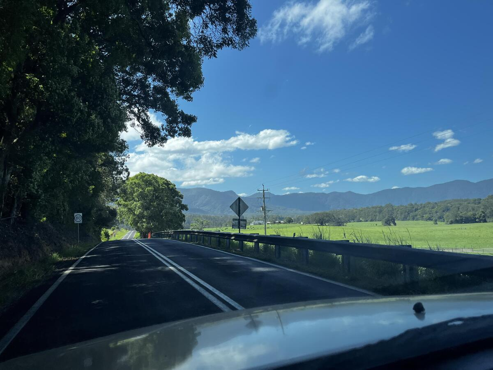
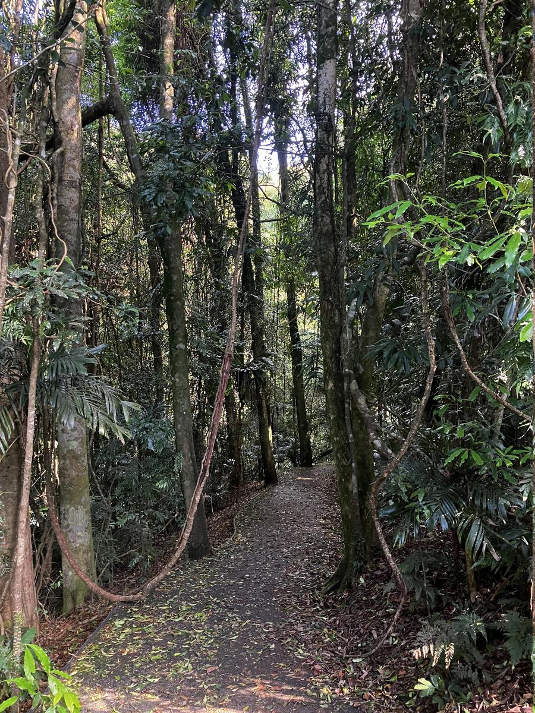
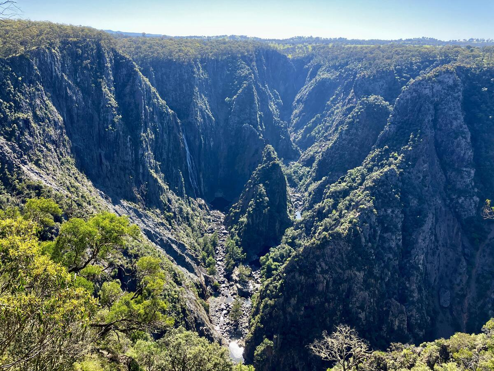
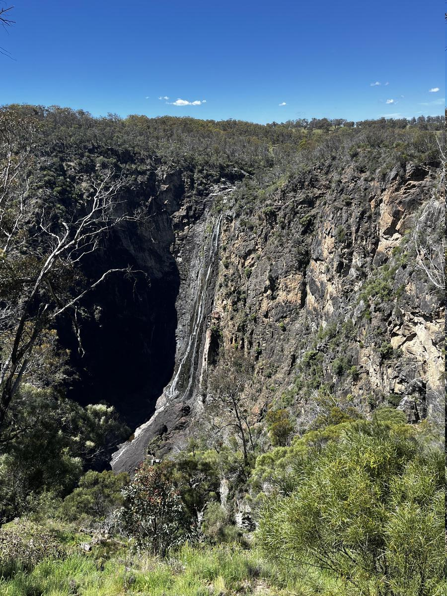
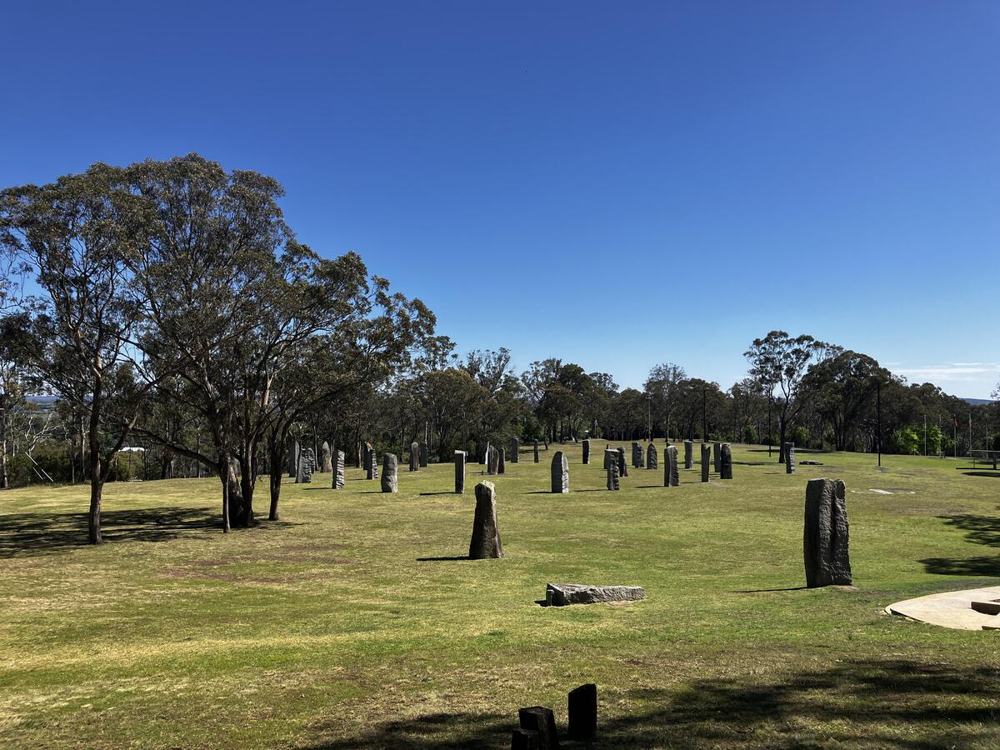

+++
title = "Waterfall Way"
date = "2024-11-14"
slug = "waterfall-way"
type = "post"

[taxonomies]
categories = [ "Travel",]
tags = [ "NSW",]

[extra]
image = "posts/2024/waterfall-way/20241031_090616-1.jpg"

+++

From South West Rocks we started heading inland, to Bellingen and the Waterfall Way Drive on the way to Armidale. In Bellingen we stopped at the Old Butter Factory Cafe which was good for the kids, and the drive itself was nice with everything being super green. 

At the Dorrigo National Park Visitor Centre they had a short treetop walk platform. 

     

There was then a couple of short walks, and we even saw a snake (which kept Rachael paranoid for the rest of the day)

   

The drive to Armidale had a bunch of short detours to waterfall lookouts which lucky for us were usually next to the carpark so we didn't have to drag the kids out of the car. Dangar Falls even had a playground next to the lookout which was very convenient!

   
 
We bypassed a few at the end to get to the hotel, we stayed at the Deer Park Motor Inn Armidale which had a herd you could feed in the afternoon. 

  

The next morning we backtracked to a couple of falls we had missed and then had a look around Armidale itself. 
 
      
 
There was some markets in town for Halloween when we went back in for dinner. 

 

We started our last drive back in the morning, driving through Guyra (which snows most years) and then Glen Innes. The Australian Standing Stones were worth stopping at.
     
  
Finally we went through Stanthorpe, stopping at a winery and Granite Belt Christmas Farm. 
  
